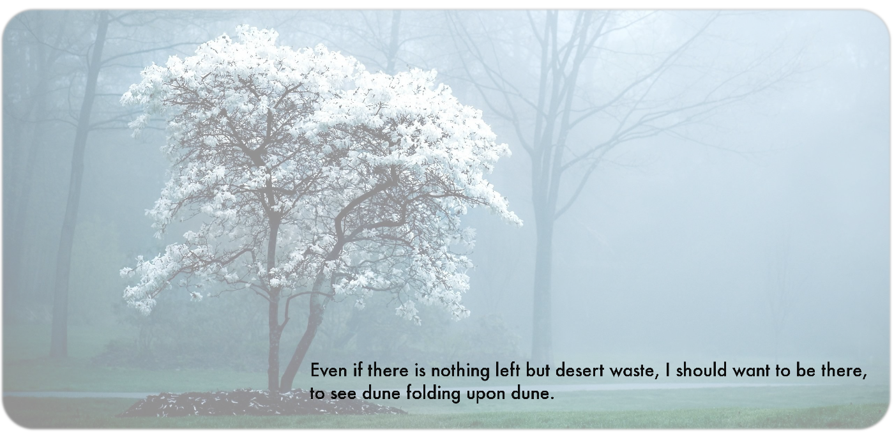
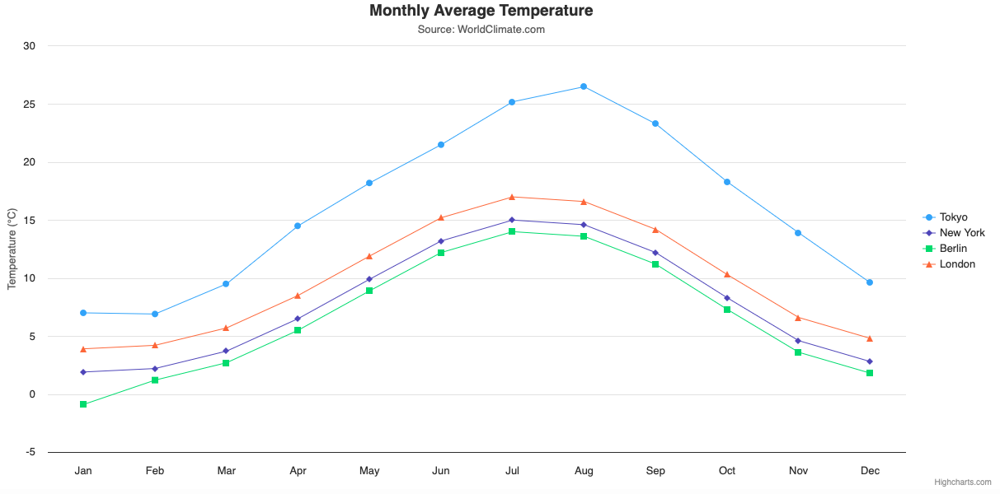
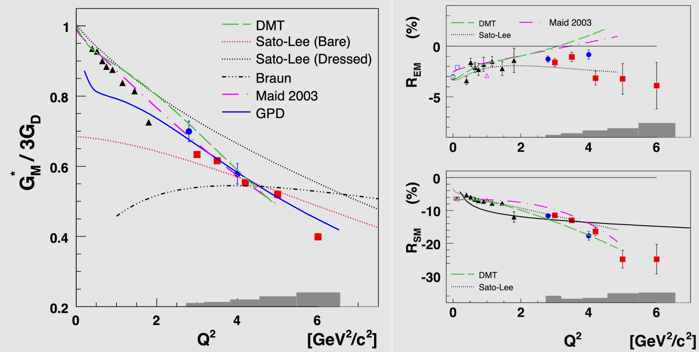

---
# Feel free to add content and custom Front Matter to this file.
# To modify the layout, see https://jekyllrb.com/docs/themes/#overriding-theme-defaults
# See https://github.com/jekyll/minima#readme

# Table: add first row (3 |) for autoformatting

layout: default

interest: |
  
  - ▸ Quark Structure
  - ▸ MonteCarlo Simulations
  - ▸ Large Language Models
  - ▸ Data Analysis
  - ▸ Geant4
  - ▸ Cherenkov Counters
  - ▸ Software Development

education: |
  - 🔬 **Staff Scientist**  
    &nbsp;&nbsp;&nbsp;&nbsp;&nbsp;&nbsp;&nbsp;&nbsp;&nbsp;[Jefferson Laboratory](https://www.jlab.org), VA, USA, 2011-present   

  - 🎓 🔬  **Post-Doc and Research Associate**  
    &nbsp;&nbsp;&nbsp;&nbsp;&nbsp;&nbsp;&nbsp;&nbsp;&nbsp;[University of Connecticut](https://uconn.edu), USA, 2004-2011   

  - 🎓  **PhD in Nuclear Physics**  
    &nbsp;&nbsp;&nbsp;&nbsp;&nbsp;&nbsp;&nbsp;&nbsp;&nbsp;[Rensselaer Polytechnic Institute](https://www.rpi.edu), Troy, NY, USA, 2003   

  - 🎓  **Laurea in Fisica**  
    &nbsp;&nbsp;&nbsp;&nbsp;&nbsp;&nbsp;&nbsp;&nbsp;&nbsp;[Università degli studi di Genova](https://www.difi.unige.it/it), Italy, 1999   

p_baseurl: "https://userweb.jlab.org/~ungaro/slides/"

---
















<h2>Maurizio Ungaro</h2> 

|                     `Staff Scientist`                      |
|:----------------------------------------------------------:|
|        [Jefferson Laboratory](https://www.jlab.org)        |
|:----------------------------------------------------------:|
| [Experimental Hall-B](https://www.jlab.org/physics/hall-b) |

|--------------------------------------------|--------------------------------------|-----------------------------------------|-----------------------------------|
| [![gscholar][gscholar-img]][gscholar-link] | [![github][github-img]][github-link] | [![inspire][inspire-img]][inspire-link] | [![email][email-img]][email-link] |

[gscholar-img]: {{ gscholar_img }}
[gscholar-link]: {{ gscholar_link }}
[github-img]: {{ github_img }}
[github-link]: {{ github_link }}
[inspire-img]: {{ inspire_img }}
[inspire-link]: {{ inspire_link }}
[email-img]: {{ email_img }}
[email-link]: {{ email_link }}





 

## About Me

I’m Mauri, a physicist working in [Hall-B](https://www.jlab.org/physics/hall-b) at [Jefferson Lab](https://www.jlab.org).

My research is focused on the internal structure and dynamics of the nucleon, in particular the physics beyond the
constituent quark model and the link between form factors and dressed quark mass (see for example
the [N → Δ(1232) transition](meson/pi0_delta/pi0_delta) and the
[meson electro-production at high Q2](meson/pi0_resonance/pi0_resonance) analyses).

I work on the Refurbishment, Operation / Maintenance / Calibration of the
[Low Threshold Cherenkov Counter](https://www.jlab.org/Hall-B/clas12-web/specs/ltcc.pdf) detector in Hall-B.

I am developing the [GEMC](https://gemc.github.io/home/) Geant4 simulation framework
and the [CLAS12 Simulations](https://github.com/gemc/clas12Tags), including
[Web Submissions](https://gemc.jlab.org/web_interface/index.php) to the
[Open Science Grid (OSG)](https://osg-htc.org), see for example our
[CLAS12 Project accounting](https://gracc.opensciencegrid.org/d/000000033/osg-project-accounting?orgId=1).

Most recently I joined the [Geant4](https://geant4.web.cern.ch) collaboration with the purpose of
[supporting it at JLab](https://jeffersonlab.github.io/g4home/).

In my free time I am learning to play hockey, while enjoying watching my kid skating much faster than me.



{% include two_col_md.html left="30%" right="70%" left_content=left right_content=right %}

  


 
  
 

## Interests

 

  {{ page.interest | markdownify }}

  



## Education

 

  {{ page.education | markdownify }}



{% include two_col_md.html left="40%" right="60%" left_content=left2 right_content=right2 %}

 

 

## Recent and Upcoming Work/Talks

 

<table class="alternate">

	<tr>
		<td> Title </td>
		<td> pdf </td>
		<td> Occasion </td>
		<td> Date </td>
	</tr>	

	
		<tr>
            <td> {{ presentation.title }} </td>

                
                    <td> <a href="{{ page.p_baseurl }}/{{presentation.filename}}.pdf"  target="_blank"> pdf </a> </td>
                
                    <td> <a href="{{ page.p_baseurl }}/no_pdf_animation.pdf"           target="_blank"> pdf </a> </td>
                 
                    <td>  </td>
                

                 
                    <td>{{presentation.occasion}} </td>
                
                     <td> <a href="{{ presentation.occasion_url }}"  target="_blank"> {{presentation.occasion}} </a> </td>
                

            <td> {{presentation.date}} </td>

        </tr>
	

</table>

 

## Skills

<table style="text-align:center;">
<tr>
    <th style="width: 35%">       Programming</th>
    <th></th>
    <th style="width: 25%">   Software</th>
    <th></th>
    <th style="width: 25%">  Languages</th>
</tr>
<tr>
    <td>
C++, [z][ba][c]sh, Python, LaTex, Git, Github, Continuous Integration, Docker, Environment-modules, HTCondor, meson, cmake, scons, fortran, PHP, Javascript, Highchart, html, CSS, Markdown
</td>
    <td></td>
    <td>
 Geant4, ROOT, XCode, PyCharm, CLion, FreeCad, Gimp, Excel, Powerpoint, Keynote, Numbers  
</td>
    <td></td>
    <td>
English, Italian
</td>
</tr>
</table>

 

## Latest News

 

	<table class="alternate">
	
		<tr>
			<td> <a href="{{news.link}}">&nbsp;&nbsp;&nbsp;{{news.title}}</a> </td>
			<td> {{news.date}} </td>
		</tr>
	
	</table>
	  

 

## Galleria

<link type="text/css" rel="stylesheet" href="/home/assets/lightslider.css" />

	 

	<ul style="text-align:center"  id="light-slider" >
    	<li data-thumb="assets/images/empty.png">
			   
    	</li>
    	<li data-thumb="assets/images/empty.png">
			<a href="/home/software/charts">Chart CSV displayer </a>
    	</li>
    	<li data-thumb="assets/images/empty.png">
			<a href="/home/meson/pi0_delta/pi0_delta">N → Δ(1232) transition  </a>
    	</li>
	</ul>

   

{:.zebra}

| Home Page Deployment | [![CI][CI-badge]][CI]  |

[CI]: https://github.com/maureeungaro/home/actions/workflows/jekyll.yml
[CI-badge]: https://github.com/maureeungaro/home/actions/workflows/jekyll.yml/badge.svg

   

[code]: assets/images/home/code.png

[software]: assets/images/home/software.png

[languages]: assets/images/home/languages.png

[quote1]: assets/images/home/quote1.png

