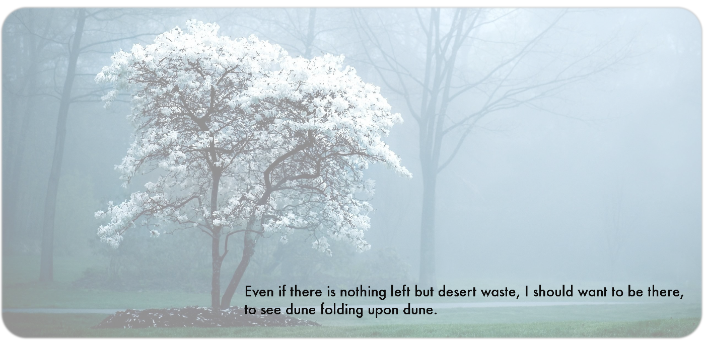
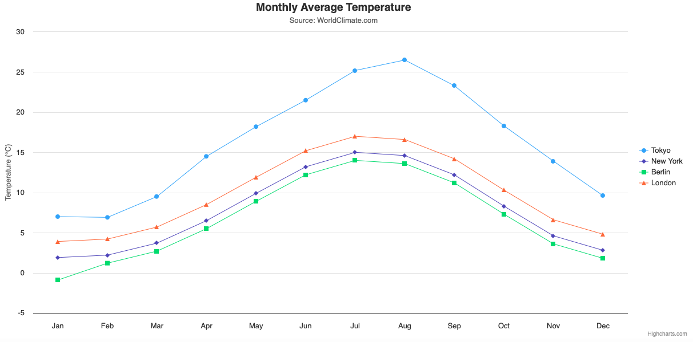
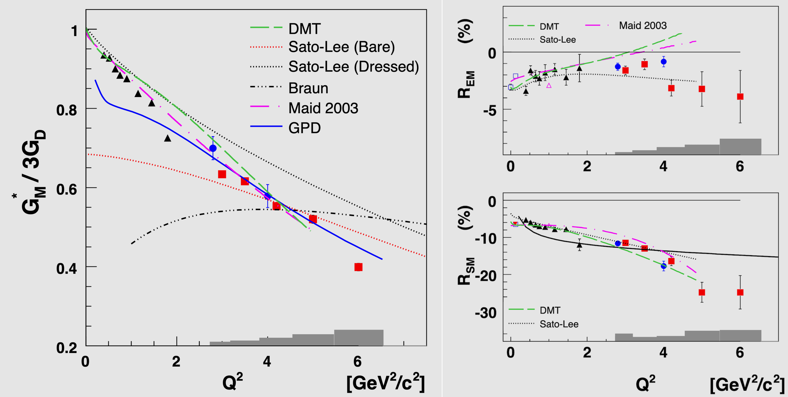

---
# Feel free to add content and custom Front Matter to this file.
# To modify the layout, see https://jekyllrb.com/docs/themes/#overriding-theme-defaults
# See https://github.com/jekyll/minima#readme

# Table: add first row (3 |) for autoformatting

layout: default
title: Maurizio Ungaro
description: Nuclear physicist at Jefferson Lab working on Geant4 simulations, GEMC, CLAS12 software, detector systems, and nucleon-structure research.
image: /assets/images/home/mauri.png
nav_exclude: true

interest: |
  - ▸ Quark Structure
  - ▸ Monte Carlo Simulations
  - ▸ Large Language Models
  - ▸ Data Analysis
  - ▸ Geant4
  - ▸ Cherenkov Counters
  - ▸ Software Development

education: |
  - 🔬 **Staff Scientist**  
    &nbsp;&nbsp;&nbsp;&nbsp;&nbsp;&nbsp;&nbsp;&nbsp;&nbsp;[Jefferson Laboratory](https://www.jlab.org), VA, USA, 2011-present   

  - 🎓 🔬  **Post-Doc and Research Associate**  
    &nbsp;&nbsp;&nbsp;&nbsp;&nbsp;&nbsp;&nbsp;&nbsp;&nbsp;[University of Connecticut](https://uconn.edu), USA, 2004-2011   

  - 🎓  **PhD in Nuclear Physics**  
    &nbsp;&nbsp;&nbsp;&nbsp;&nbsp;&nbsp;&nbsp;&nbsp;&nbsp;[Rensselaer Polytechnic Institute](https://www.rpi.edu), Troy, NY, USA, 2003   

  - 🎓  **Laurea in Fisica**  
    &nbsp;&nbsp;&nbsp;&nbsp;&nbsp;&nbsp;&nbsp;&nbsp;&nbsp;[Università degli studi di Genova](https://www.difi.unige.it/it), Italy, 1999   

p_baseurl: "https://userweb.jlab.org/~ungaro/slides/"

---
























<h2>Maurizio Ungaro</h2> 

Nuclear physicist and simulation software developer

|                      `Staff Scientist`                       |
|:------------------------------------------------------------:|
|      [Jefferson Laboratory](https://www.jlab.org)            |
| :----------------------------------------------------------: |
|  [Experimental Hall-B](https://www.jlab.org/physics/hall-b)  |

[gscholar-img]: {{ gscholar_img }}
[gscholar-link]: {{ gscholar_link }}
[github-img]: {{ github_img }}
[github-link]: {{ github_link }}
[inspire-img]: {{ inspire_img }}
[inspire-link]: {{ inspire_link }}
[researchgate-img]: {{ researchgate_img }}
[researchgate-link]: {{ researchgate_link }}
[scopus-img]: {{ scopus_img }}
[scopus-link]: {{ scopus_link }}
[email-img]: {{ email_img }}
[email-link]: {{ email_link }}
[orcid-img]: {{ orcid_img }}
[orcid-link]: {{ orcid_link }}
[linkedin-img]: {{ linkedin_img }}
[linkedin-link]: {{ linkedin_link }}





 

## About Me

I am Maurizio Ungaro, a nuclear physicist working in [Hall-B](https://www.jlab.org/physics/hall-b)
at [Jefferson Lab](https://www.jlab.org).
This site collects my research, talks, simulation software, detector work, technical notes, and selected links.
It is intended for collaborators, Geant4 and GEMC users, CLAS12 simulation users, and students looking for practical examples.
My work connects nuclear physics analysis, detector operations, and simulation infrastructure, with a focus on making
Geant4-based workflows easier to build, run, document, and share.

In my free time, I am learning to play hockey while enjoying watching my kid skate much faster than me.

 

<table class="zebra compact-table">
  <tr>
    <th>Primary links</th>
    <td><a href="/home/profile/">Profile</a></td>
    <td><a href="https://gemc.github.io/home/">GEMC</a></td>
    <td><a href="/home/showcase/">Research & Talks</a></td>
    <td><a href="/home/mynotes/">Notes</a></td>
  </tr>
</table>

 

For collaboration, software questions, or detector/simulation support, email me or use the research and code profiles below.

<table class="small-icons">
  <tr>
    <td> <a href="{{ gscholar_link }}">Google Scholar</a></td>
    <td> <a href="{{ github_link }}">GitHub</a></td>
    <td> <a href="{{ inspire_link }}">INSPIRE</a></td>
    <td>
       
      <a href="{{ scopus_link }}">Scopus</a>
    </td>
    <td>
       
      <a href="{{ researchgate_link }}">ResearchGate</a>
    </td>
    <td> <a href="{{ orcid_link }}">ORCID</a></td>
    <td> <a href="{{ linkedin_link }}">LinkedIn</a></td>
    <td> <a href="{{ email_link }}">Email</a></td>
  </tr>
</table>



{% include two_col_md.html left="30%" right="70%" left_content=left right_content=right %}

  

## Start Here

| If you are looking for... | Start with |
|:--|:--|
| Biography, CV, resume, or professional links | [Profile](/home/profile/) |
| Geant4 examples, tutorials, or JLab support | [Geant4 at JLab](https://jeffersonlab.github.io/g4home/) |
| GEMC simulation workflows | [GEMC](https://gemc.github.io/home/) |
| CLAS12 simulation releases and production workflows | [CLAS12 Simulations](https://github.com/gemc/clas12Tags) and [OSG submissions](/home/osg/osg) |
| Research talks, papers, and technical notes | [Research & Talks](/home/showcase/) |
| Practical computing notes | [Notes](/home/mynotes/) |

  

## What I Work On

| Area | Focus |
|:--|:--|
| Nuclear physics | Nucleon structure, physics beyond the constituent quark model, and links between form factors and dressed quark mass, including the [N → Δ(1232) transition](meson/pi0_delta/pi0_delta) and [meson electro-production at high Q2](meson/pi0_resonance/pi0_resonance). |
| Detector work | Refurbishment, operation, maintenance, and calibration of the [Low Threshold Cherenkov Counter](https://www.jlab.org/Hall-B/clas12-web/specs/ltcc.pdf) detector in Hall-B. |
| Simulation software | [GEMC](https://gemc.github.io/home/), [CLAS12 Simulations](https://github.com/gemc/clas12Tags), [Web Submissions](https://gemc.jlab.org/web_interface/index.php), and [Open Science Grid](https://osg-htc.org) production workflows. |
| Geant4 support | [Geant4 at JLab](https://jeffersonlab.github.io/g4home/) tutorials, examples, and support material for Jefferson Lab users. |

 

## Recent Talks and Notes

 

<table class="alternate">

	<tr>
		<td> Title </td>
		<td> PDF </td>
		<td> Occasion </td>
		<td> Date </td>
	</tr>	

	
		<tr>
            <td> {{ presentation.title }} </td>

                
                    <td> <a href="{{ page.p_baseurl }}/{{presentation.filename}}.pdf"  target="_blank"> PDF </a> </td>
                
                    <td> <a href="{{ page.p_baseurl }}/no_pdf_animation.pdf"           target="_blank"> PDF </a> </td>
                 
                    <td>  </td>
                

                 
                    <td>{{presentation.occasion}} </td>
                
                     <td> <a href="{{ presentation.occasion_url }}"  target="_blank"> {{presentation.occasion}} </a> </td>
                

            <td> {{presentation.date}} </td>

        </tr>
	

</table>

More talks, papers, and notes are listed in [Research & Talks](/home/showcase/).

 

## Technical Skills

| Area | Tools and Experience |
|:--|:--|
| Simulation and analysis | Geant4, GEMC, CLAS12 simulations, ROOT, detector geometry, event generation, digitization workflows |
| Programming and infrastructure | C++, Python, shell scripting, Git, GitHub, continuous integration, Docker, Environment Modules, HTCondor, Meson, CMake, SCons |
| Scientific communication | LaTeX, Markdown, HTML, CSS, JavaScript, Highcharts, technical documentation, tutorials, presentations |
| Languages | English, Italian |

 



## Interests

  {{ page.interest | markdownify }}





## Experience and Education

 

  {{ page.education | markdownify }}



{% include two_col_md.html left="40%" right="60%" left_content=left2 right_content=right2 %}

 

## Latest News

 

	<table class="alternate">
	
		<tr>
			<td> <a href="{{news.link}}">&nbsp;&nbsp;&nbsp;{{news.title}}</a> </td>
			<td> {{news.date}} </td>
		</tr>
	
	</table>
	  

 

## Gallery

<link type="text/css" rel="stylesheet" href="/home/assets/lightslider.css" />

	 

	<ul style="text-align:center"  id="light-slider" >
    	<li data-thumb="assets/images/empty.png">
			   
    	</li>
    	<li data-thumb="assets/images/empty.png">
			<a href="/home/software/charts">Chart CSV displayer </a>
    	</li>
    	<li data-thumb="assets/images/empty.png">
			<a href="/home/meson/pi0_delta/pi0_delta">N → Δ(1232) transition  </a>
    	</li>
	</ul>

   

{:.zebra}

| Home Page Deployment | [![CI][CI-badge]][CI]  |

[CI]: https://github.com/maureeungaro/home/actions/workflows/jekyll.yml
[CI-badge]: https://github.com/maureeungaro/home/actions/workflows/jekyll.yml/badge.svg

   

[code]: assets/images/home/code.png

[software]: assets/images/home/software.png

[languages]: assets/images/home/languages.png

[quote1]: assets/images/home/quote1.png
