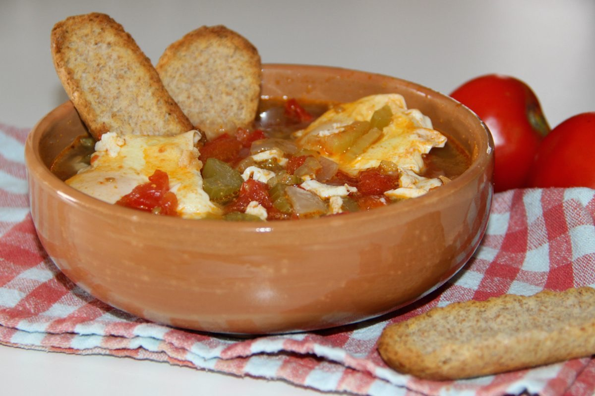
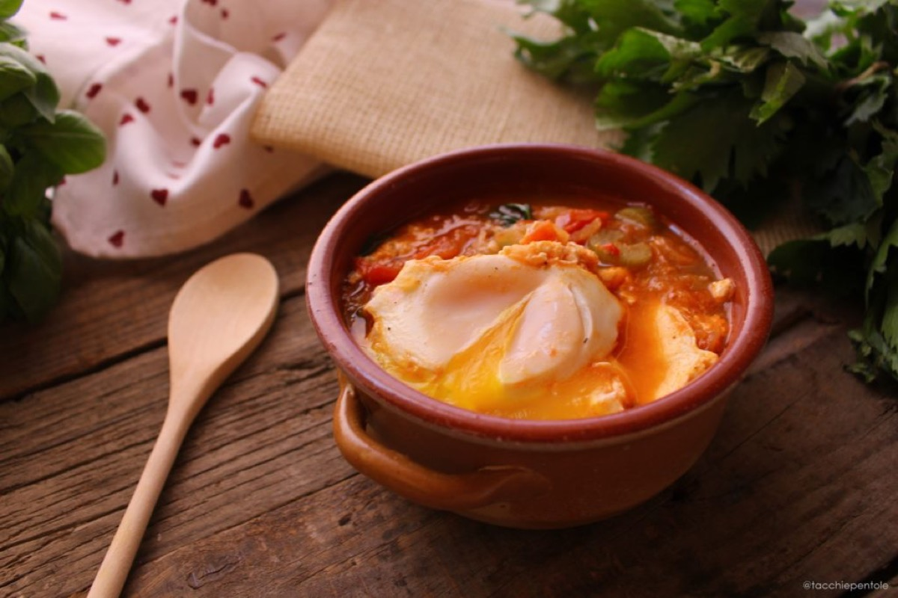
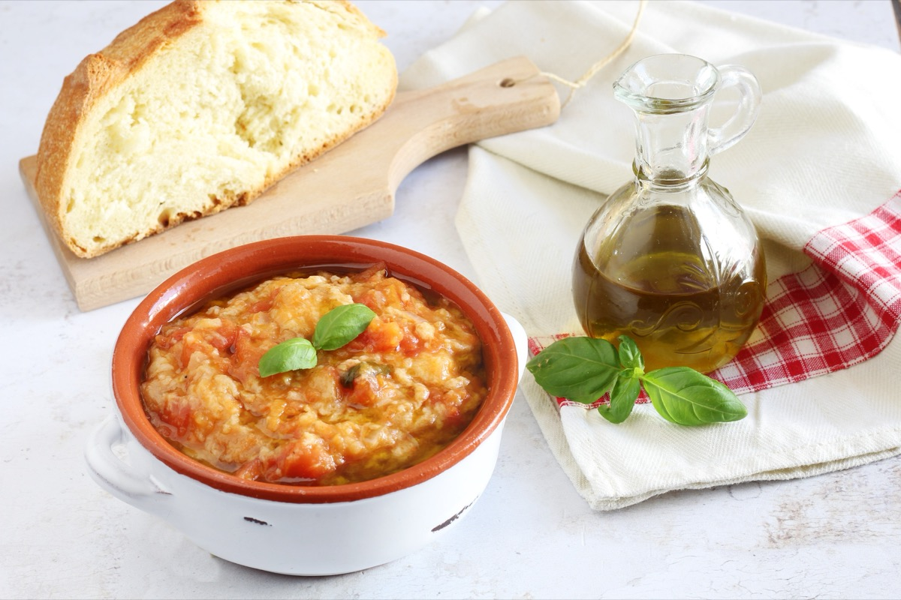
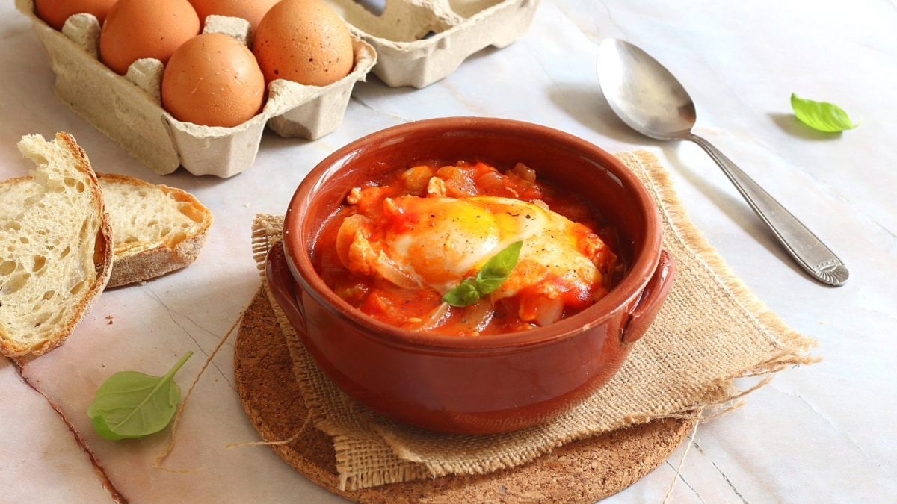

# Acquacotta

<table>
  <tr>
    <td>
      
    </td>
    <td>
      
    </td>
  </tr>
  <tr>
    <td>
      
    </td>
    <td>
      
    </td>
  </tr>
</table>

## Background

Acquacotta means "cooked water" and comes from the rural cuisine of southern Tuscany and Lazio. The
once-austere soup turns vegetables, bread, and eggs into a satisfying meal.

## Ingredients

- 3 tablespoons olive oil
- 2 onions, sliced
- 2 celery stalks, sliced
- 400 g canned tomatoes
- 1 l vegetable stock
- 4 eggs
- 4 thick slices stale bread
- 60 g Pecorino
- Salt and pepper

## How to cook

1. Soften onions and celery in oil. Add tomatoes and stock; simmer for 25 minutes.
2. Crack eggs into the gently simmering soup, cover, and poach until whites set.
3. Put bread in bowls, ladle over soup and one egg each, and finish with Pecorino.
