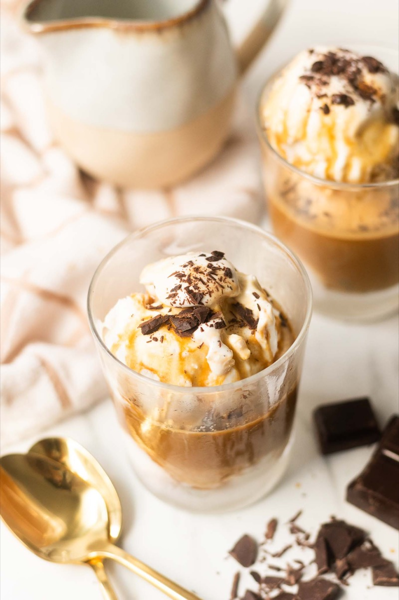
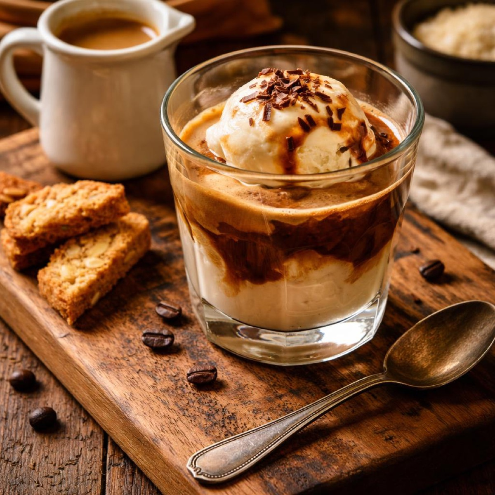
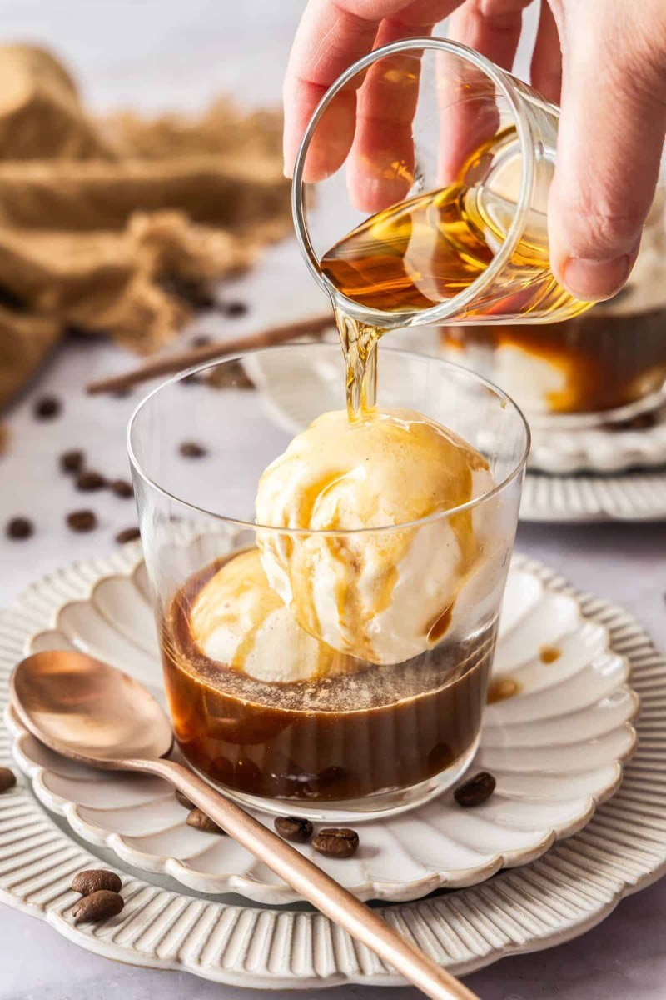
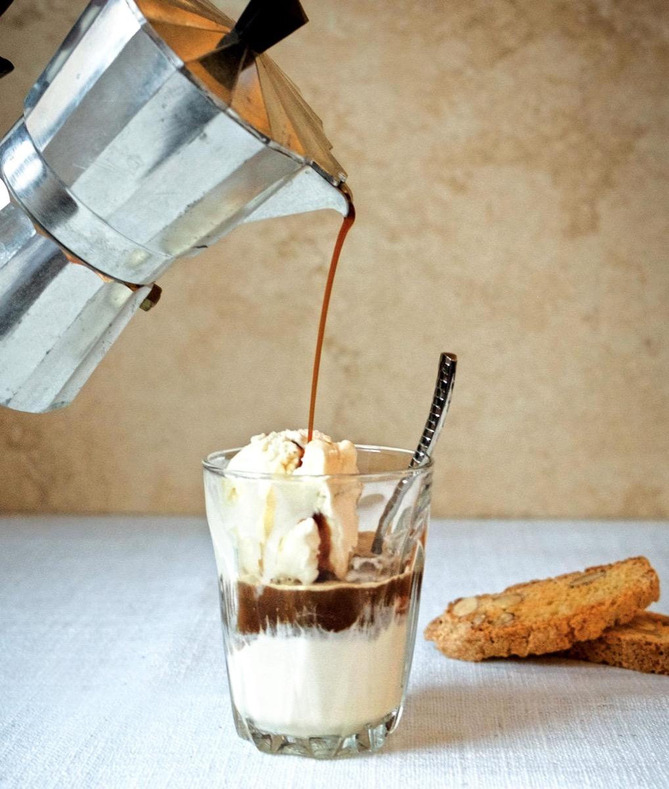

# Affogato

<table>
  <tr>
    <td>
      
    </td>
    <td>
      
    </td>
  </tr>
  <tr>
    <td>
      
    </td>
    <td>
      
    </td>
  </tr>
</table>

## Background

Affogato means "drowned" in Italian: vanilla gelato is drowned with a shot of hot espresso. It sits between
dessert and coffee and should be assembled only when everyone is ready.

## Ingredients

- 8 small scoops vanilla gelato
- 4 shots freshly brewed espresso
- Dark chocolate shavings, optional

## How to cook

1. Chill four small glasses or bowls.
2. Put two scoops of gelato in each and brew the espresso.
3. Pour one hot shot over each serving, add optional chocolate, and eat immediately.
