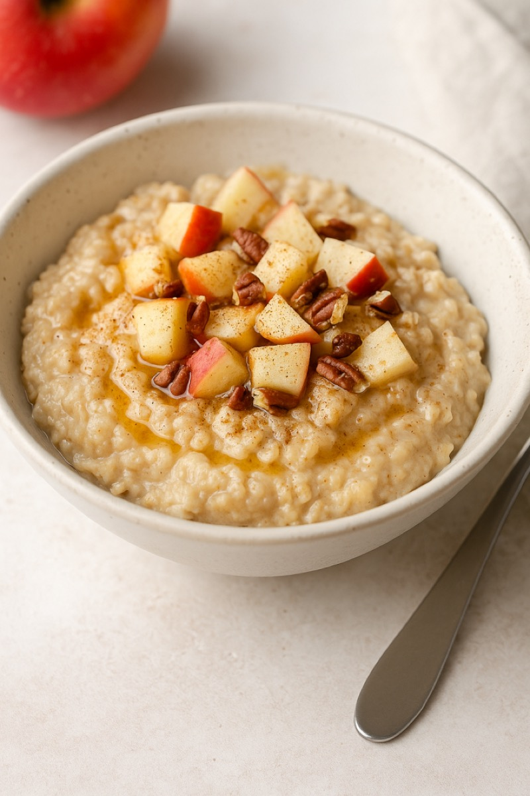
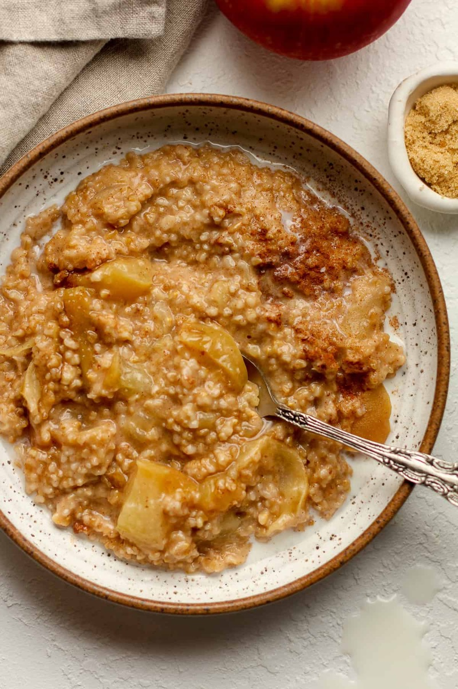
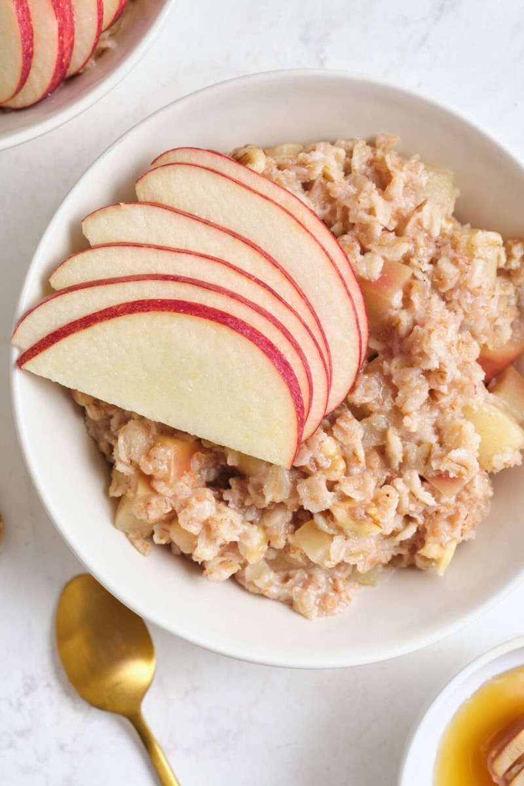
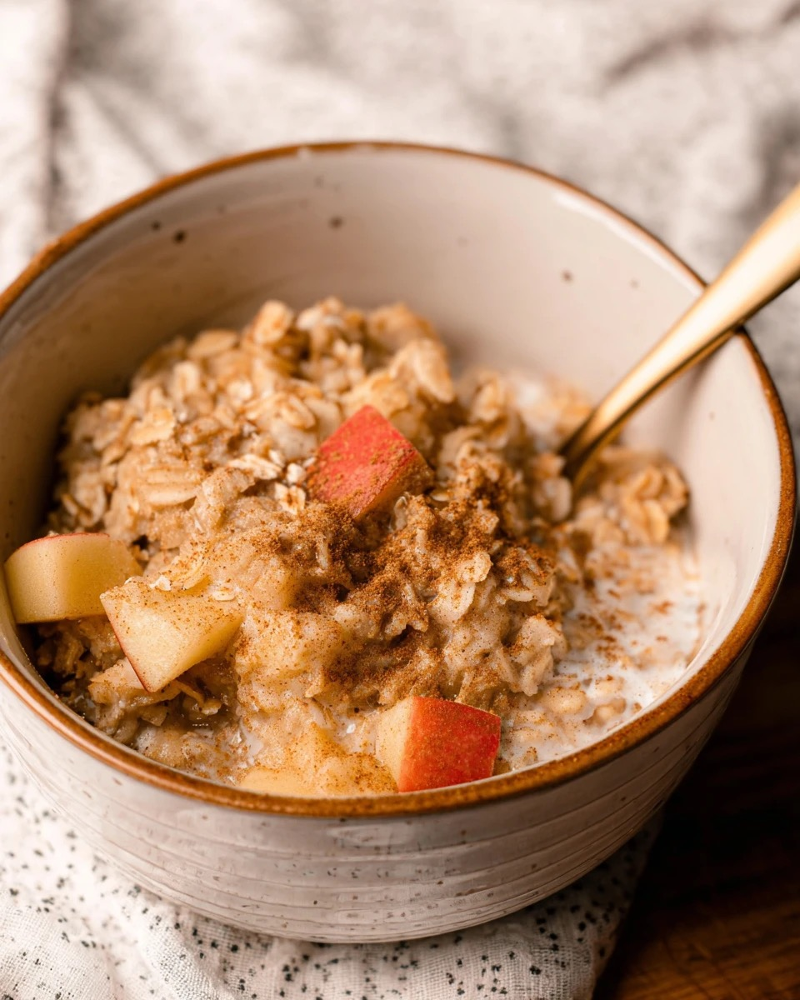

# Apple Cinnamon Oatmeal

<table>
  <tr>
    <td>
      
    </td>
    <td>
      
    </td>
  </tr>
  <tr>
    <td>
      
    </td>
    <td>
      
    </td>
  </tr>
</table>

## Background

Oatmeal became a widespread American breakfast as rolled oats made whole-grain porridge quicker to prepare.
Apples, cinnamon, and brown sugar are a familiar cool-weather combination.

## Ingredients

- 320 g rolled oats
- 950 ml milk or water
- 2 apples, diced
- 1 teaspoon cinnamon
- 2 tablespoons brown sugar
- 1/4 teaspoon salt
- 40 g chopped walnuts, optional

## How to cook

1. Bring liquid, apples, cinnamon, sugar, and salt to a simmer.
2. Stir in oats and cook for 5 to 8 minutes, stirring, until creamy.
3. Rest for 2 minutes and serve with optional walnuts and extra milk.
