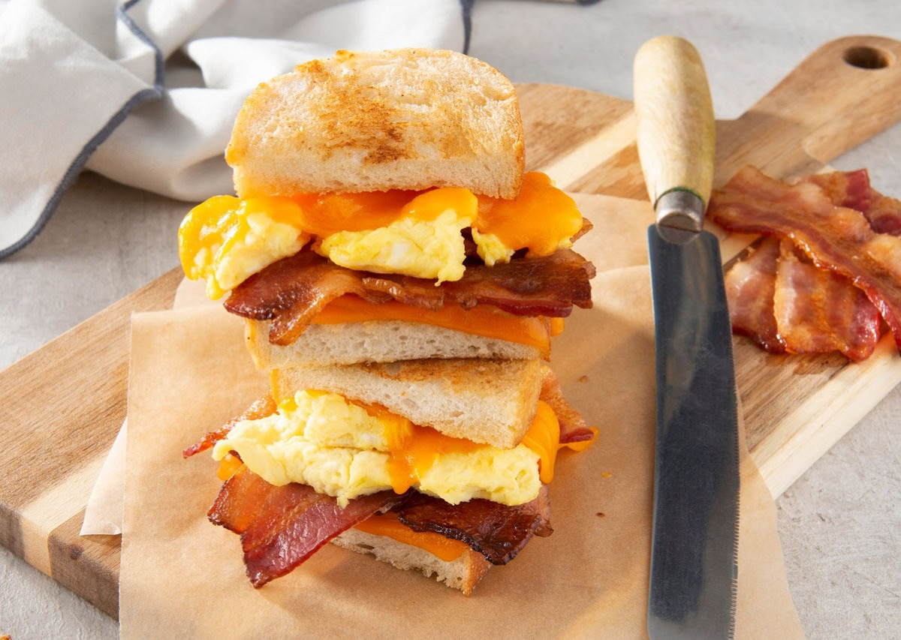
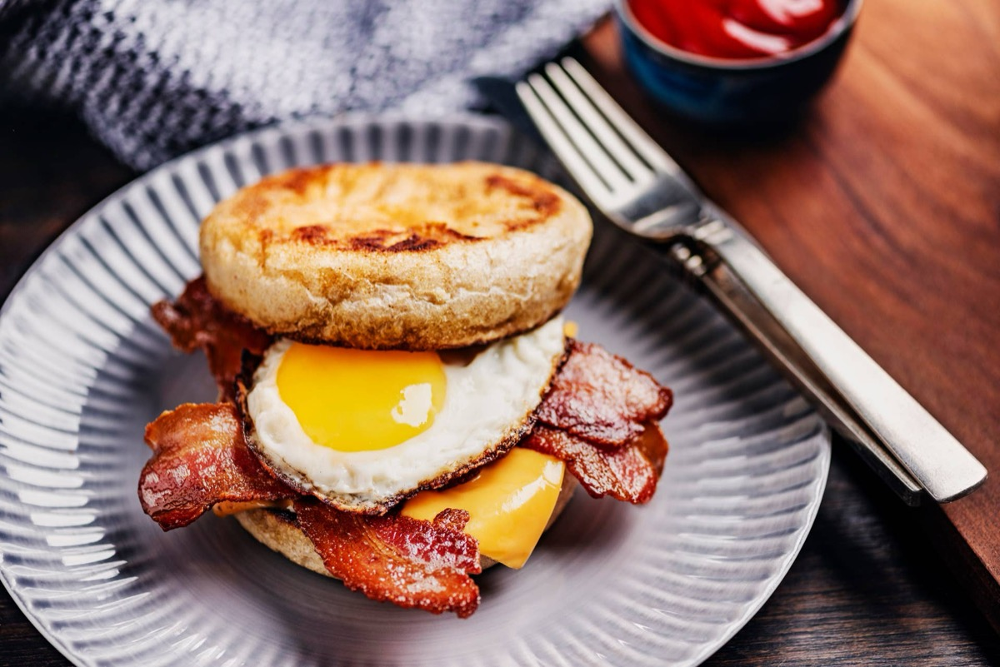
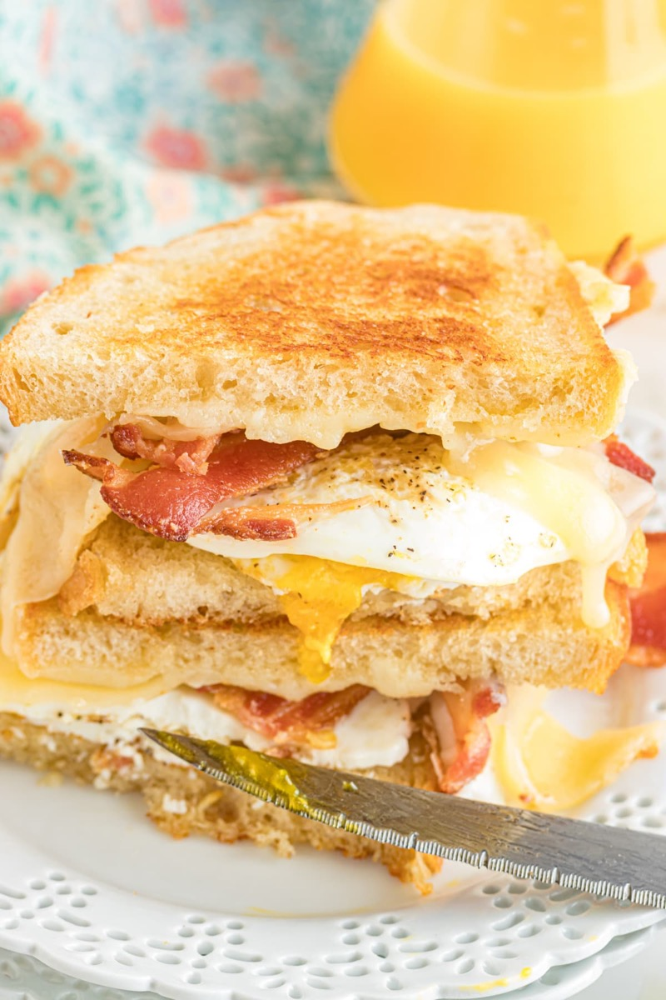
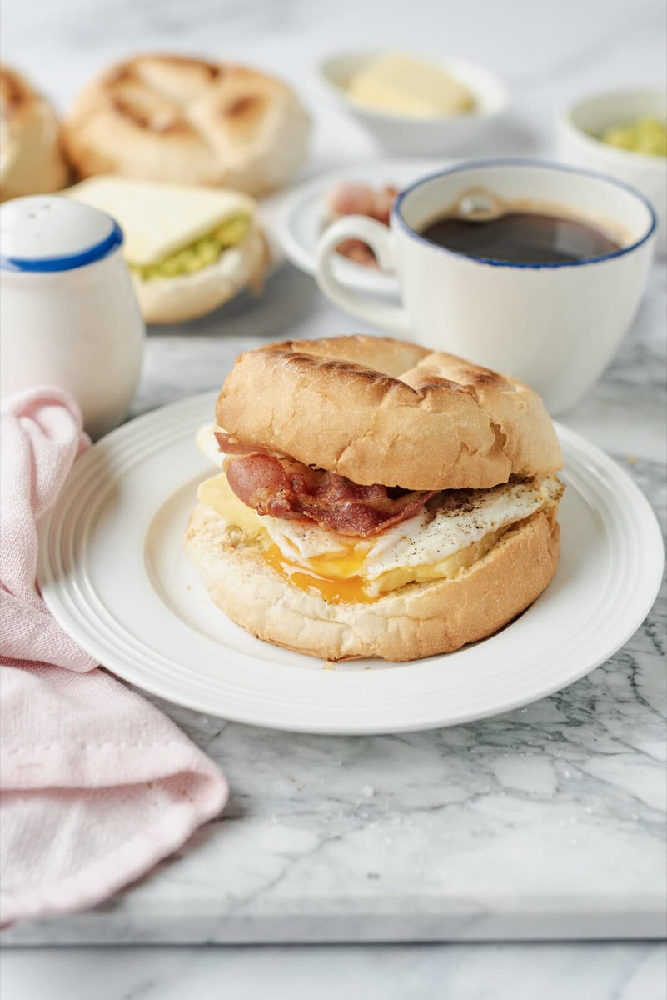

# Bacon, Egg, and Cheese Breakfast Sandwich

<table>
  <tr>
    <td>
      
    </td>
    <td>
      
    </td>
  </tr>
  <tr>
    <td>
      
    </td>
    <td>
      
    </td>
  </tr>
</table>

## Background

Bacon, egg, and cheese sandwiches are a standard American breakfast-counter meal, especially in the Northeast.
A soft roll keeps the crisp bacon, fried egg, and melted cheese portable.

## Ingredients

- 4 kaiser rolls or English muffins
- 8 slices bacon
- 4 eggs
- 4 slices American or cheddar cheese
- 1 tablespoon butter
- Salt, pepper, and ketchup or hot sauce

## How to cook

1. Cook bacon until crisp and toast the split rolls.
2. Fry eggs in butter, breaking yolks if desired. Season, flip, and top each with cheese until melted.
3. Fill each roll with bacon and one cheesy egg. Add ketchup or hot sauce.
