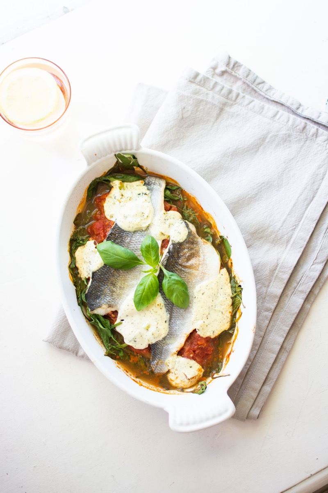
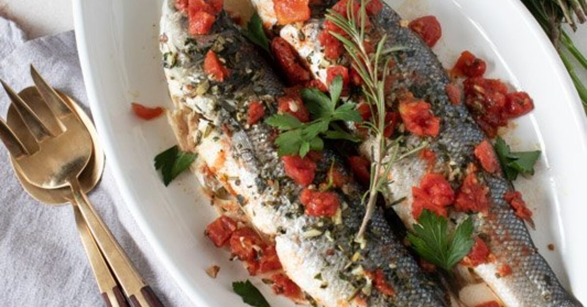
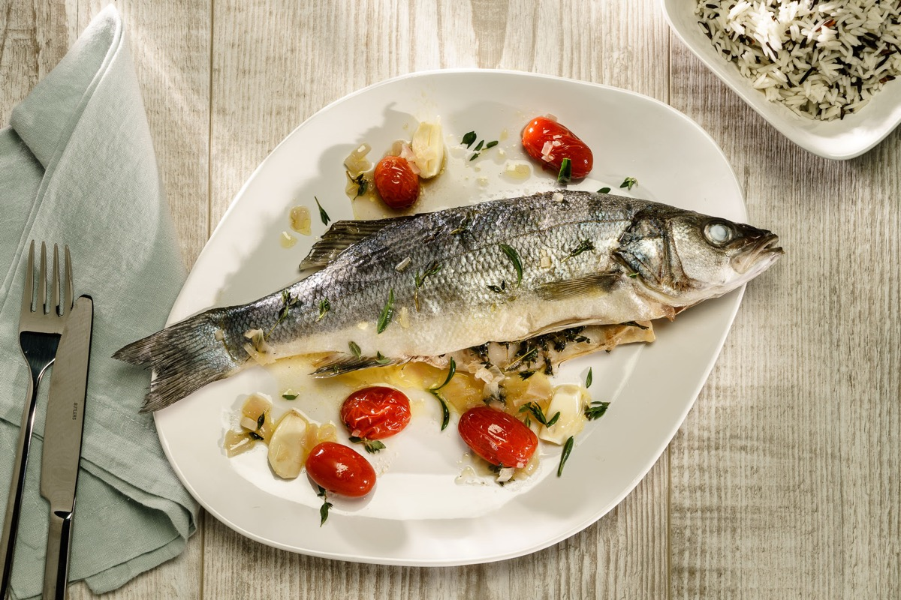
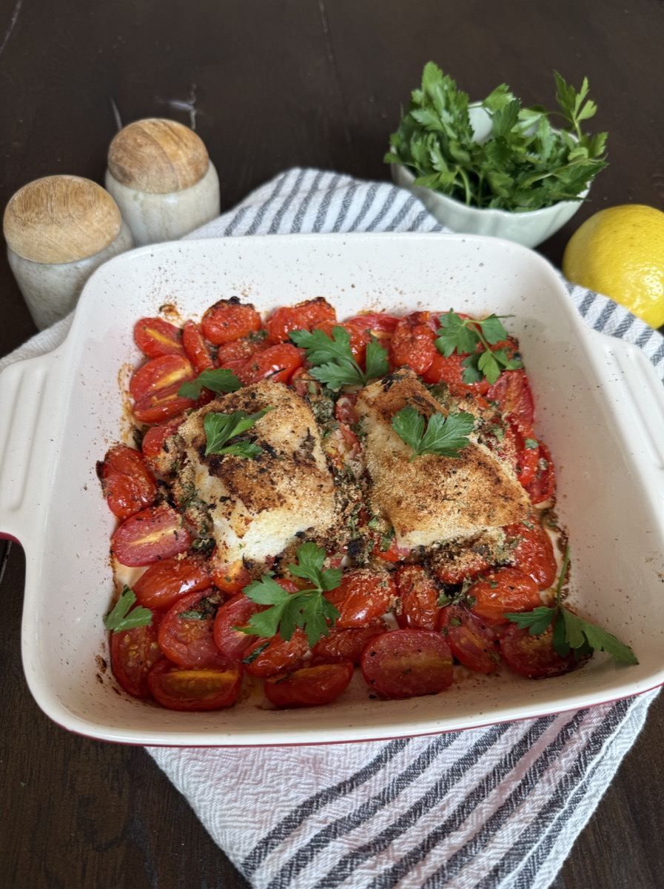

# Italian-Style Baked Sea Bass

<table>
  <tr>
    <td>
      
    </td>
    <td>
      
    </td>
  </tr>
  <tr>
    <td>
      
    </td>
    <td>
      
    </td>
  </tr>
</table>

## Background

Whole or filleted fish baked with olive oil, lemon, garlic, and herbs is common along Italy's coasts. The
simple method protects the fish's flavor and requires little active work.

## Ingredients

- 4 sea bass fillets, about 170 g each
- 3 tablespoons olive oil
- 2 garlic cloves, sliced
- 1 lemon, thinly sliced
- 250 g cherry tomatoes
- 2 tablespoons parsley
- Salt and pepper

## How to cook

1. Heat the oven to 200°C. Put fish in an oiled baking dish and season.
2. Add garlic, lemon, tomatoes, and remaining oil.
3. Bake for 12 to 16 minutes, until fish flakes and reaches 63°C. Finish with parsley.
