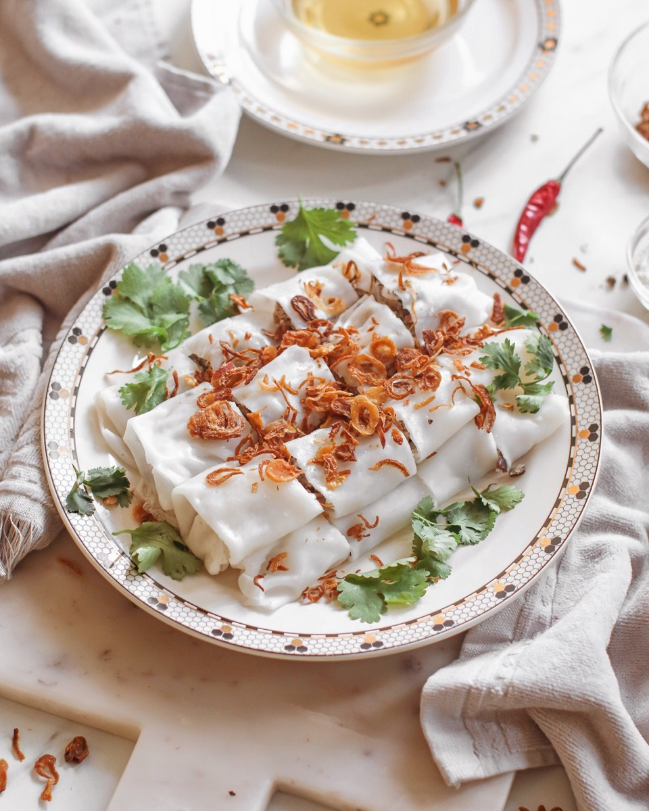
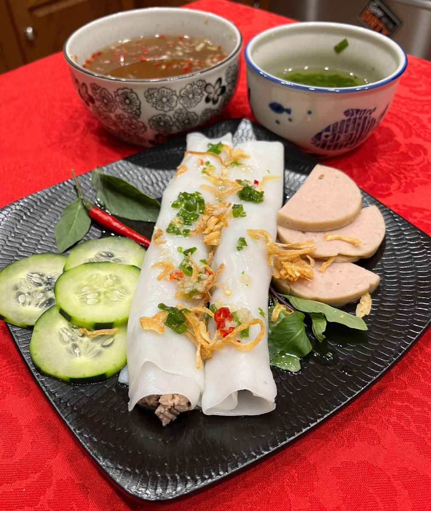
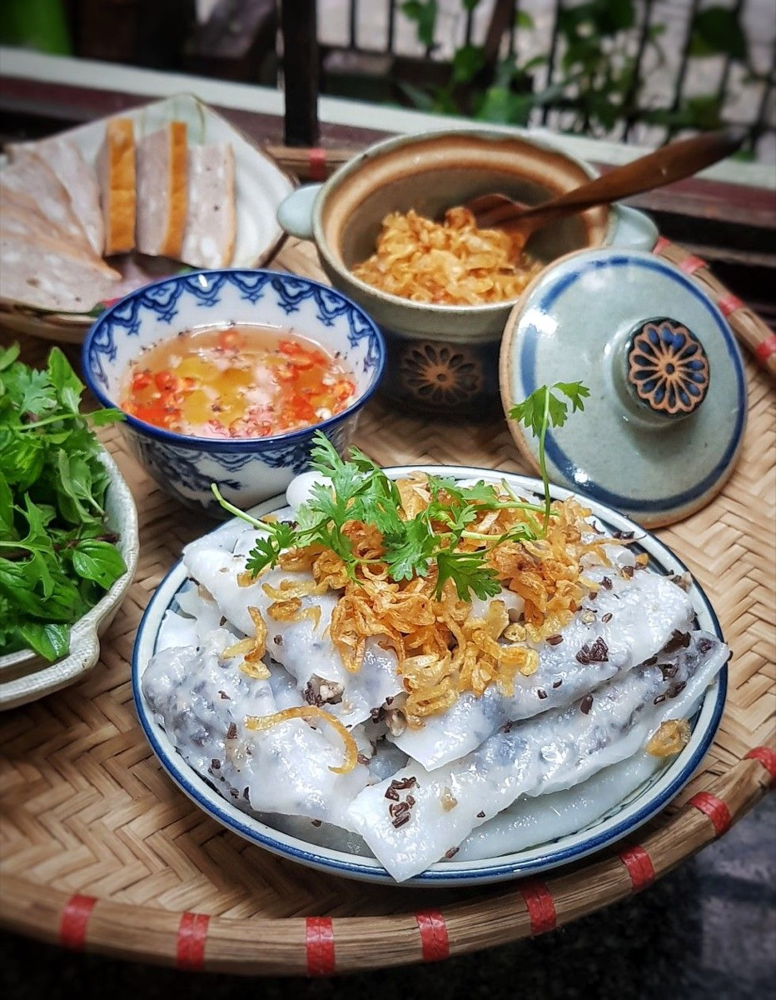
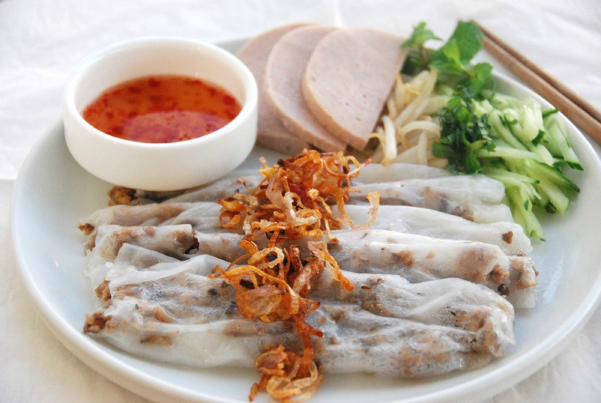

# Bánh Cuốn

<table>
  <tr>
    <td>
      
    </td>
    <td>
      
    </td>
  </tr>
  <tr>
    <td>
      
    </td>
    <td>
      
    </td>
  </tr>
</table>

## Background

Bánh cuốn are delicate steamed rice rolls from northern Vietnam. Traditionally eaten at breakfast, the
translucent sheets enclose seasoned pork and mushrooms and are served with herbs and nước chấm.

## Ingredients

- 200 g bánh cuốn rice-flour mix
- 500 ml water, or the amount directed on the package
- 1 tablespoon neutral oil, plus more for the pan
- 300 g ground pork
- 25 g dried wood-ear mushrooms, soaked and finely chopped
- 2 shallots, minced
- 1 tablespoon fish sauce
- 1/2 teaspoon black pepper
- Bean sprouts, cucumber, herbs, fried shallots, and nước chấm, for serving

## How to cook

1. Whisk the flour mix, water, and oil; rest for 30 minutes.
2. Brown the pork with shallots. Add mushrooms, fish sauce, and pepper, and cook until dry and fragrant.
3. Brush a nonstick skillet lightly with oil. Add just enough batter to coat it, cover, and steam for 30 to 45
   seconds, until translucent.
4. Turn the sheet onto an oiled tray, add a line of filling, and roll gently. Repeat with the remaining batter.
5. Serve warm with vegetables, herbs, fried shallots, and nước chấm.
