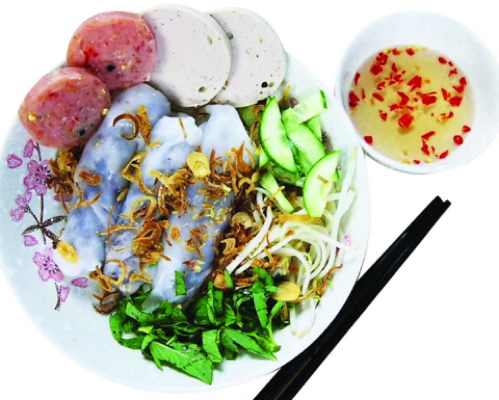
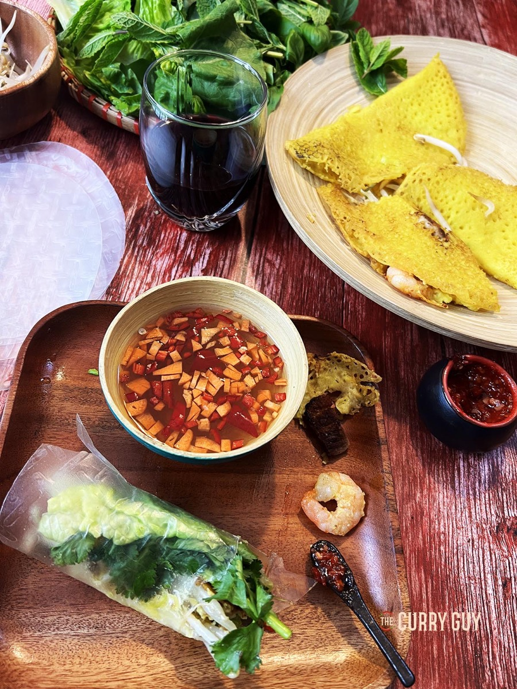
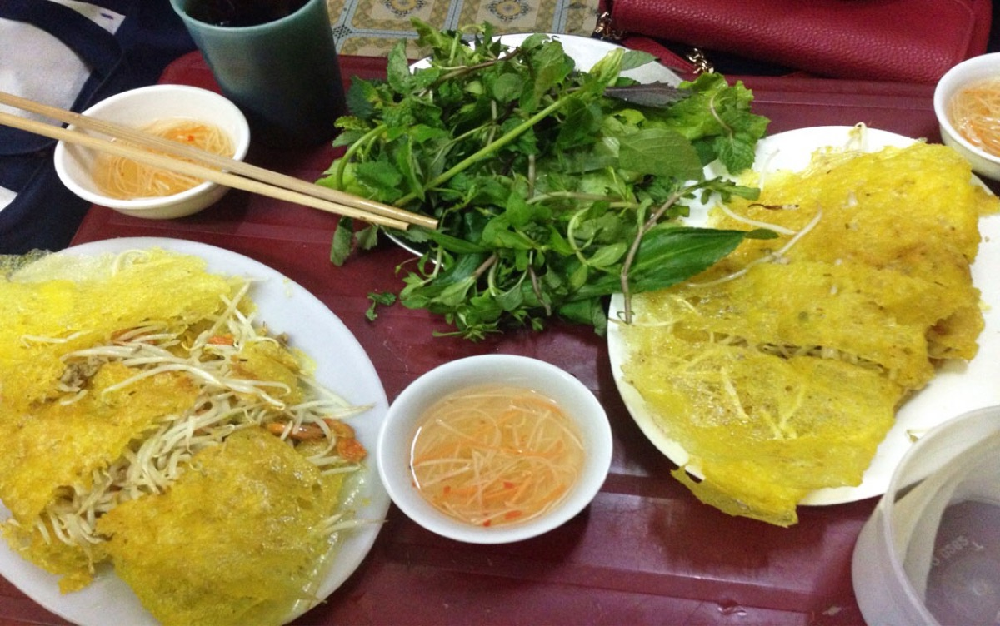
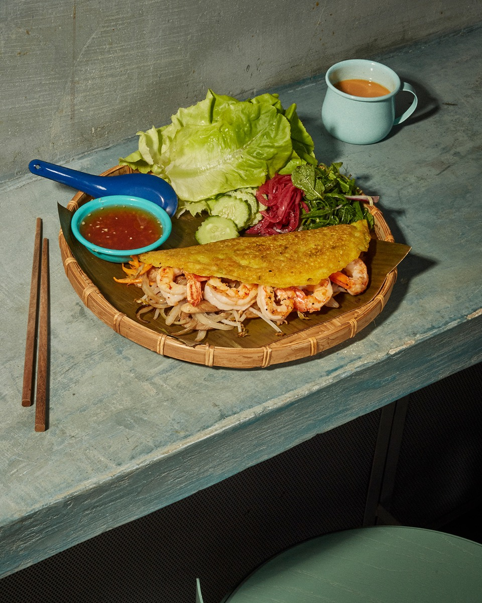

# Bánh Xèo and Tit Cha Ching

<table>
  <tr>
    <td>
      
    </td>
    <td>
      
    </td>
  </tr>
  <tr>
    <td>
      
    </td>
    <td>
      
    </td>
  </tr>
</table>

## Background

Bánh xèo is a crisp Vietnamese rice-flour pancake named for the sizzling sound the batter makes in the pan.
This version pairs it with "Tit Cha Ching," the family name used here for red-marinated fried pork, or thịt
chả chiên.

## Ingredients

### Tit Cha Ching

- 450 g pork shoulder, cut into thin strips
- 1 tablespoon fish sauce
- 1 tablespoon sugar
- 1 tablespoon soy sauce
- 2 garlic cloves, minced
- 1 teaspoon paprika
- 1/2 teaspoon five-spice powder
- 1 tablespoon neutral oil

### Pancakes and serving

- 200 g rice flour
- 1 teaspoon turmeric
- 1/2 teaspoon salt
- 400 ml coconut milk
- 200 ml water
- 4 scallions, sliced
- 200 g bean sprouts
- Neutral oil, for frying
- Lettuce, mint, cilantro, and prepared nước chấm

## How to cook

1. Mix the pork with fish sauce, sugar, soy sauce, garlic, paprika, and five-spice. Marinate for 30 minutes.
2. Whisk rice flour, turmeric, salt, coconut milk, water, and scallions into a thin batter. Rest for 20
   minutes.
3. Fry the pork in oil over medium-high heat until browned and cooked through; keep warm.
4. Oil a hot nonstick skillet, pour in a thin layer of batter, and scatter over pork and bean sprouts. Cover
   for 1 minute, then uncover and cook until crisp. Fold in half and repeat.
5. Wrap pieces in lettuce with herbs and dip in nước chấm.
