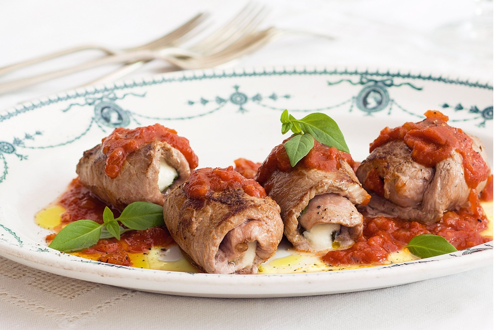
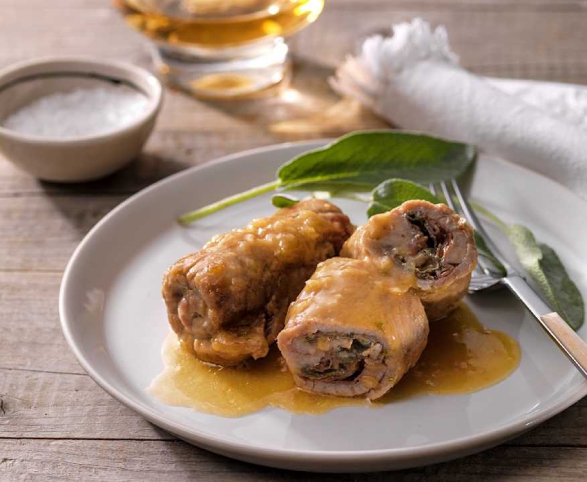
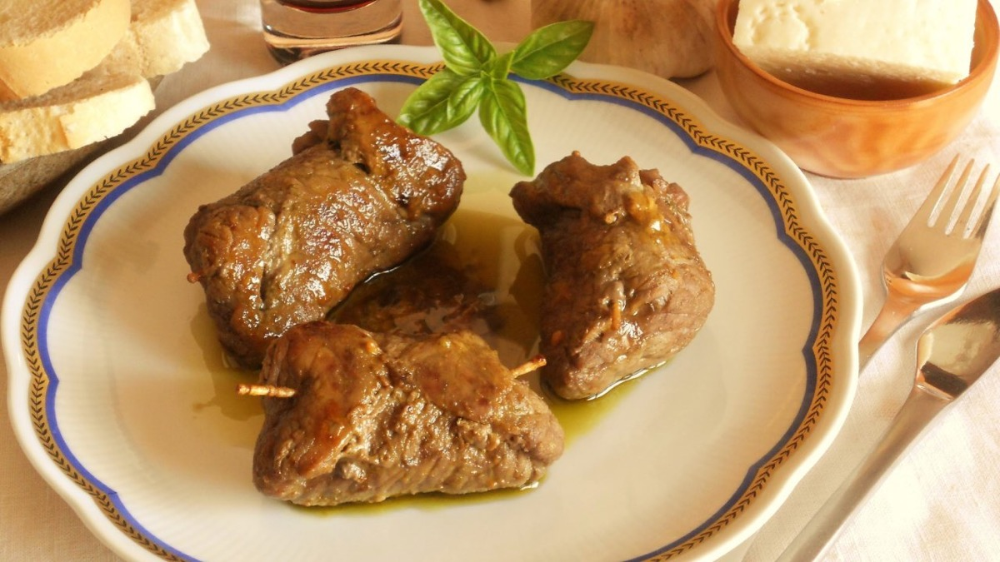
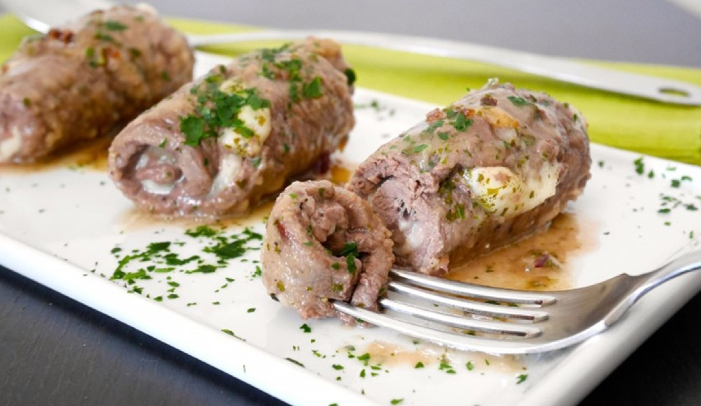

# Italian Beef Involtini

<table>
  <tr>
    <td>
      
    </td>
    <td>
      
    </td>
  </tr>
  <tr>
    <td>
      
    </td>
    <td>
      
    </td>
  </tr>
</table>

## Background

Involtini are Italian rolls made by wrapping thin slices of meat or vegetables around a filling. Beef versions
vary by region and household; southern preparations are often simmered in tomato sauce and may be called
braciole.

## Ingredients

- 8 thin beef cutlets, about 700 g total
- Salt and black pepper
- 60 g fine breadcrumbs
- 40 g grated Pecorino or Parmesan
- 2 garlic cloves, minced
- 3 tablespoons chopped parsley
- 2 tablespoons olive oil
- 1 small onion, chopped
- 800 g canned crushed tomatoes
- 120 ml dry red wine
- Kitchen twine or toothpicks

## How to cook

1. Pound beef to 3 mm. Season, then cover each slice with breadcrumbs, cheese, half the garlic, and parsley.
   Roll tightly and secure.
2. Brown the rolls in olive oil in a Dutch oven; transfer to a plate. Soften onion and remaining garlic.
3. Add wine and reduce by half. Add tomatoes and return the rolls to the pot.
4. Cover and simmer gently for 60 to 75 minutes, until tender. Remove twine or toothpicks before serving with
   sauce.
