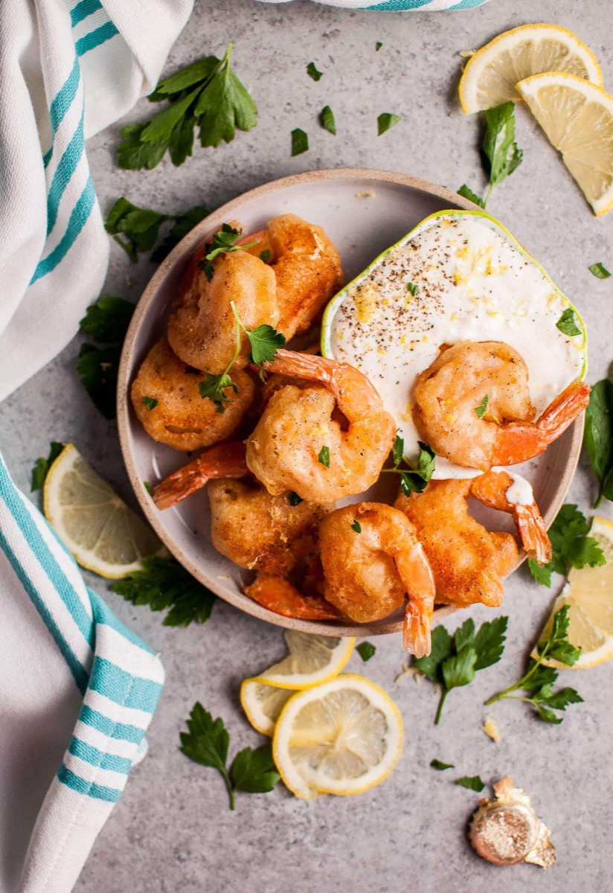
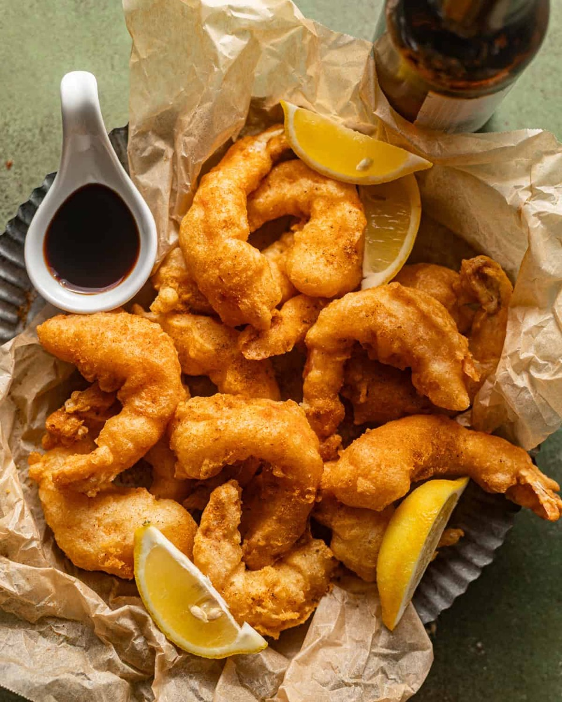
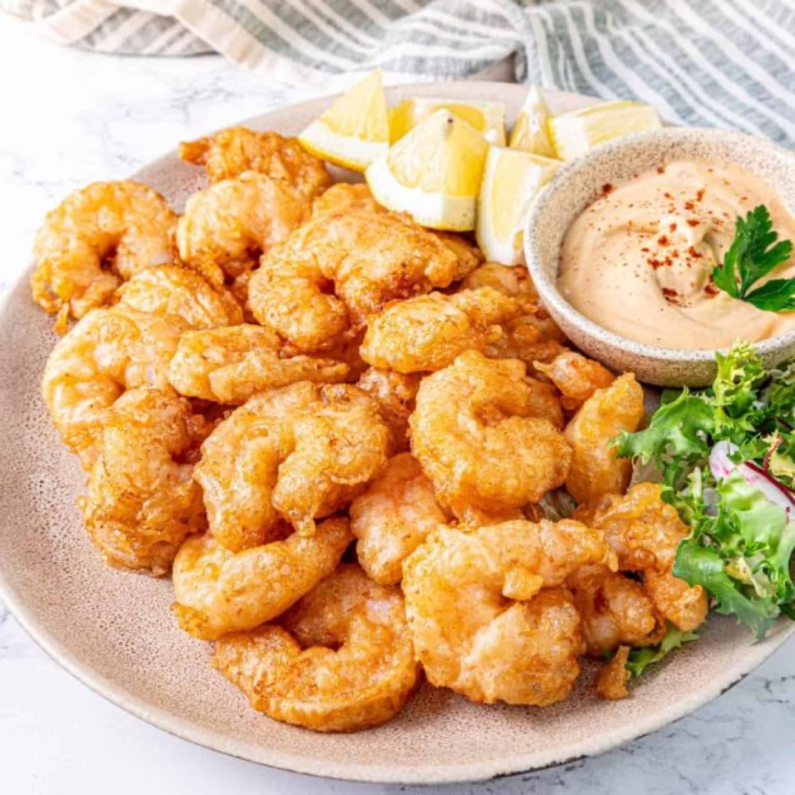
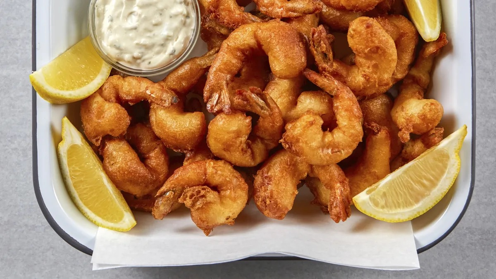

# Beer-Fried Shrimp

<table>
  <tr>
    <td>
      
    </td>
    <td>
      
    </td>
  </tr>
  <tr>
    <td>
      
    </td>
    <td>
      
    </td>
  </tr>
</table>

## Background

Beer batter is a European and North American frying technique related to the batter used for fish and chips.
Its carbonation and alcohol help produce a light, crisp shell around quickly cooked shrimp.

## Ingredients

- 700 g large shrimp, peeled and deveined
- 125 g all-purpose flour, plus 60 g for dredging
- 30 g cornstarch
- 1 teaspoon baking powder
- 1 teaspoon salt
- 240 ml very cold pale lager
- Neutral oil, for deep-frying
- Lemon wedges and tartar or cocktail sauce, for serving

## How to cook

1. Pat the shrimp very dry. Heat 5 cm of oil in a heavy pot to 180°C.
2. Whisk 125 g flour, cornstarch, baking powder, and salt. Stir in the cold beer only until combined; small
   lumps are fine.
3. Dust shrimp in the reserved flour, dip in batter, and fry in small batches for 2 to 3 minutes until crisp
   and opaque. Keep the oil near 180°C.
4. Drain on a rack, season with salt, and serve immediately with lemon and sauce.
