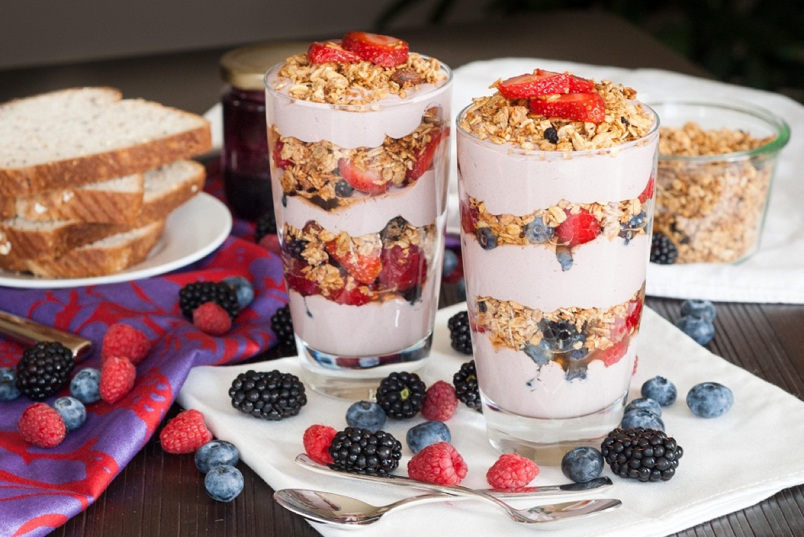
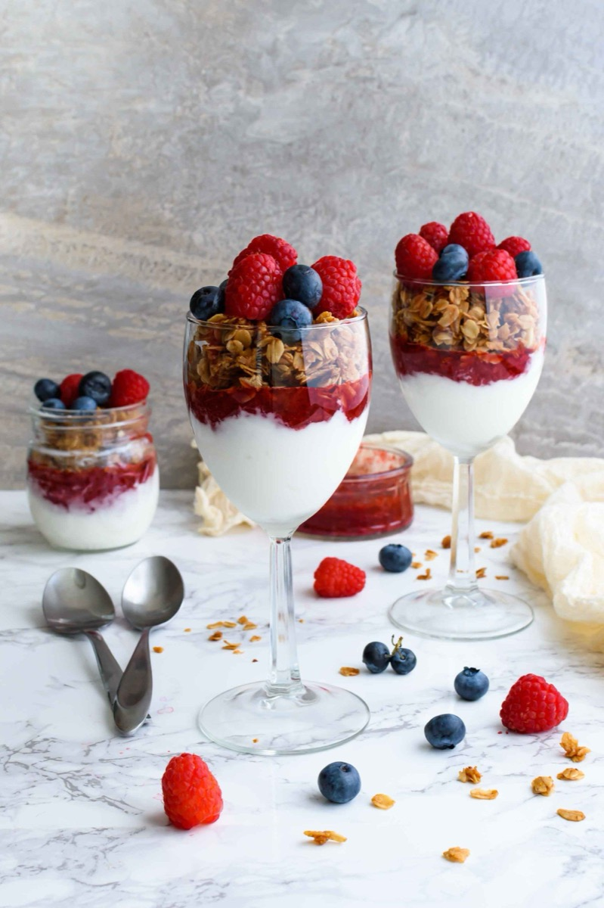
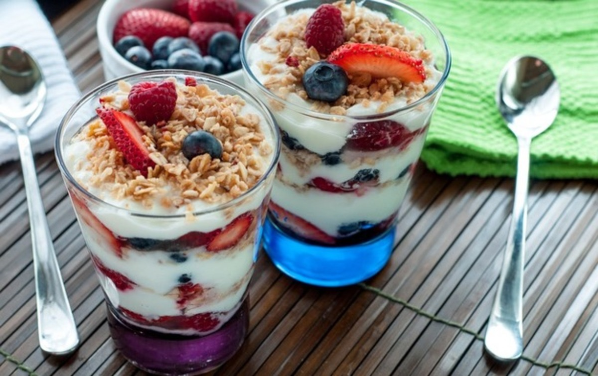

# Berry Yogurt Parfaits

<table>
  <tr>
    <td>
      
    </td>
    <td>
      
    </td>
  </tr>
  <tr>
    <td>
      
    </td>
    <td>
      
    </td>
  </tr>
</table>

## Background

American breakfast parfaits adapt the layered French dessert format to yogurt, fruit, and granola. They require
no cooking and are best assembled shortly before eating so the granola stays crisp.

## Ingredients

- 700 g plain or vanilla Greek yogurt
- 300 g mixed berries
- 160 g granola
- 2 tablespoons honey

## How to cook

1. Spoon a layer of yogurt into four glasses or bowls.
2. Add berries and granola, then repeat the layers.
3. Drizzle with honey and serve immediately. Keep components separate if preparing ahead.
