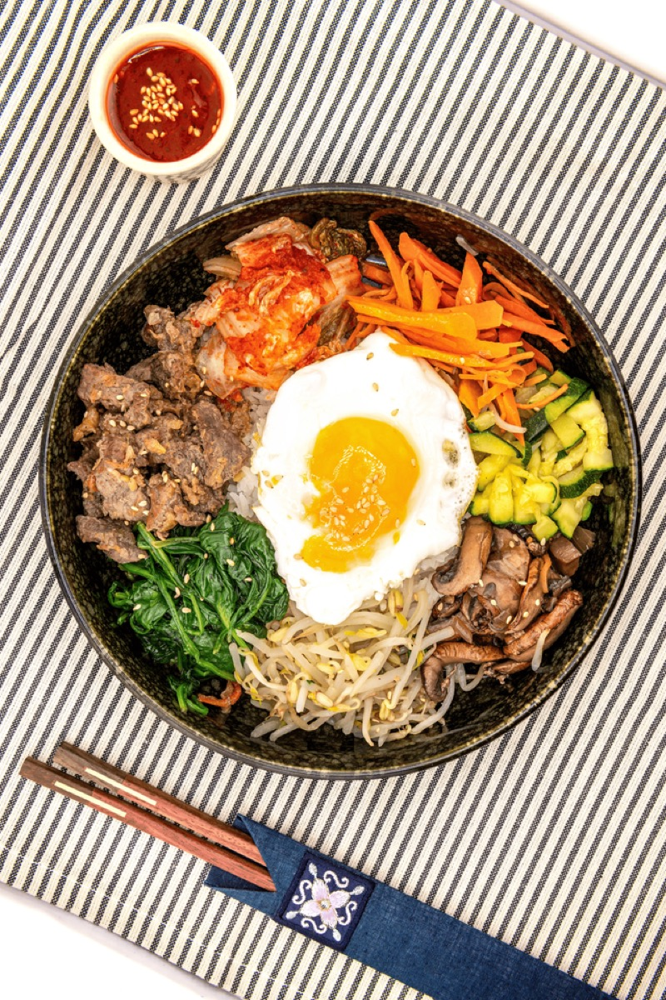
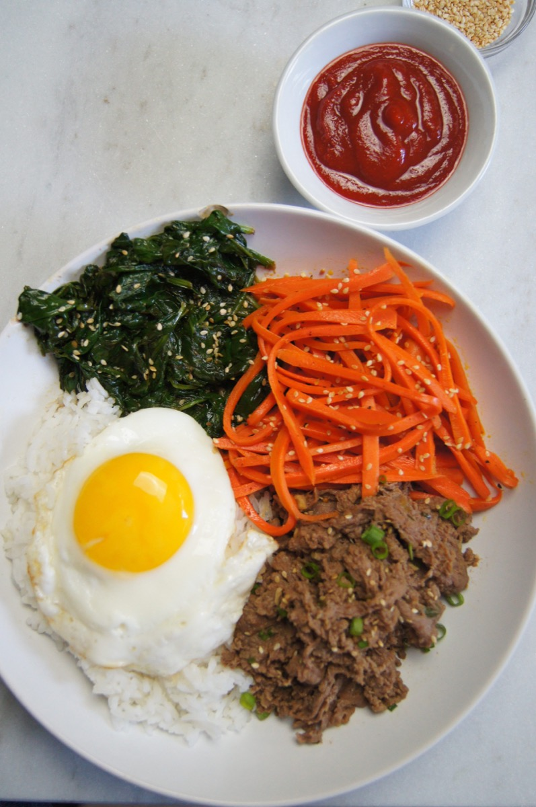
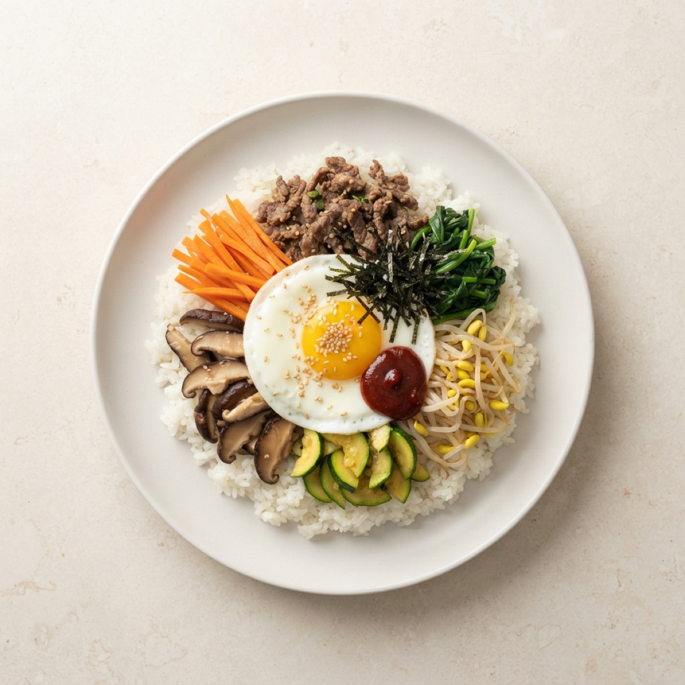
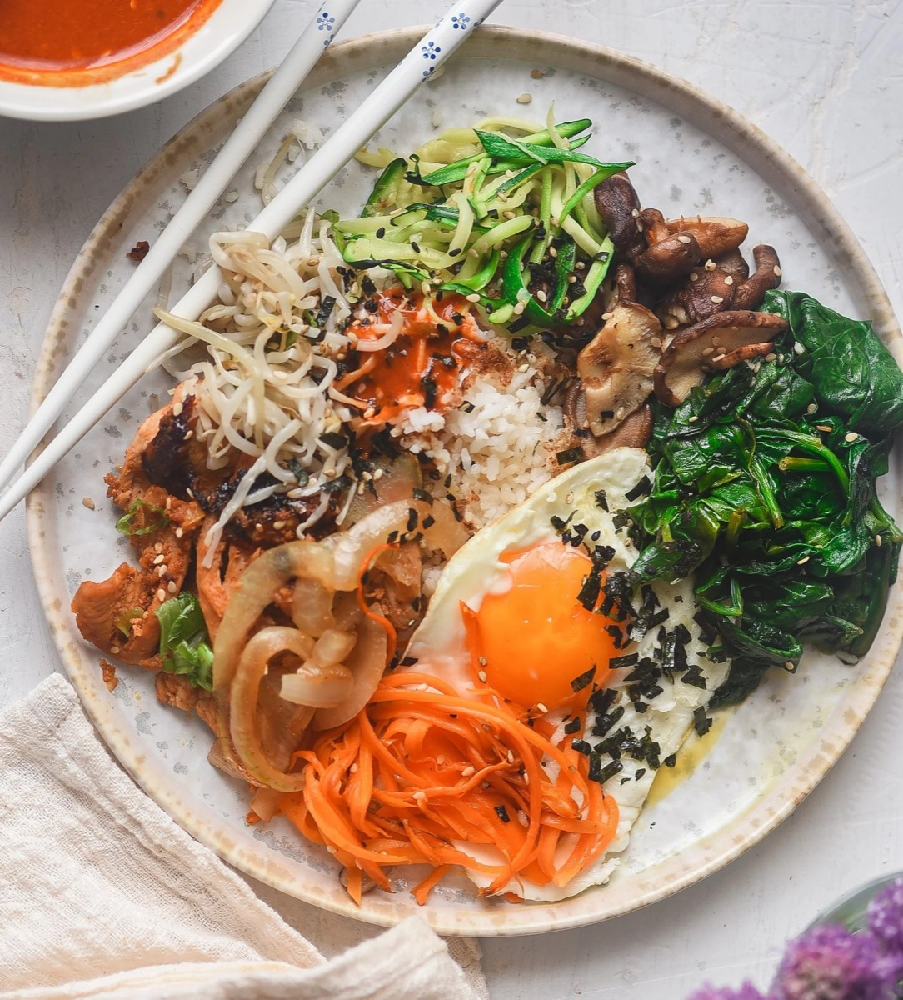

# Bibimbap

<table>
  <tr>
    <td>
      
    </td>
    <td>
      
    </td>
  </tr>
  <tr>
    <td>
      
    </td>
    <td>
      
    </td>
  </tr>
</table>

## Background

Bibimbap means "mixed rice" in Korean. Regional versions vary, but the dish characteristically brings rice,
seasoned vegetables, meat, egg, and chile paste together in one bowl to be mixed at the table.

## Ingredients

- 600 g cooked short-grain rice
- 250 g thinly sliced beef
- 1 tablespoon soy sauce
- 1 teaspoon sesame oil
- 2 garlic cloves, minced and divided
- 1 carrot, julienned
- 1 zucchini, julienned
- 200 g spinach
- 200 g bean sprouts
- 4 eggs
- 4 tablespoons gochujang
- Sesame seeds and neutral oil

## How to cook

1. Marinate beef with soy sauce, sesame oil, and half the garlic for 15 minutes, then sear until browned.
2. Sauté the carrot and zucchini separately with a little oil and salt. Blanch spinach and sprouts separately;
   drain well and season each with garlic, sesame oil, and salt.
3. Fry the eggs sunny-side up.
4. Divide hot rice among bowls. Arrange beef and vegetables in separate groups, top with an egg, and serve with
   gochujang and sesame seeds. Mix thoroughly before eating.
