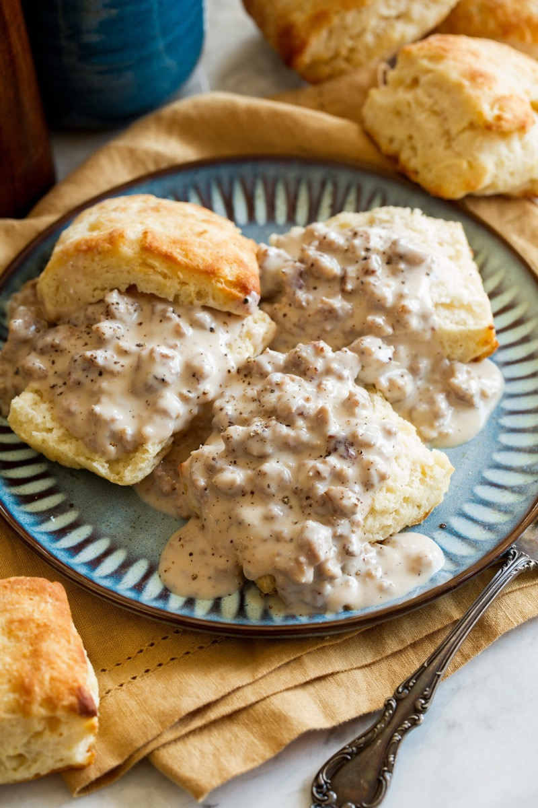
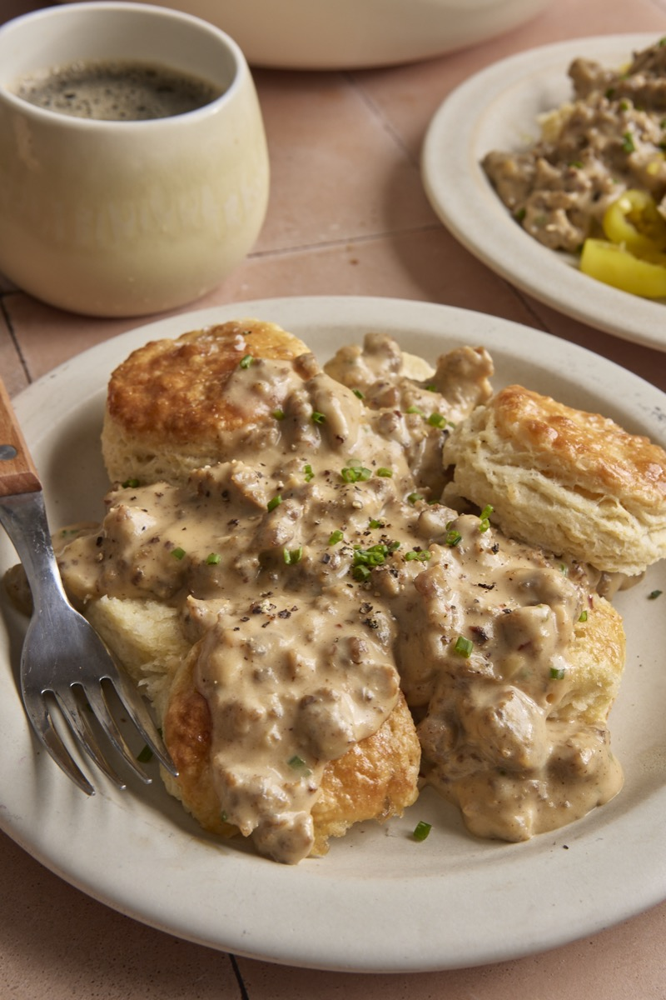
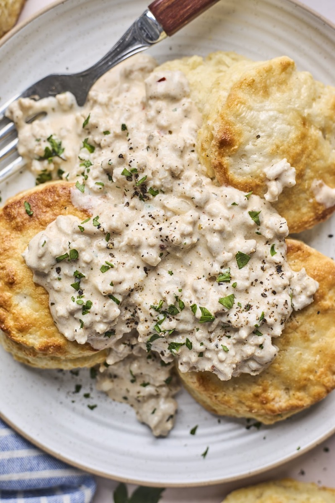
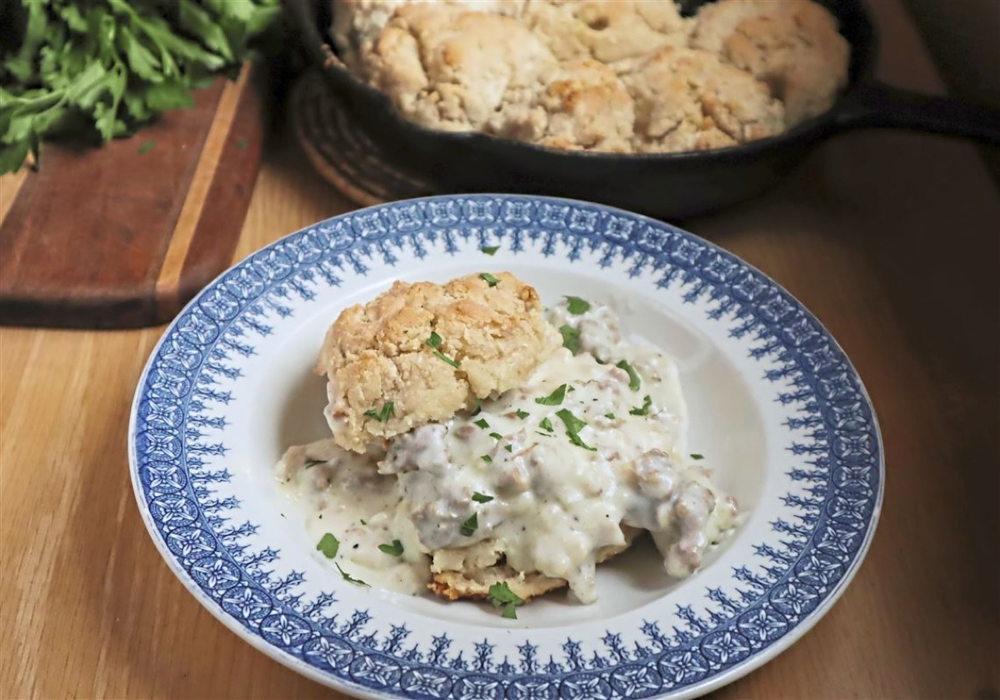

# Biscuits and Sausage Gravy

<table>
  <tr>
    <td>
      
    </td>
    <td>
      
    </td>
  </tr>
  <tr>
    <td>
      
    </td>
    <td>
      
    </td>
  </tr>
</table>

## Background

Biscuits with creamy sausage gravy are strongly associated with the American South and Appalachia. The dish
turns breakfast sausage drippings, flour, and milk into a substantial sauce for tender biscuits.

## Ingredients

- 8 warm buttermilk biscuits
- 450 g breakfast sausage
- 40 g all-purpose flour
- 700 ml milk
- Salt, black pepper, and a pinch of cayenne

## How to cook

1. Brown sausage in a skillet, breaking it into small pieces; leave about 3 tablespoons fat in the pan.
2. Stir in flour for 1 minute. Gradually add milk, stirring, and simmer until thick.
3. Season generously with pepper. Split biscuits and spoon gravy over them.
