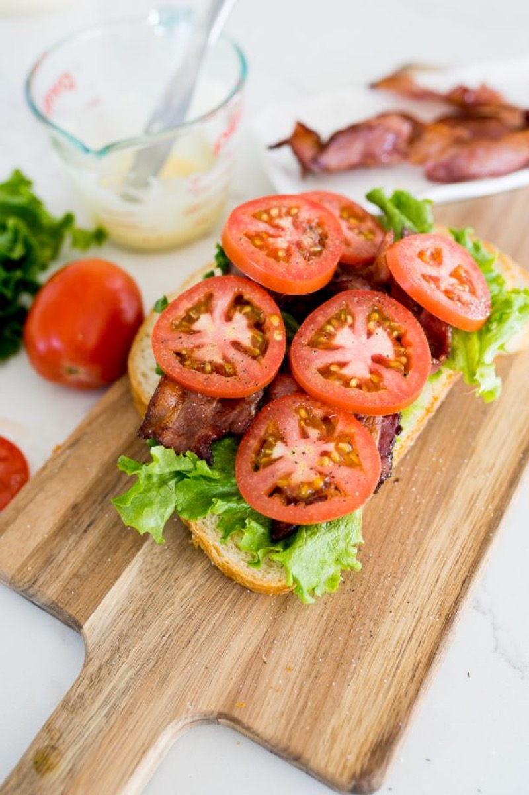
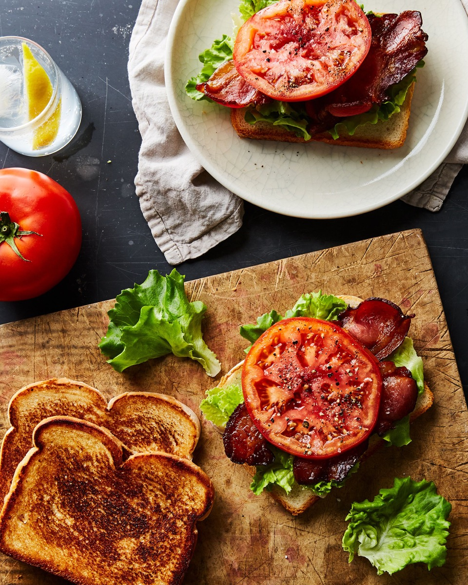
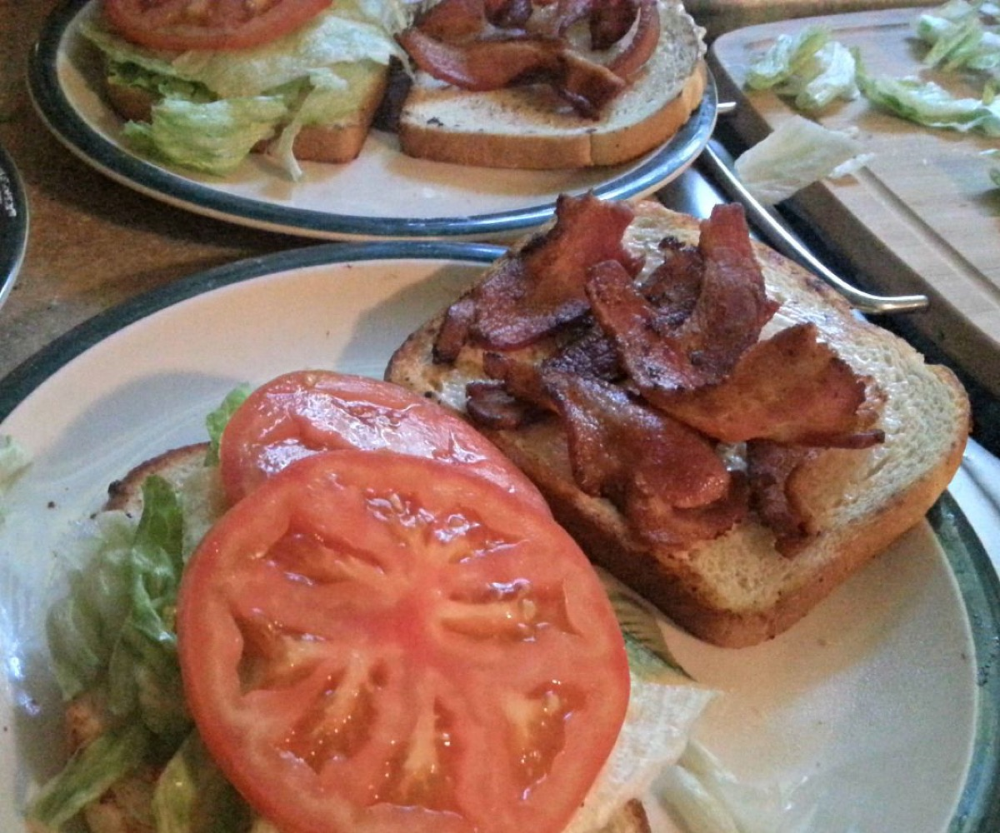
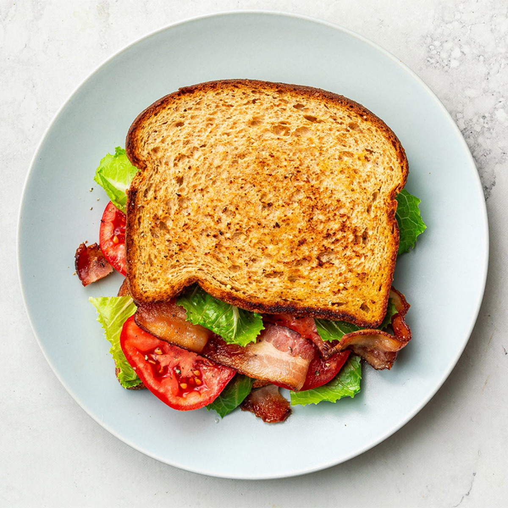

# BLT

<table>
  <tr>
    <td>
      
    </td>
    <td>
      
    </td>
  </tr>
  <tr>
    <td>
      
    </td>
    <td>
      
    </td>
  </tr>
</table>

## Background

The bacon, lettuce, and tomato sandwich developed in the United States from earlier bacon sandwiches. The
initials "BLT" became common shorthand after World War II, when lettuce and tomatoes became available more
widely year-round.

## Ingredients

- 12 slices bacon
- 8 slices sturdy sandwich bread
- 4 tablespoons mayonnaise
- 1 large ripe tomato, sliced
- 8 crisp lettuce leaves
- Salt and black pepper

## How to cook

1. Cook the bacon in a skillet over medium heat, turning occasionally, until crisp. Drain on a rack or paper
   towels.
2. Toast the bread lightly and spread one side of every slice with mayonnaise.
3. Layer lettuce, tomato, salt, pepper, and bacon on four slices. Close with the remaining bread, cut in half,
   and serve promptly.
