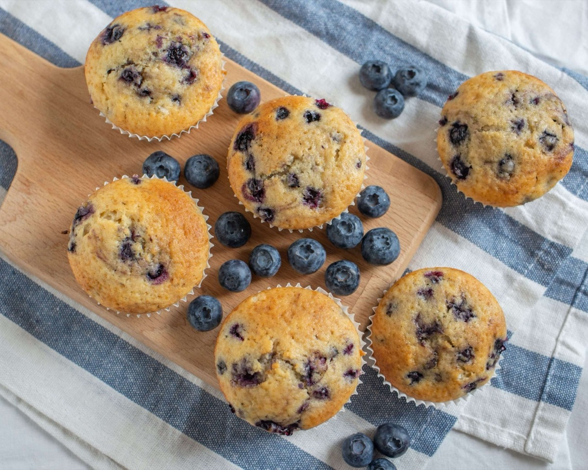
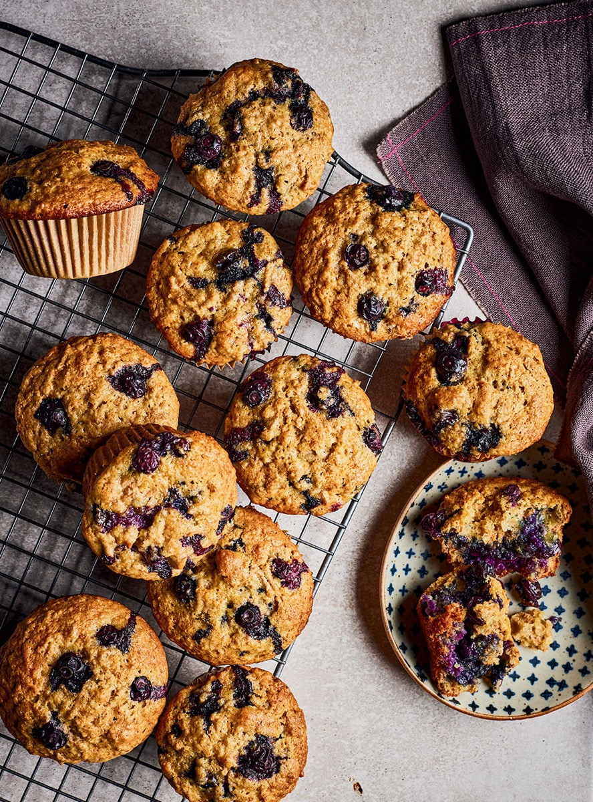
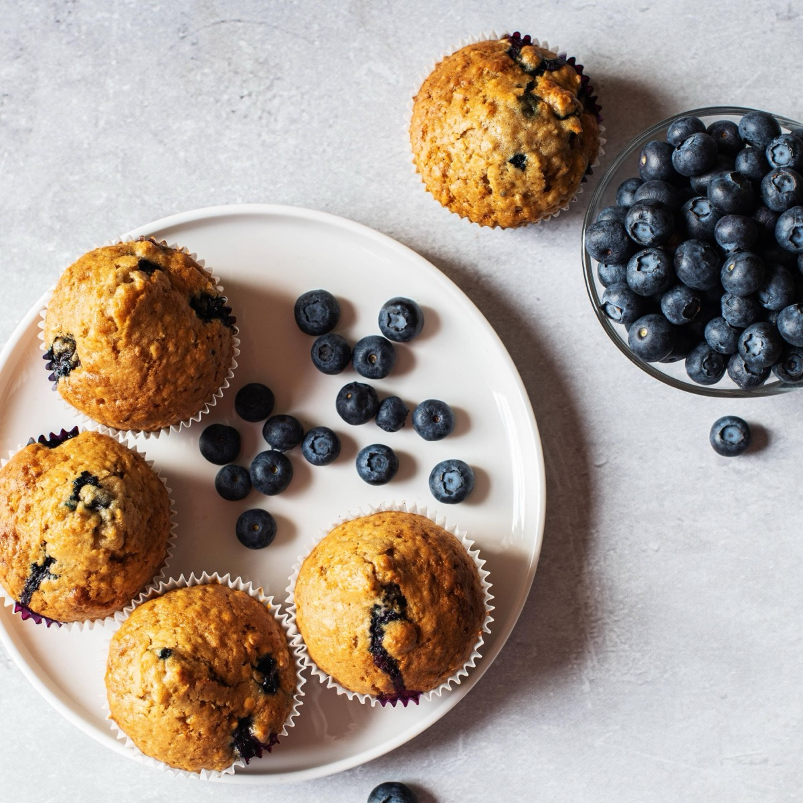
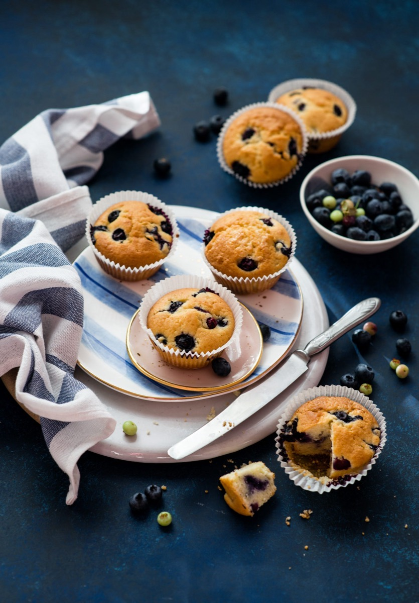

# Blueberry Muffins

<table>
  <tr>
    <td>
      
    </td>
    <td>
      
    </td>
  </tr>
  <tr>
    <td>
      
    </td>
    <td>
      
    </td>
  </tr>
</table>

## Background

Blueberry muffins are a familiar American quick bread, especially in regions where blueberries grow abundantly.
Baking powder allows them to rise without yeast, making them practical for breakfast.

## Ingredients

- 250 g all-purpose flour
- 150 g sugar
- 2 teaspoons baking powder
- 1/2 teaspoon salt
- 120 ml neutral oil
- 2 eggs
- 180 ml milk
- 1 teaspoon vanilla
- 200 g blueberries

## How to cook

1. Heat the oven to 190°C and line a 12-cup muffin pan.
2. Mix dry ingredients. Whisk oil, eggs, milk, and vanilla; fold into dry ingredients, then fold in berries.
3. Divide among cups and bake for 18 to 22 minutes, until a tester comes out clean.
