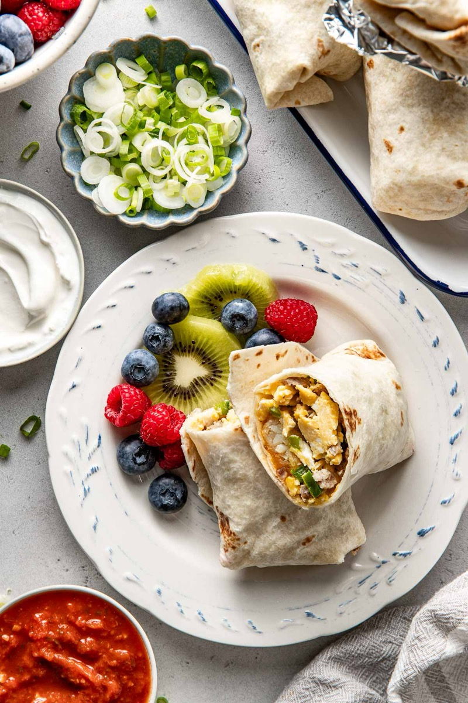
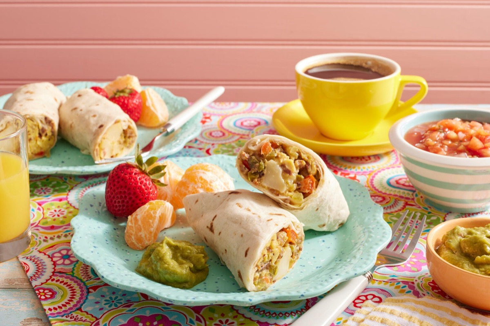
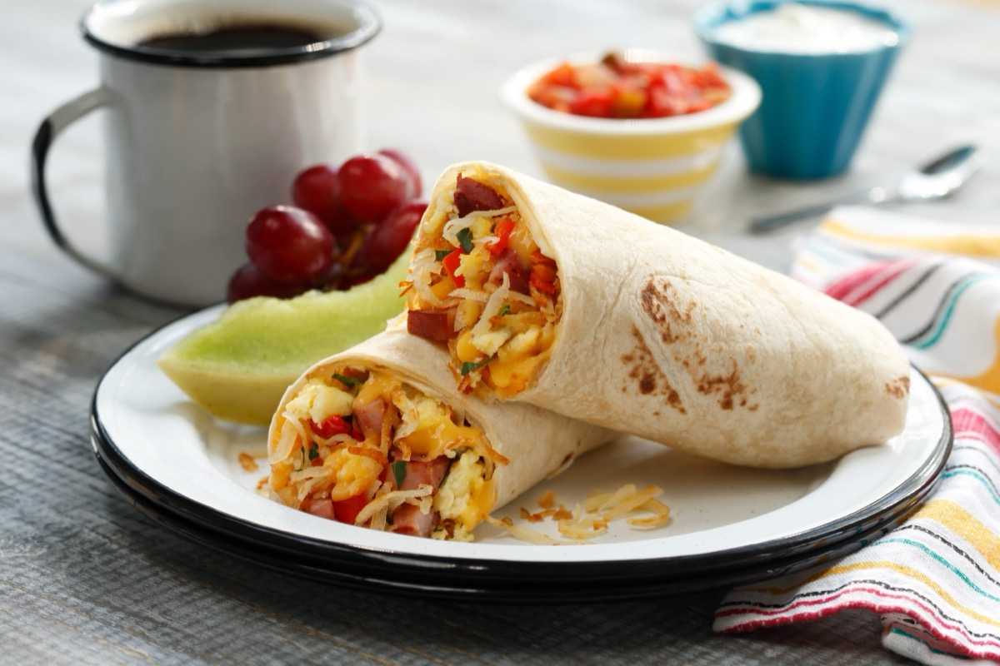
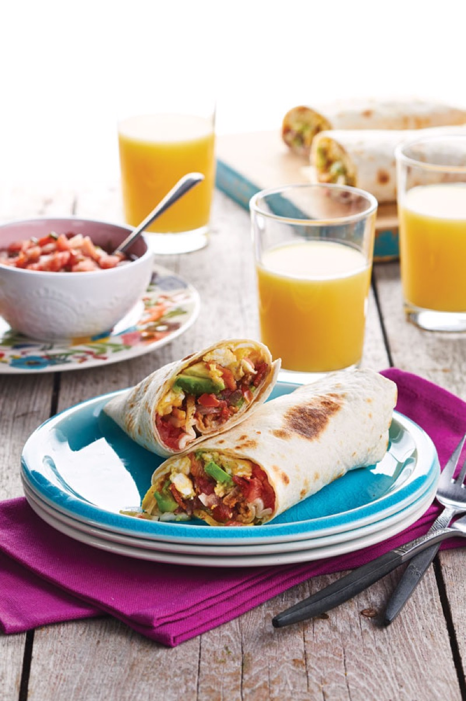

# Breakfast Burritos

<table>
  <tr>
    <td>
      
    </td>
    <td>
      
    </td>
  </tr>
  <tr>
    <td>
      
    </td>
    <td>
      
    </td>
  </tr>
</table>

## Background

The breakfast burrito is associated particularly with the American Southwest and New Mexico. A flour tortilla
wraps eggs, potatoes, cheese, and salsa into a portable morning meal.

## Ingredients

- 4 large flour tortillas
- 8 eggs
- 300 g cooked diced potatoes
- 120 g grated cheddar
- 120 ml salsa
- 2 tablespoons butter
- Salt and pepper

## How to cook

1. Warm tortillas. Crisp cooked potatoes in half the butter.
2. Softly scramble seasoned eggs in remaining butter.
3. Divide potatoes, eggs, cheese, and salsa among tortillas. Fold in the sides and roll tightly.
