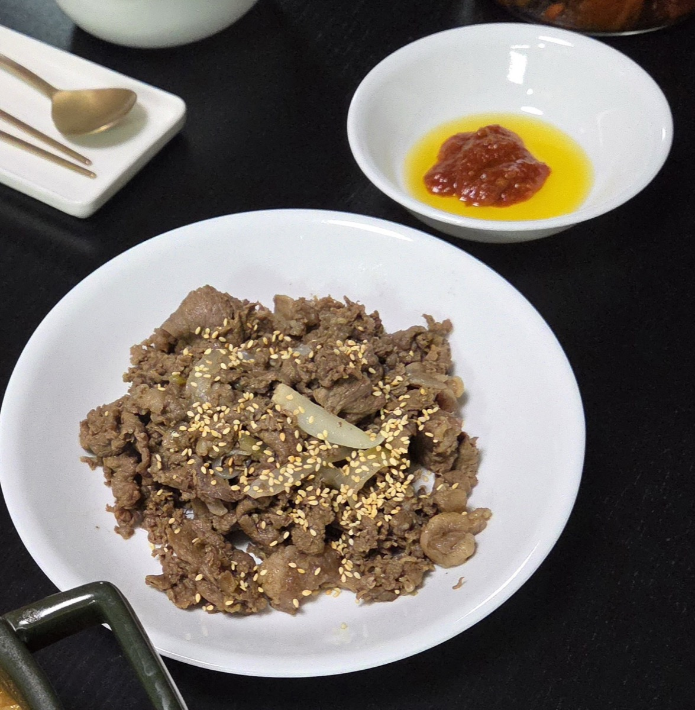
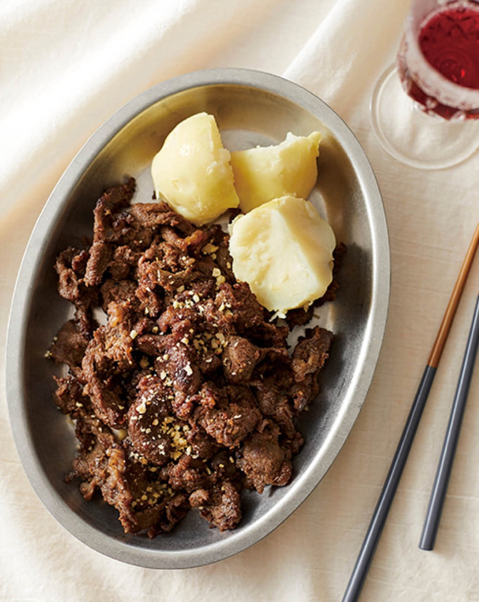
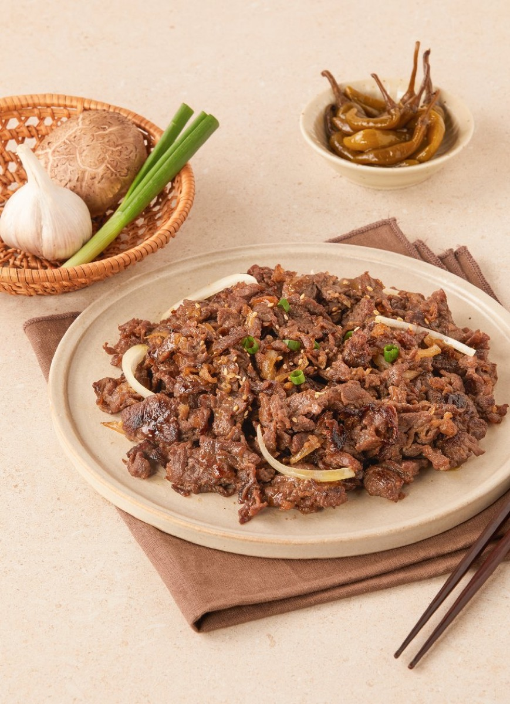
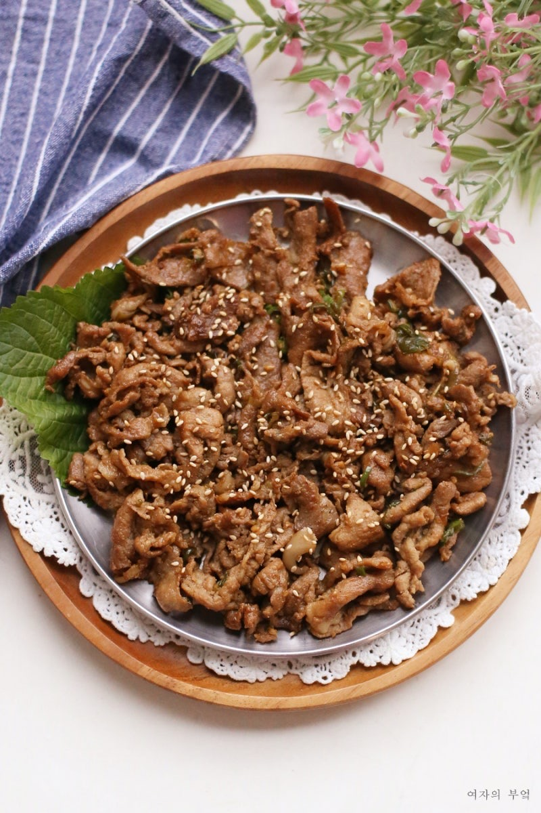

# Bulgogi

<table>
  <tr>
    <td>
      
    </td>
    <td>
      
    </td>
  </tr>
  <tr>
    <td>
      
    </td>
    <td>
      
    </td>
  </tr>
</table>

## Background

Bulgogi, meaning "fire meat," is a Korean dish of thinly sliced, marinated beef. Its ancestors date to ancient
Korean grilled-meat dishes; the sweet-savory version familiar today became especially popular in the twentieth
century.

## Ingredients

- 700 g rib-eye or sirloin, very thinly sliced
- 1 small Asian pear, grated
- 4 tablespoons soy sauce
- 2 tablespoons brown sugar
- 1 tablespoon toasted sesame oil
- 3 garlic cloves, minced
- 1 teaspoon grated ginger
- 4 scallions, sliced
- 1 tablespoon neutral oil
- 1 teaspoon sesame seeds

## How to cook

1. Mix pear, soy sauce, sugar, sesame oil, garlic, ginger, and half the scallions. Add the beef and marinate
   for 30 minutes or refrigerate for up to 4 hours.
2. Heat a wide skillet or grill until very hot. Cook the beef in uncrowded batches for 2 to 3 minutes, turning
   once, until browned and just cooked.
3. Garnish with sesame seeds and the remaining scallions. Serve with steamed rice and lettuce leaves.
