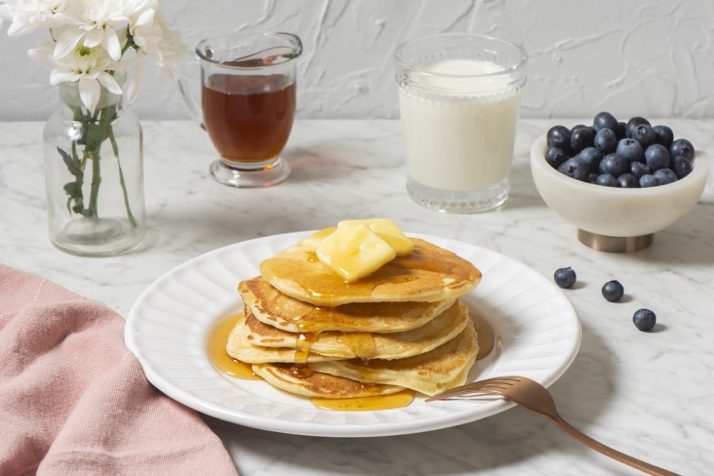
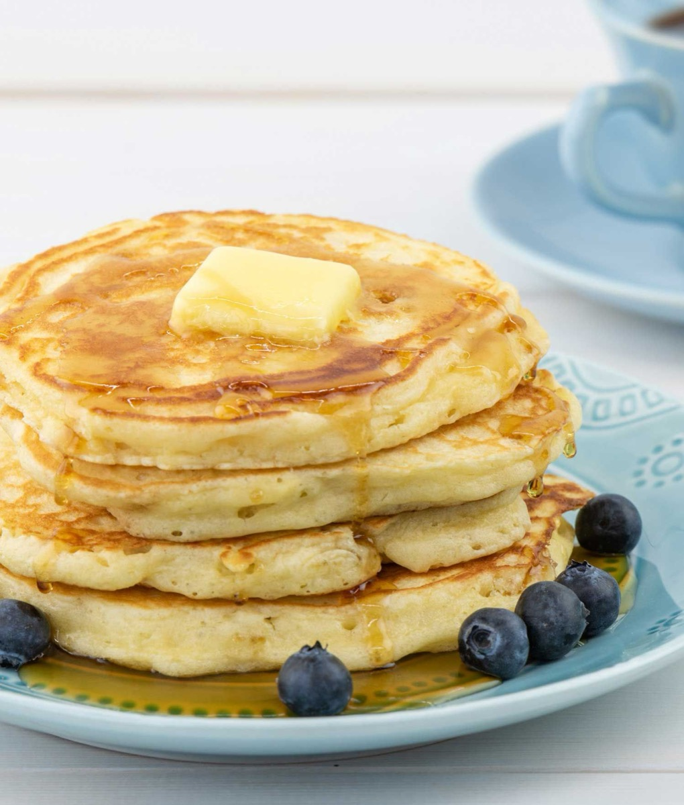
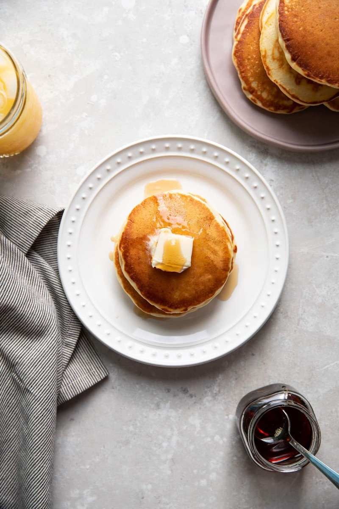
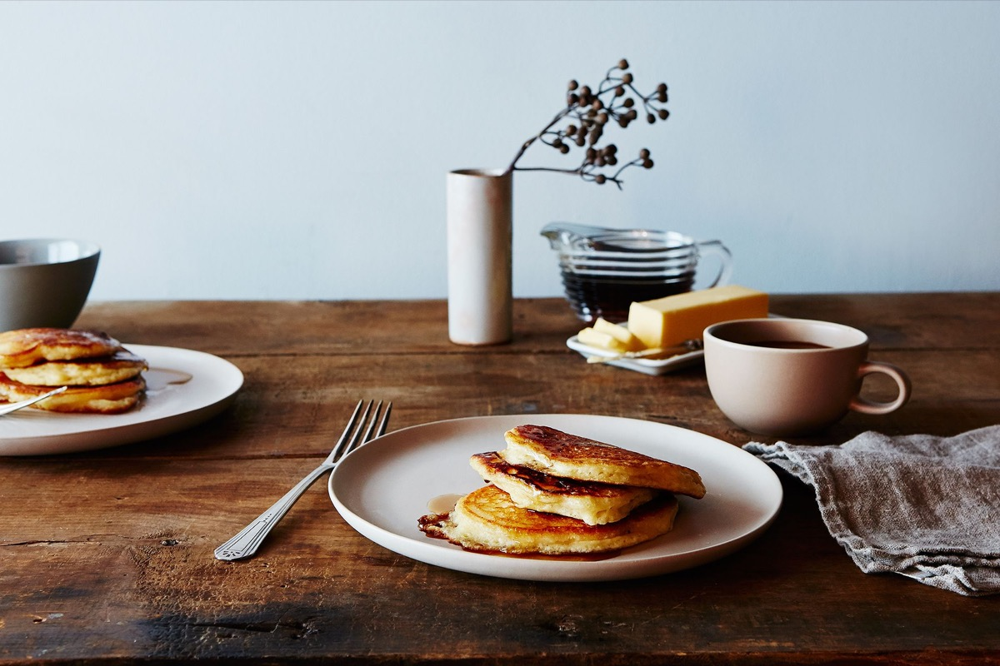

# Buttermilk Pancakes

<table>
  <tr>
    <td>
      
    </td>
    <td>
      
    </td>
  </tr>
  <tr>
    <td>
      
    </td>
    <td>
      
    </td>
  </tr>
</table>

## Background

Griddle cakes have long histories in many cultures. Fluffy, baking-soda-leavened buttermilk pancakes became a
classic American breakfast, valued for their tender crumb and tangy flavor.

## Ingredients

- 250 g all-purpose flour
- 2 tablespoons sugar
- 1 teaspoon baking powder
- 1/2 teaspoon baking soda
- 1/2 teaspoon salt
- 480 ml buttermilk
- 2 eggs
- 60 g melted butter

## How to cook

1. Whisk dry ingredients. Whisk buttermilk, eggs, and butter separately, then combine just until lumpy.
2. Rest for 5 minutes. Spoon onto a lightly greased medium-hot griddle.
3. Flip when bubbles hold open and edges look dry; cook until golden.
