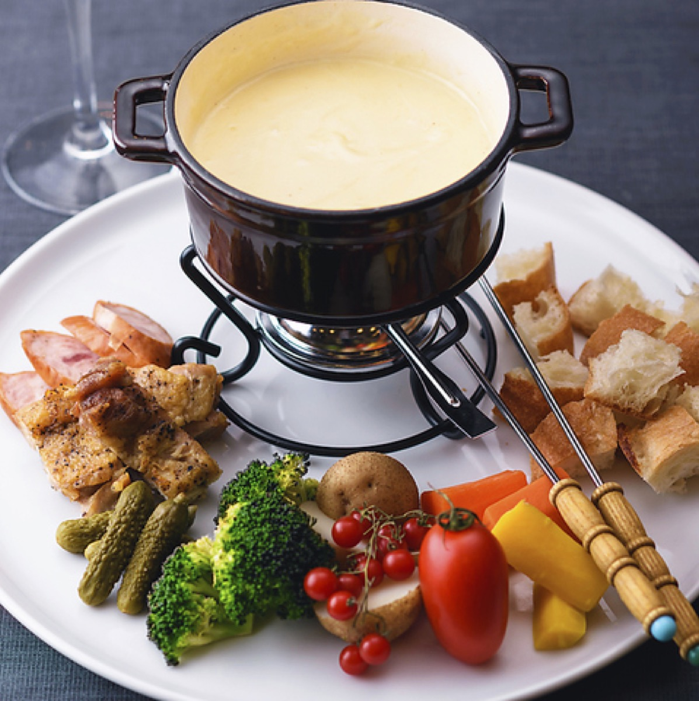
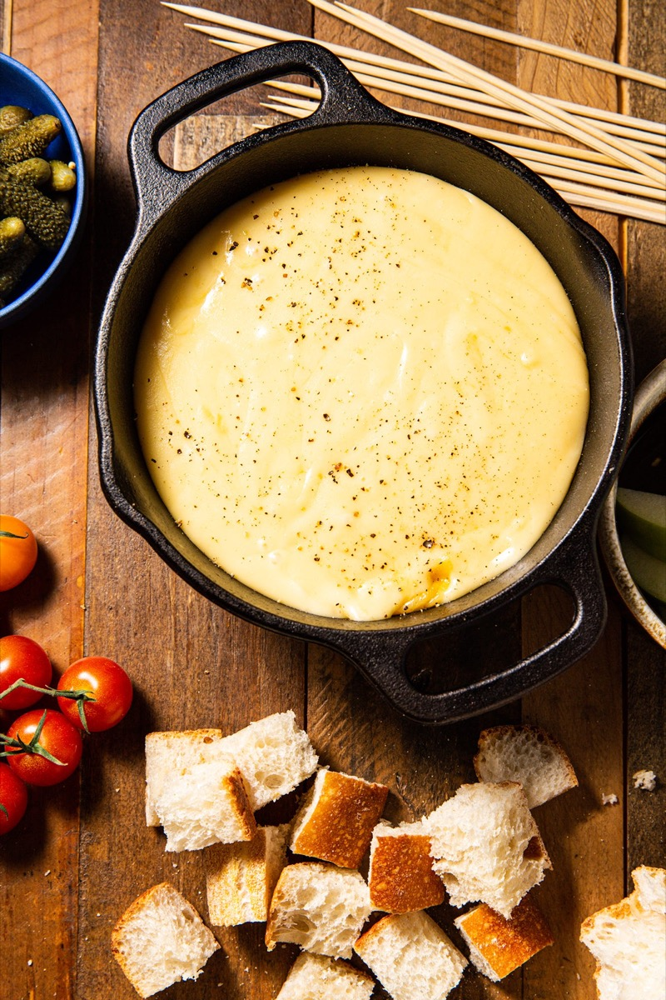
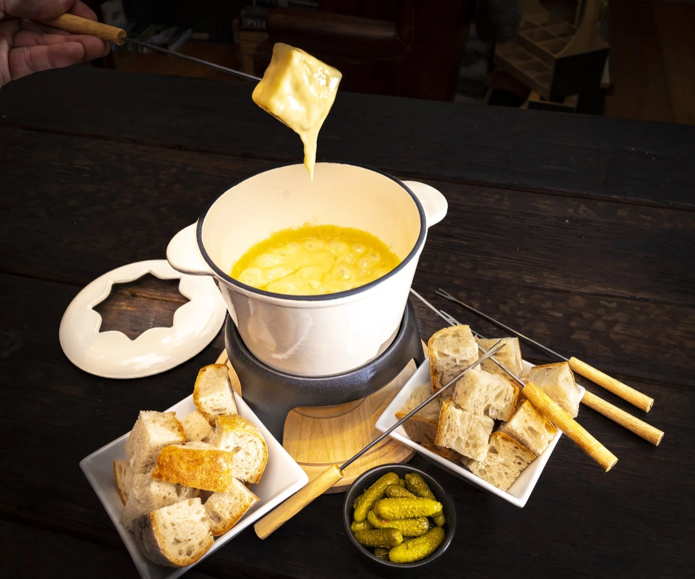

# Cheese Fondue

<table>
  <tr>
    <td>
      
    </td>
    <td>
      
    </td>
  </tr>
  <tr>
    <td>
      
    </td>
    <td>
      
    </td>
  </tr>
</table>

## Background

Cheese fondue is associated with the Alpine regions of Switzerland, where melted cheese and wine offered a
warming way to use winter staples. It became an internationally recognized Swiss national dish in the twentieth
century.

## Ingredients

- 1 garlic clove, halved
- 300 g Gruyère, grated
- 300 g Emmental, grated
- 300 ml dry white wine
- 1 tablespoon lemon juice
- 1 tablespoon cornstarch
- 2 tablespoons kirsch, optional
- Black pepper and a pinch of nutmeg
- 1 crusty loaf, cut into cubes

## How to cook

1. Rub a fondue pot with garlic. Warm the wine and lemon juice until steaming but not boiling.
2. Add cheese a handful at a time, stirring in a figure eight until melted before adding more.
3. Mix cornstarch with kirsch, stir it into the cheese, and simmer gently until smooth and slightly thickened.
4. Season with pepper and nutmeg. Keep warm over a low burner and dip bread cubes with fondue forks.
