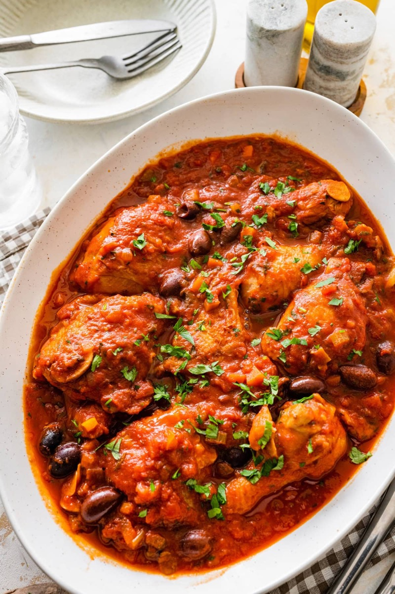
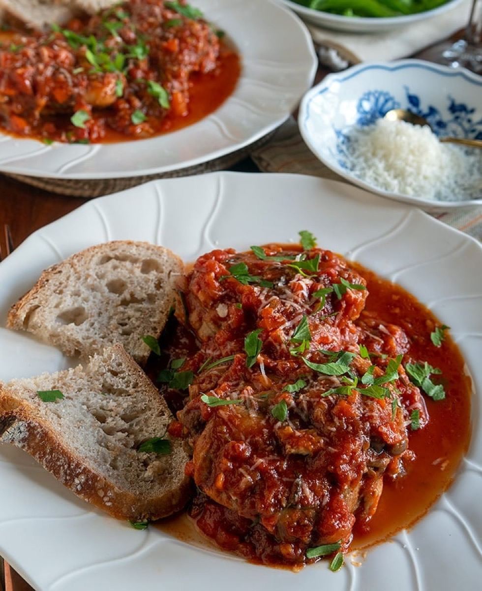
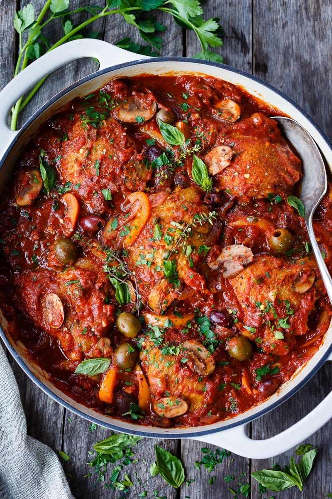
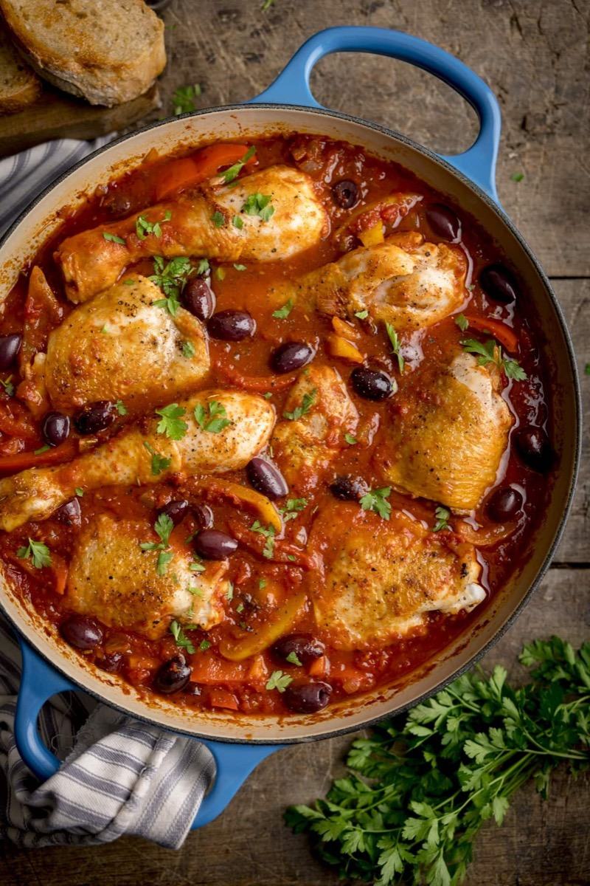

# Chicken Cacciatore

<table>
  <tr>
    <td>
      
    </td>
    <td>
      
    </td>
  </tr>
  <tr>
    <td>
      
    </td>
    <td>
      
    </td>
  </tr>
</table>

## Background

Cacciatore means "hunter-style" in Italian. Recipes vary, but chicken braised with tomato, wine, herbs, and
vegetables is a familiar home version.

## Ingredients

- 8 bone-in chicken thighs
- Salt, pepper, and 2 tablespoons olive oil
- 1 onion and 1 bell pepper, sliced
- 250 g mushrooms, sliced
- 2 garlic cloves, minced
- 120 ml red wine
- 800 g canned tomatoes
- Rosemary or oregano

## How to cook

1. Season and brown chicken in oil; remove. Soften onion, pepper, mushrooms, and garlic.
2. Add wine and reduce by half. Add tomatoes and herbs, then return chicken.
3. Cover and simmer for 30 minutes; uncover until thick and chicken reaches 74°C.
