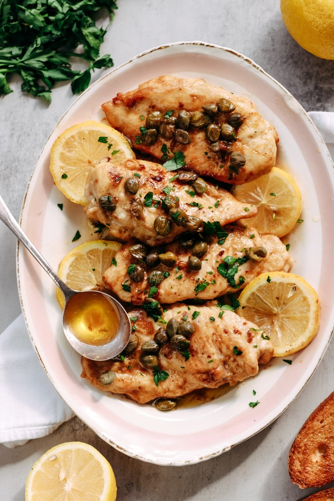
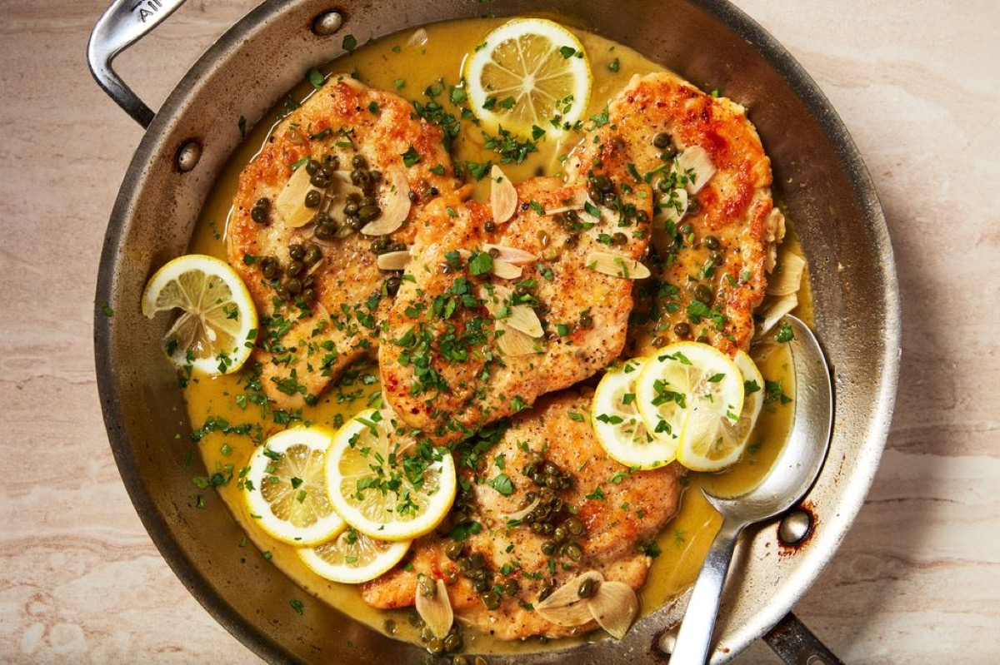
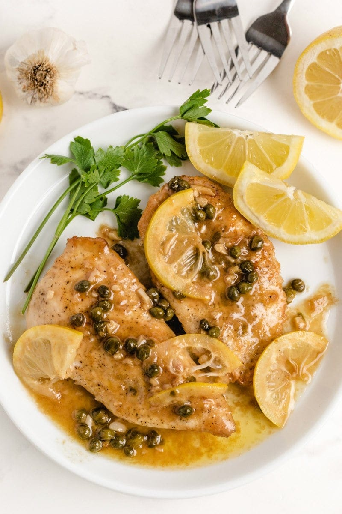
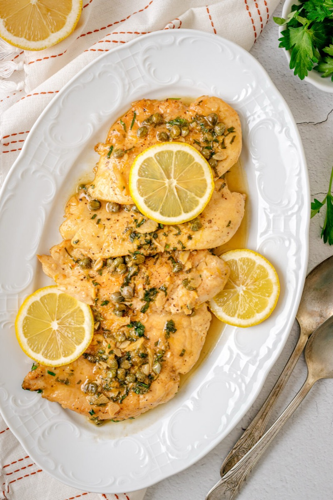

# Chicken Piccata

<table>
  <tr>
    <td>
      
    </td>
    <td>
      
    </td>
  </tr>
  <tr>
    <td>
      
    </td>
    <td>
      
    </td>
  </tr>
</table>

## Background

Chicken piccata is an Italian American adaptation of the Italian method of serving thin meat slices in a
piquant lemon and caper sauce. It cooks quickly because the chicken is pounded thin.

## Ingredients

- 4 chicken breasts, halved horizontally
- Salt, pepper, and 60 g flour
- 2 tablespoons olive oil
- 50 g butter, divided
- 120 ml chicken stock
- 60 ml lemon juice
- 2 tablespoons capers
- Chopped parsley

## How to cook

1. Season chicken and dust lightly with flour. Brown in oil and half the butter, 2 to 3 minutes per side;
   remove.
2. Add stock, lemon, and capers. Simmer and scrape up browned bits.
3. Return chicken until it reaches 74°C. Swirl in remaining butter and parsley.
