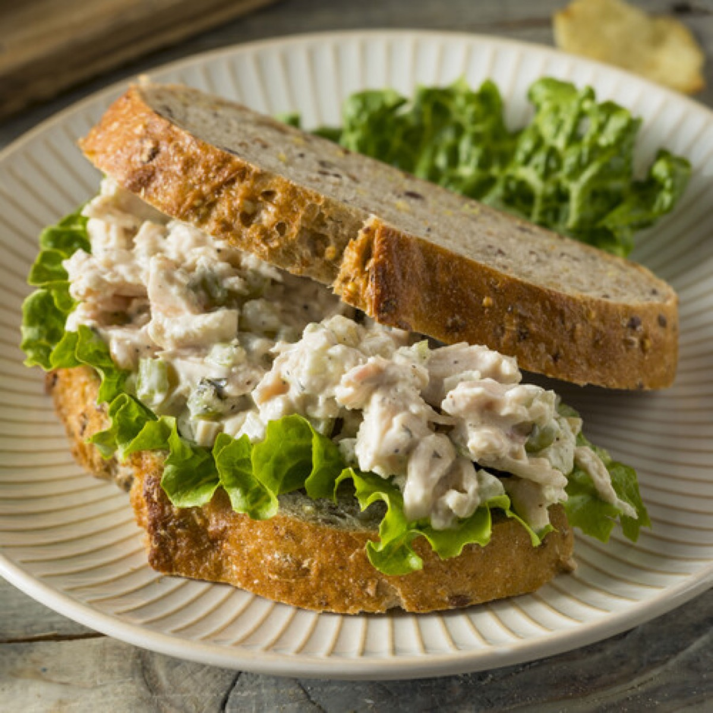
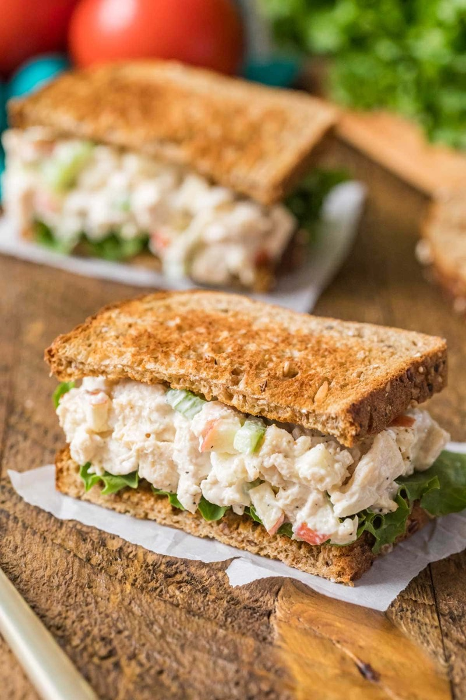
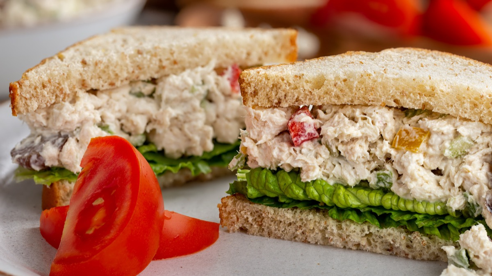
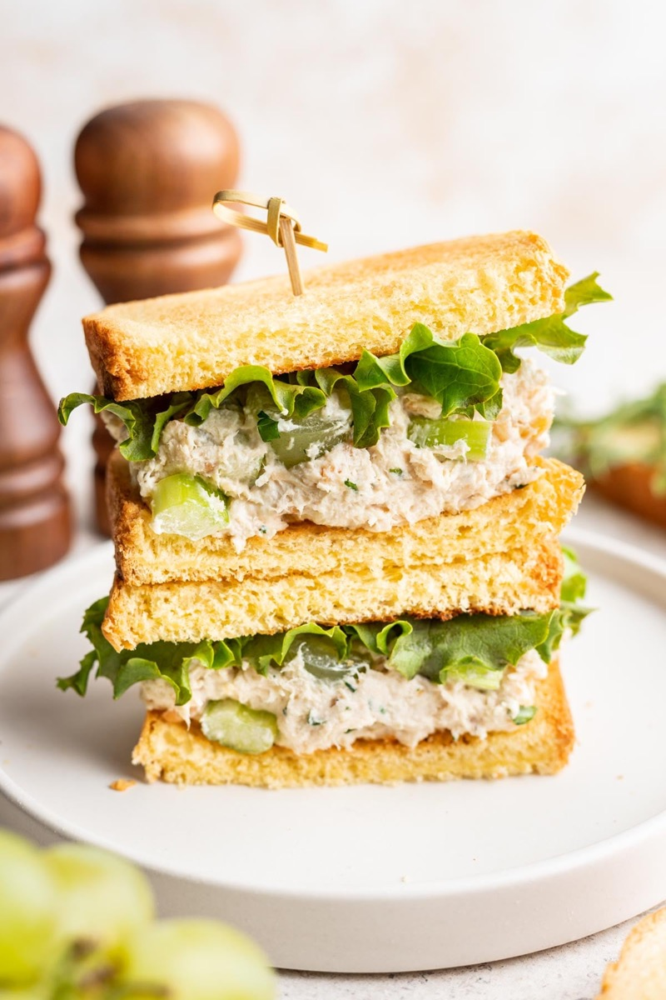

# Chicken Salad Sandwich

<table>
  <tr>
    <td>
      
    </td>
    <td>
      
    </td>
  </tr>
  <tr>
    <td>
      
    </td>
    <td>
      
    </td>
  </tr>
</table>

## Background

American chicken salad developed from older composed meat salads and became a popular sandwich filling in the
late nineteenth and twentieth centuries. Celery provides the characteristic crunch.

## Ingredients

- 450 g cooked chicken, diced
- 80 g mayonnaise
- 2 celery stalks, finely diced
- 2 scallions, sliced
- 1 tablespoon lemon juice
- 1 teaspoon Dijon mustard
- Salt and pepper
- 8 slices bread and lettuce leaves

## How to cook

1. Mix chicken, mayonnaise, celery, scallions, lemon, mustard, salt, and pepper.
2. Chill for 20 minutes if time permits and adjust seasoning.
3. Divide among four lettuce-lined sandwiches. Keep chilled until serving.
