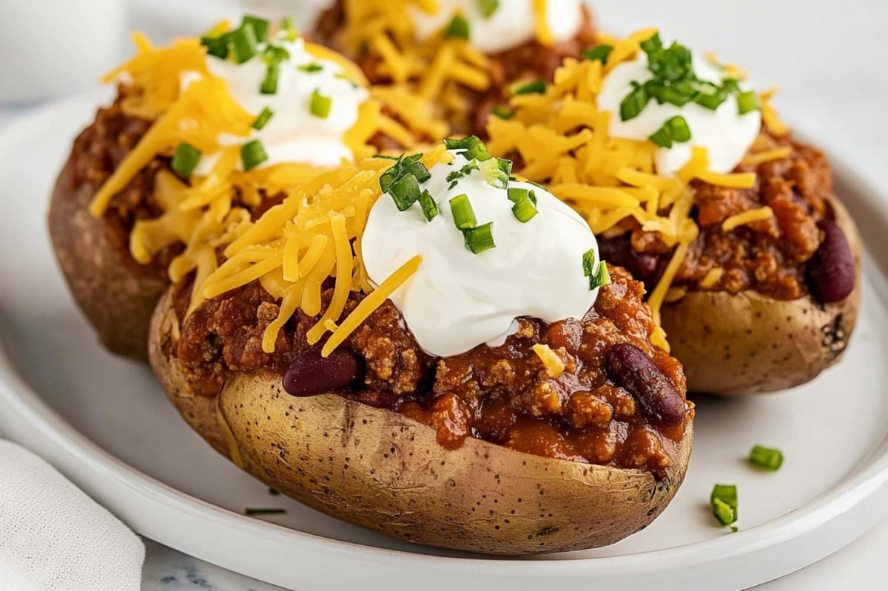
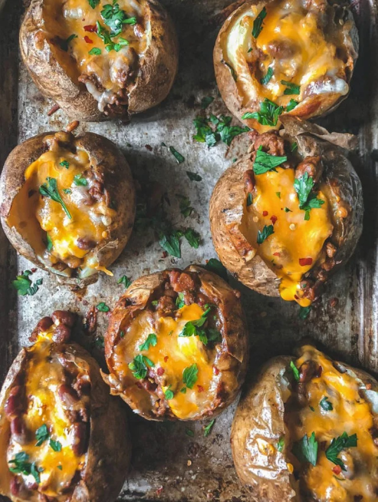
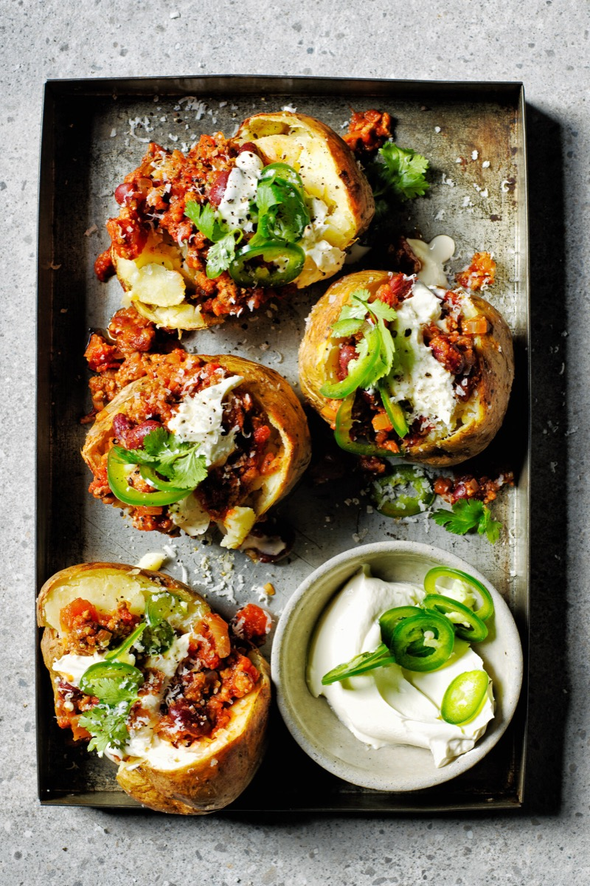
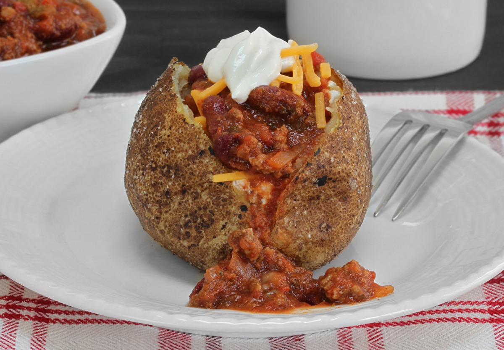

# Chili Baked Potatoes

<table>
  <tr>
    <td>
      
    </td>
    <td>
      
    </td>
  </tr>
  <tr>
    <td>
      
    </td>
    <td>
      
    </td>
  </tr>
</table>

## Background

Loaded baked potatoes are a casual American lunch and a useful home for leftovers. Chili turns the potato into
a full meal, while cheese and scallions provide easy finishing touches.

## Ingredients

- 4 large russet potatoes
- 1 tablespoon oil and 1 teaspoon salt
- 600 g prepared beef or bean chili
- 120 g grated cheddar
- 4 tablespoons sour cream
- 3 scallions, sliced

## How to cook

1. Heat the oven to 220°C. Scrub, dry, oil, and salt potatoes; prick each several times.
2. Bake directly on the rack for 50 to 70 minutes until very tender. Warm the chili.
3. Split potatoes, fluff the centers, and top with chili, cheese, sour cream, and scallions.
