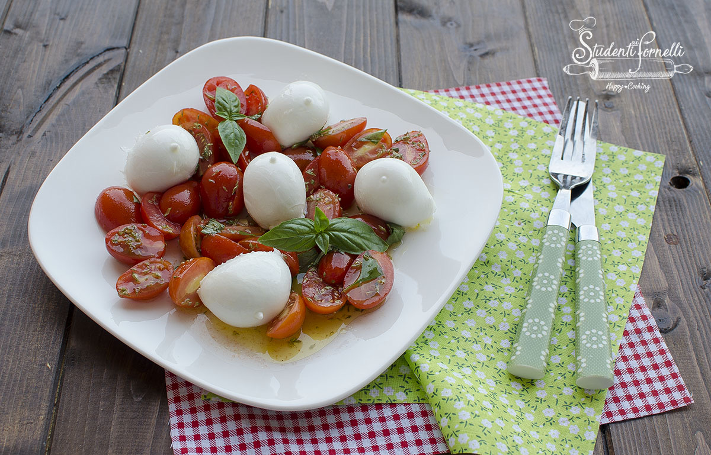
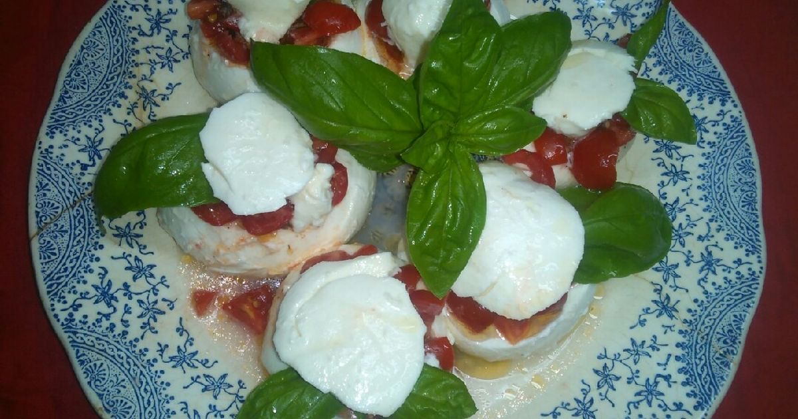
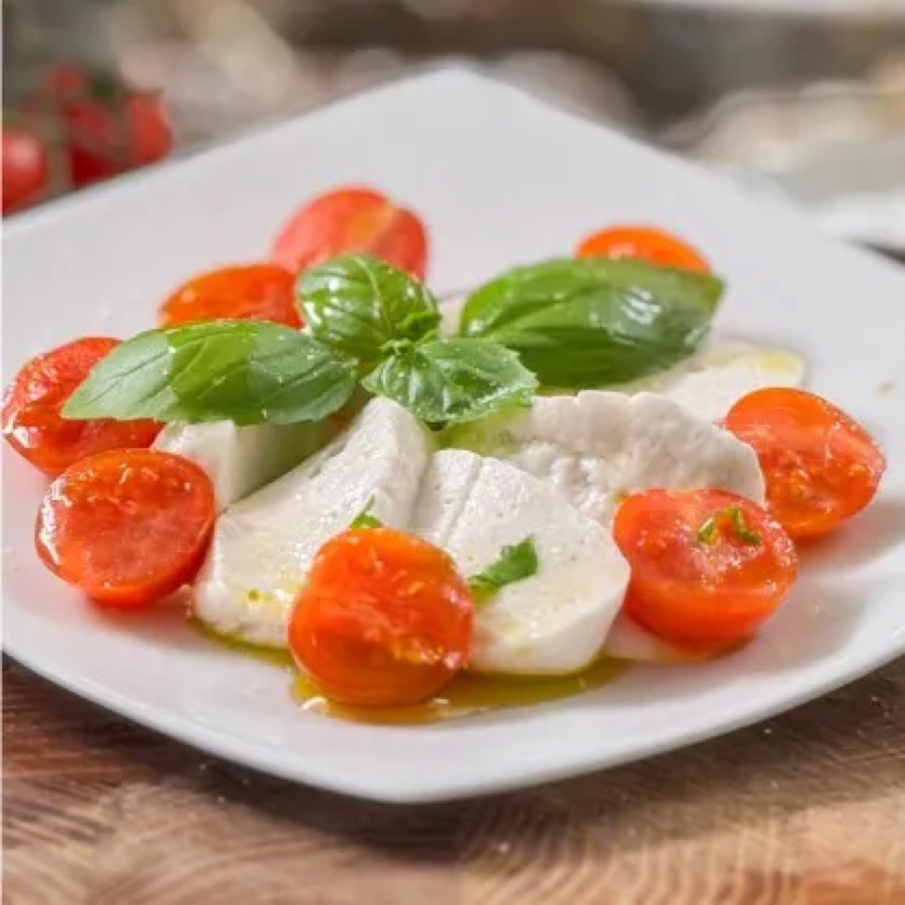
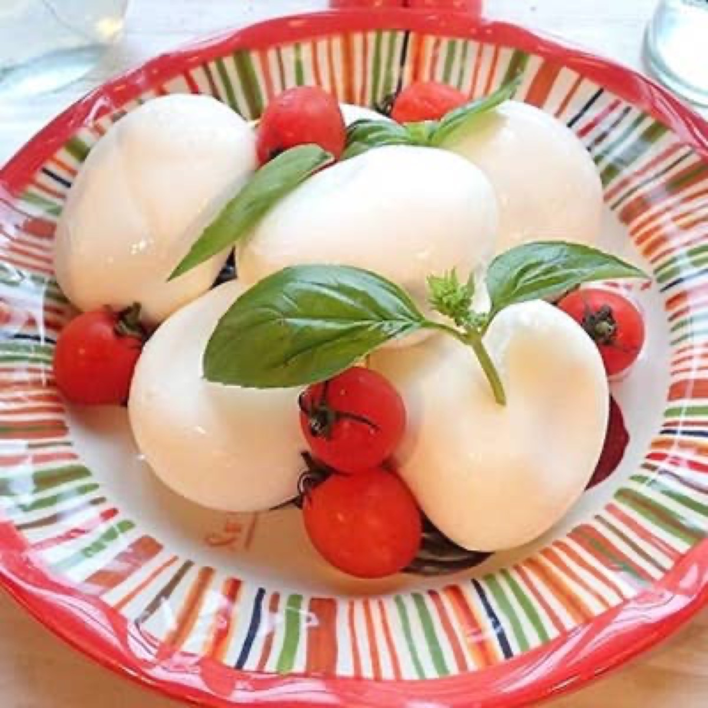

# Ciliegine di Mozzarella con Pomodorini e Basilico

<table>
  <tr>
    <td>
      
    </td>
    <td>
      
    </td>
  </tr>
  <tr>
    <td>
      
    </td>
    <td>
      
    </td>
  </tr>
</table>

## Background

This is a small-format variation of insalata caprese from Campania, Italy. Cherry-size mozzarella, cherry
tomatoes, and basil echo the colors and clean flavors of the classic salad while making it easy to share.

## Ingredients

- 400 g mozzarella ciliegine, drained
- 400 g ripe cherry tomatoes, halved
- 20 fresh basil leaves, torn
- 3 tablespoons extra-virgin olive oil
- 1 tablespoon red wine vinegar
- 1/2 teaspoon fine salt
- Black pepper

## How to cook

1. Let the mozzarella drain well and place it in a bowl with the tomatoes.
2. Whisk olive oil, vinegar, salt, and pepper. Pour over the mozzarella and tomatoes and toss gently.
3. Fold in basil immediately before serving. Rest for 10 minutes at room temperature, but do not refrigerate
   for a long period because cold dulls the tomatoes' flavor.
