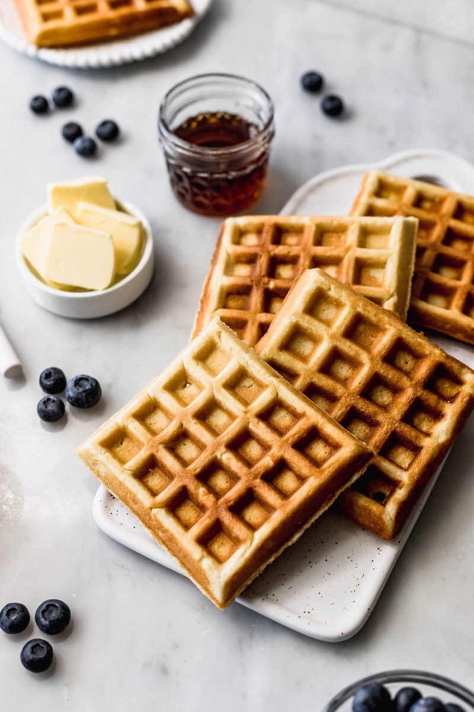
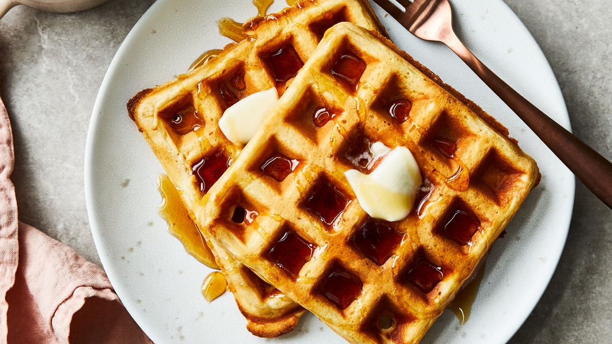
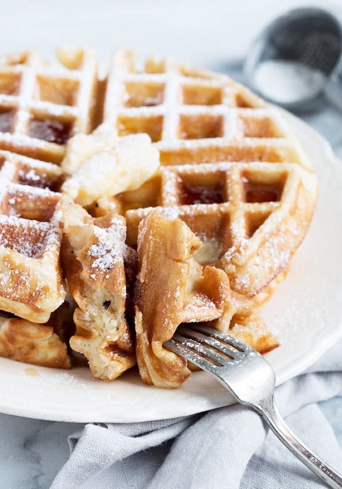
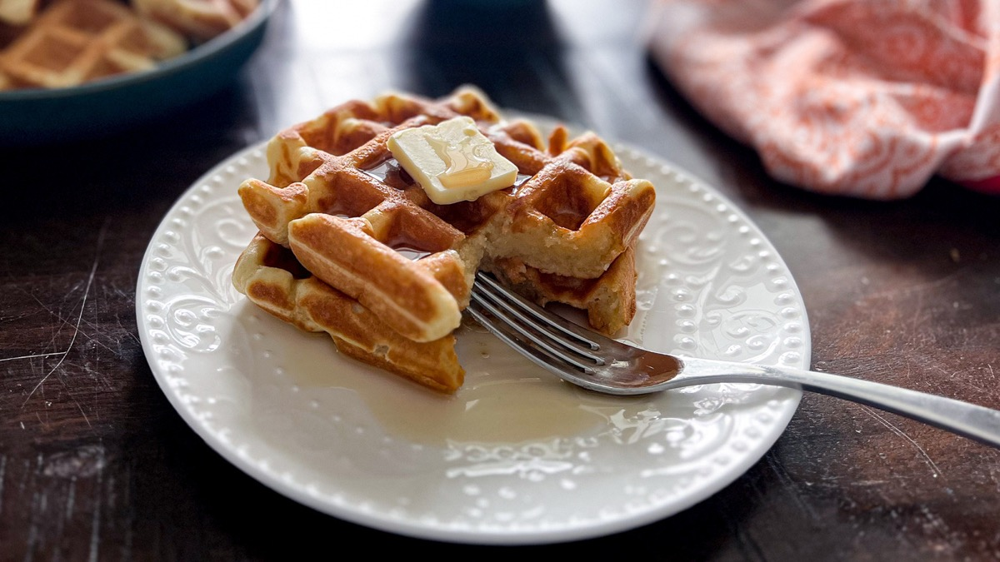

# Classic Waffles

<table>
  <tr>
    <td>
      
    </td>
    <td>
      
    </td>
  </tr>
  <tr>
    <td>
      
    </td>
    <td>
      
    </td>
  </tr>
</table>

## Background

Waffles came to North America through European traditions and became a familiar American breakfast as home
waffle irons spread. A hot iron creates their crisp grid and tender center.

## Ingredients

- 250 g all-purpose flour
- 2 tablespoons sugar
- 1 tablespoon baking powder
- 1/2 teaspoon salt
- 420 ml milk
- 2 eggs
- 90 g melted butter
- 1 teaspoon vanilla

## How to cook

1. Preheat the waffle iron. Whisk dry ingredients in one bowl and wet ingredients in another.
2. Combine only until no dry flour remains.
3. Cook the amount directed for the iron until deeply golden. Serve immediately or hold on a rack in a low
   oven.
