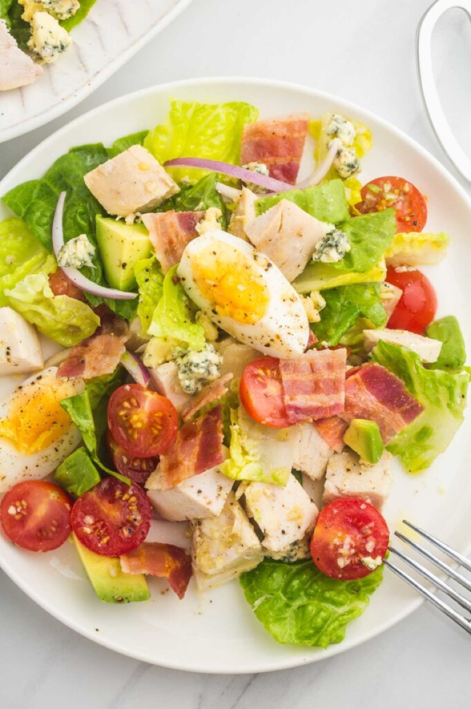
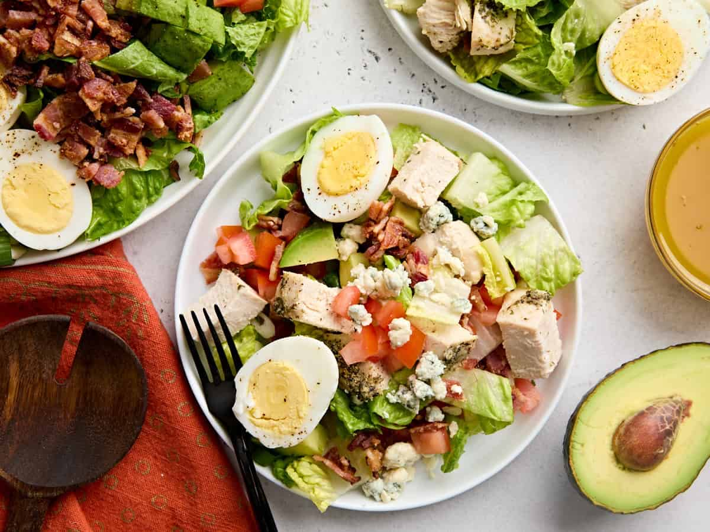
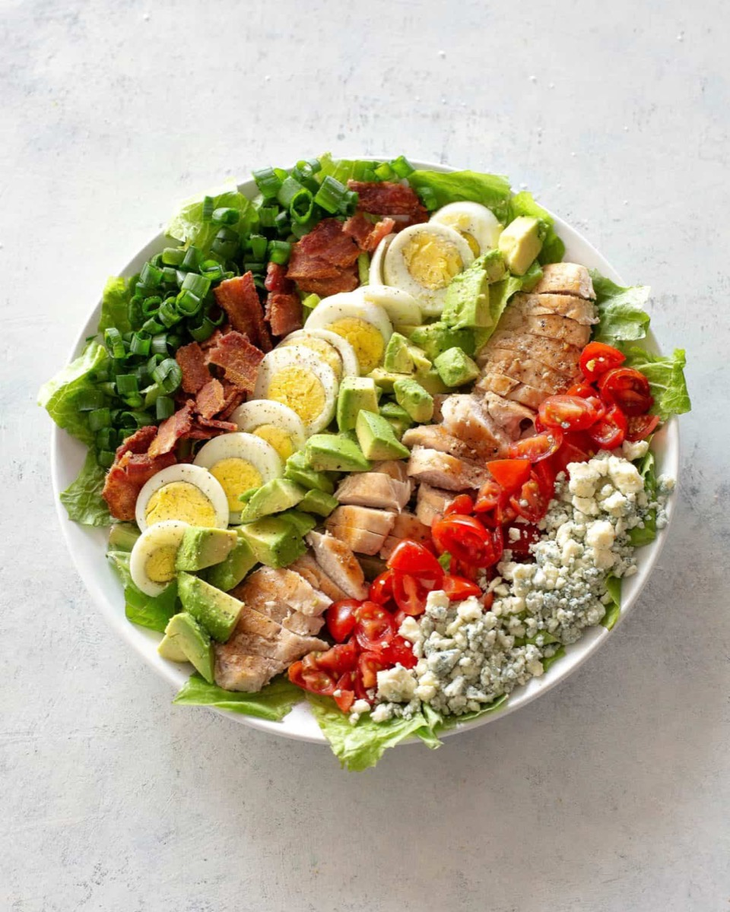
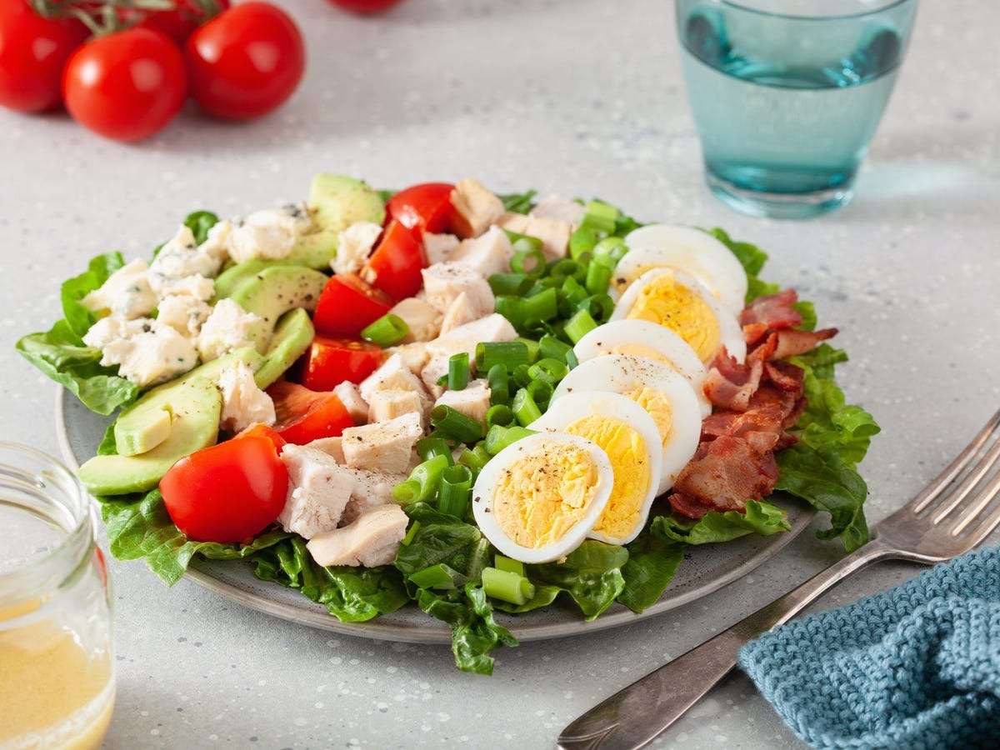

# Cobb Salad

<table>
  <tr>
    <td>
      
    </td>
    <td>
      
    </td>
  </tr>
  <tr>
    <td>
      
    </td>
    <td>
      
    </td>
  </tr>
</table>

## Background

The Cobb salad is associated with Hollywood's Brown Derby restaurant in the 1930s. Rows of chicken, bacon, egg,
avocado, tomato, and blue cheese make it a substantial American main-dish salad.

## Ingredients

- 2 romaine hearts, chopped
- 350 g cooked chicken, diced
- 6 slices bacon, cooked and crumbled
- 4 hard-boiled eggs, quartered
- 2 avocados and 2 tomatoes, diced
- 100 g blue cheese, crumbled
- 60 ml red wine vinaigrette

## How to cook

1. Spread lettuce on a platter.
2. Arrange chicken, bacon, eggs, avocado, tomatoes, and cheese in rows.
3. Dress just before serving, or pass vinaigrette at the table.
