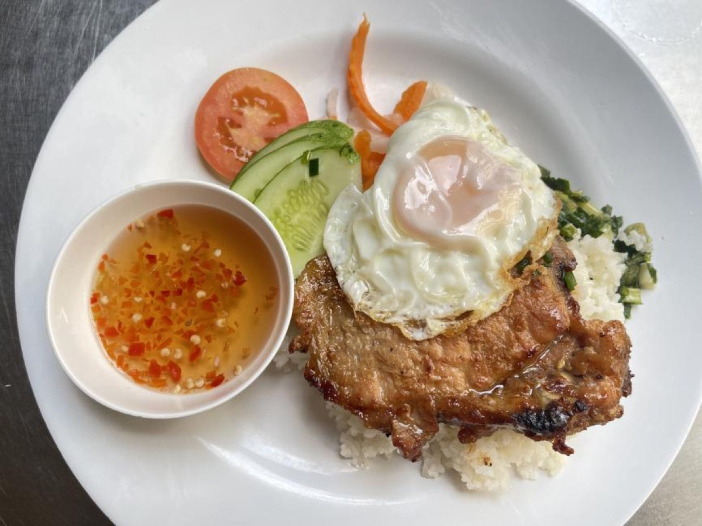
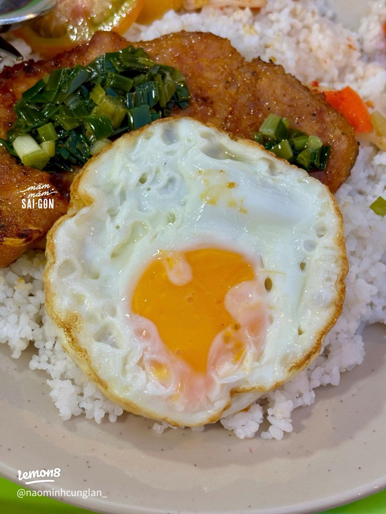
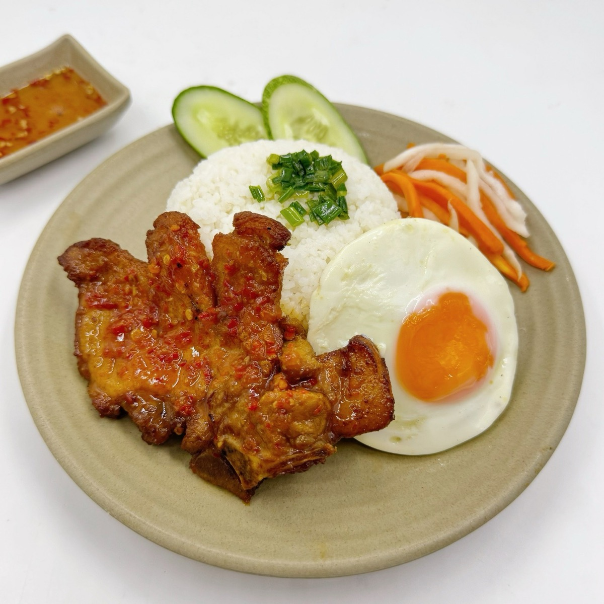
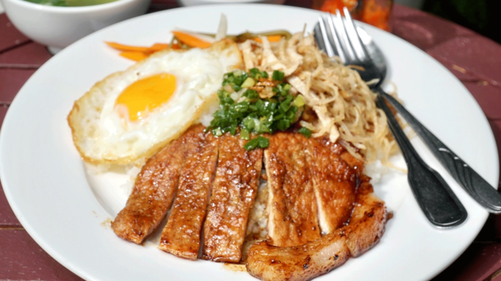

# Cơm Tấm with Pork Chop and Fried Egg

<table>
  <tr>
    <td>
      
    </td>
    <td>
      
    </td>
  </tr>
  <tr>
    <td>
      
    </td>
    <td>
      
    </td>
  </tr>
</table>

## Background

Cơm tấm is southern Vietnam's "broken rice," once made from fractured grains considered less valuable. It
became a beloved street meal, commonly topped with grilled pork, egg, pickles, scallion oil, and fish-sauce
dressing.

## Ingredients

- 4 thin bone-in pork chops
- 2 tablespoons fish sauce
- 1 tablespoon soy sauce
- 1 tablespoon sugar
- 1 tablespoon minced lemongrass
- 2 garlic cloves, minced
- 1 tablespoon neutral oil, plus more for frying
- 600 g cooked broken rice
- 4 eggs
- Pickled carrot and daikon, scallion oil, cucumber, and nước chấm

## How to cook

1. Marinate chops with fish sauce, soy sauce, sugar, lemongrass, garlic, and oil for at least 30 minutes.
2. Grill or sear over medium-high heat for 3 to 5 minutes per side, until caramelized and cooked to 63°C;
   rest.
3. Fry eggs sunny-side up.
4. Divide rice among plates and top each with a chop and egg. Add pickles, cucumber, scallion oil, and nước
   chấm.
