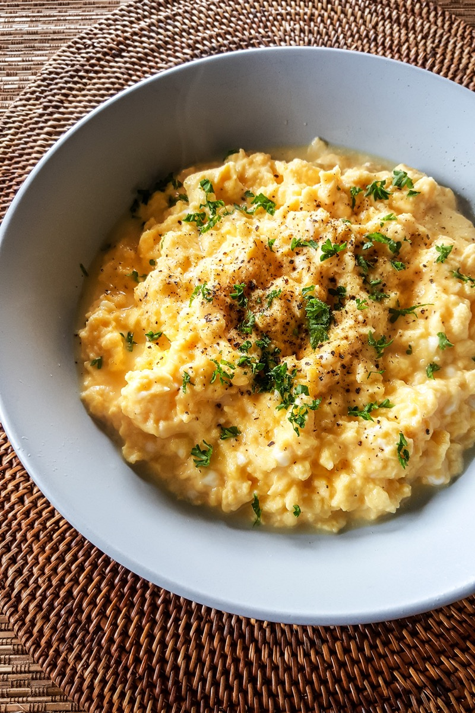
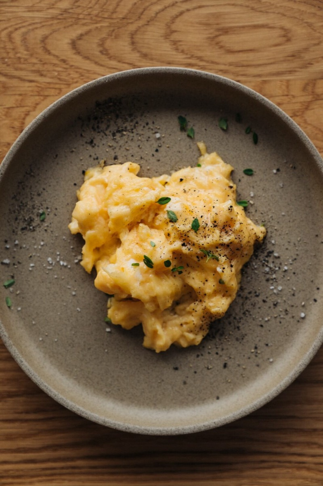
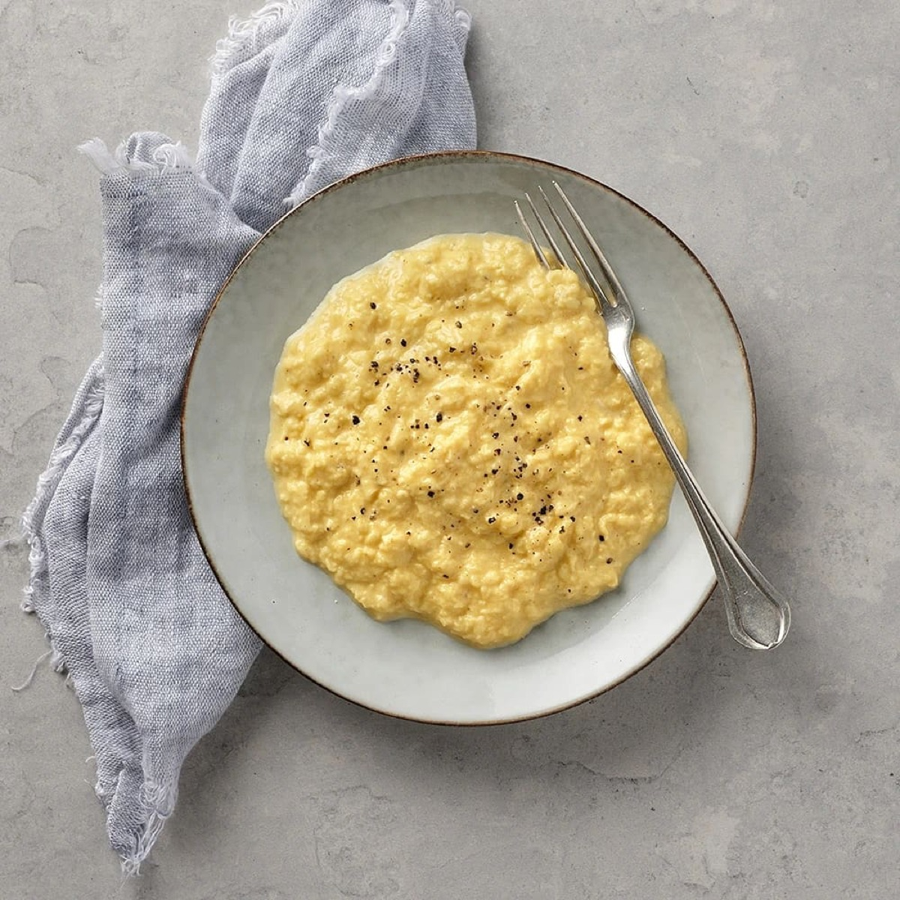
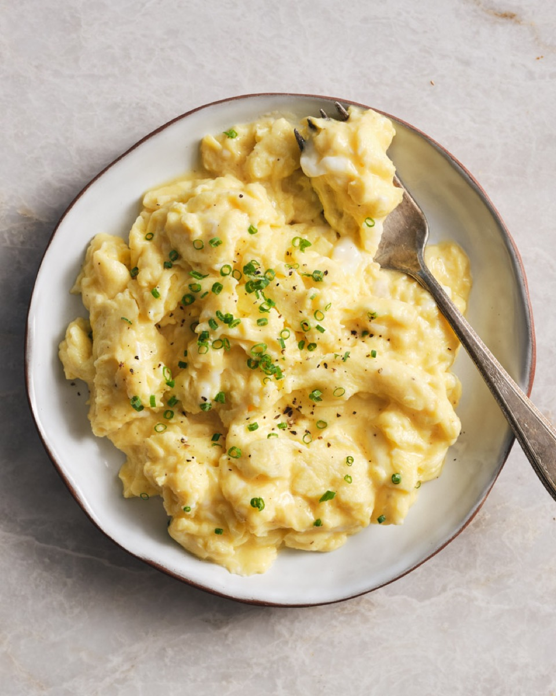

# Creamy Scrambled Eggs

<table>
  <tr>
    <td>
      
    </td>
    <td>
      
    </td>
  </tr>
  <tr>
    <td>
      
    </td>
    <td>
      
    </td>
  </tr>
</table>

## Background

Scrambled eggs are a foundational American breakfast. Low heat and frequent folding create soft curds, while
removing the pan before the eggs look fully done prevents overcooking.

## Ingredients

- 8 eggs
- 30 g butter
- 2 tablespoons milk or cream, optional
- Salt, pepper, and chopped chives

## How to cook

1. Beat eggs with optional milk, salt, and pepper until uniform.
2. Melt butter over medium-low heat. Add eggs and slowly sweep a spatula across the pan to form broad curds.
3. Remove while still slightly glossy; residual heat will finish them. Add chives and serve.
