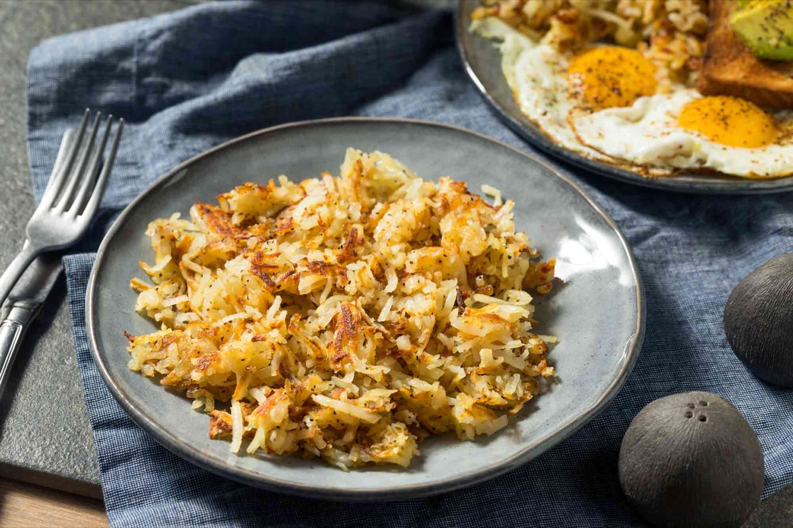
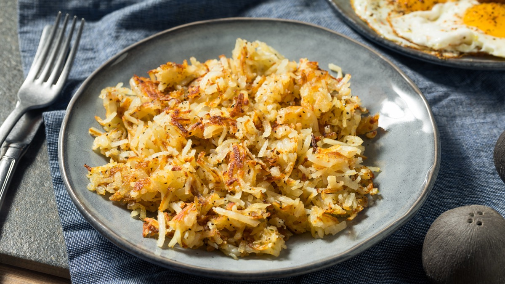
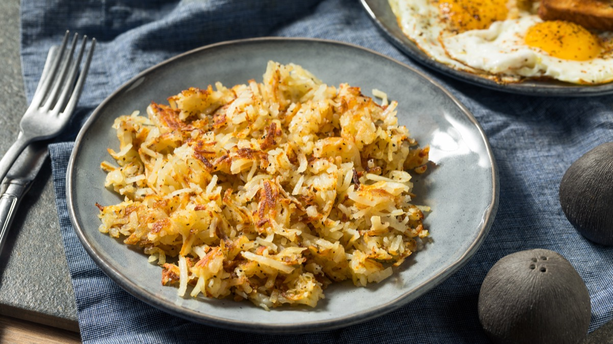
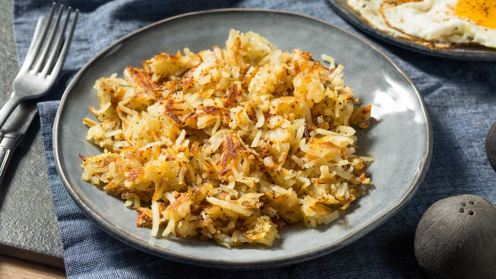

# Crispy Hash Browns

<table>
  <tr>
    <td>
      
    </td>
    <td>
      
    </td>
  </tr>
  <tr>
    <td>
      
    </td>
    <td>
      
    </td>
  </tr>
</table>

## Background

Shredded hash-brown potatoes are a classic American diner breakfast. Removing moisture and leaving the potatoes
undisturbed in a broad, thin layer are the keys to a crisp crust.

## Ingredients

- 900 g russet potatoes
- 3 tablespoons neutral oil
- 30 g butter
- 1 teaspoon salt
- Black pepper

## How to cook

1. Peel and grate potatoes. Rinse briefly, then squeeze extremely dry in a clean towel.
2. Heat half the oil and butter in a wide skillet. Spread half the potatoes in a thin layer and season.
3. Cook undisturbed for 5 to 7 minutes per side until crisp. Repeat with the remaining potatoes.
