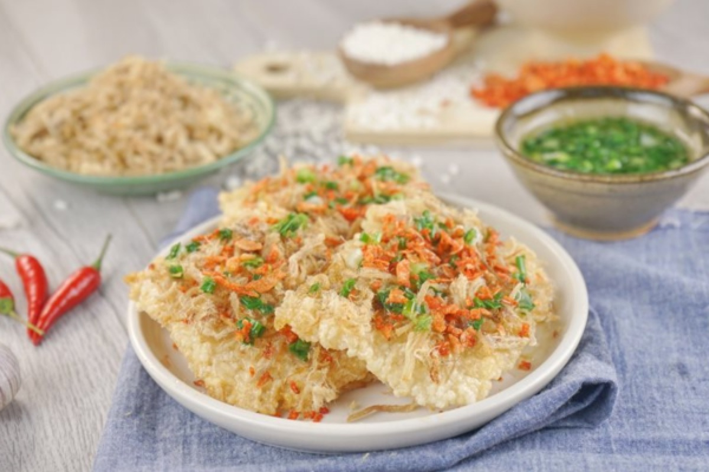
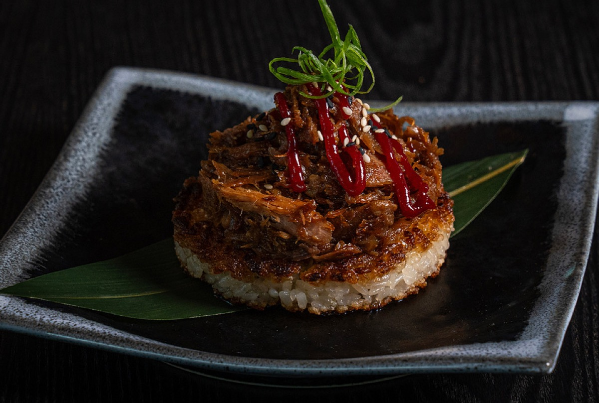
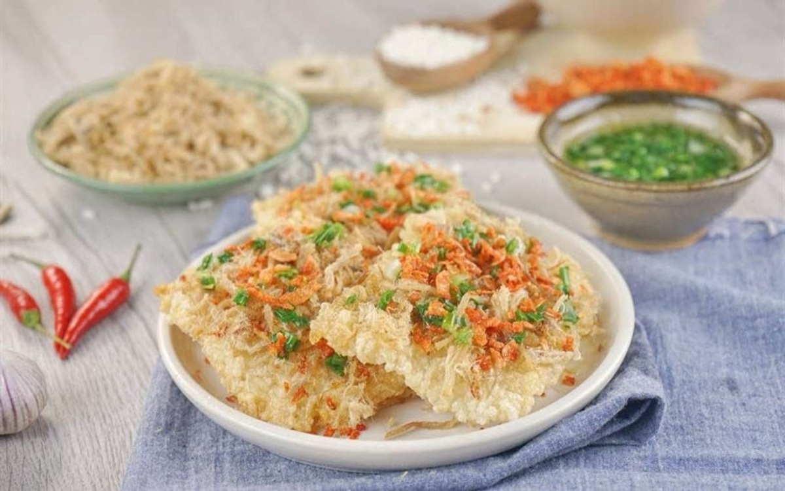
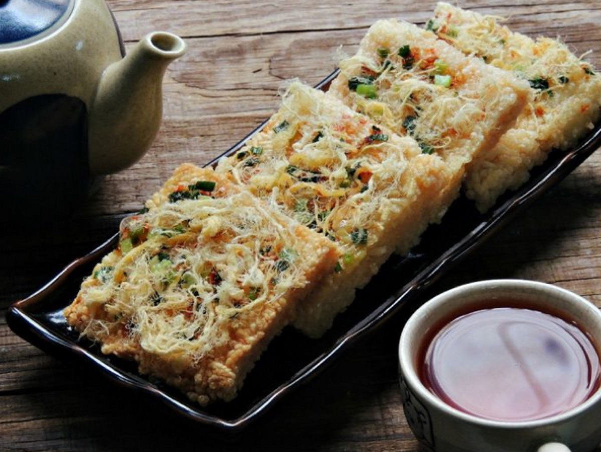

# Crispy Rice Cakes with Shredded Pork

<table>
  <tr>
    <td>
      
    </td>
    <td>
      
    </td>
  </tr>
  <tr>
    <td>
      
    </td>
    <td>
      
    </td>
  </tr>
</table>

## Background

Crisp rice cakes topped with savory meat appear in several East and Southeast Asian cuisines. This home-style
version turns chilled rice into pan-fried cakes and finishes them with soy-braised shredded pork.

## Ingredients

- 600 g cold cooked short-grain rice
- 1 egg, beaten
- 2 tablespoons cornstarch
- 1/2 teaspoon salt
- 4 tablespoons neutral oil, divided
- 400 g cooked shredded pork
- 2 tablespoons soy sauce
- 1 tablespoon rice vinegar
- 1 teaspoon sugar
- 1 teaspoon sesame oil
- 2 scallions, sliced

## How to cook

1. Mix cold rice with egg, cornstarch, and salt. With wet hands, press into eight firm patties.
2. Heat half the neutral oil in a nonstick skillet. Fry cakes over medium heat for 4 to 5 minutes per side
   until deeply crisp, adding more oil as needed.
3. Warm pork with soy sauce, vinegar, sugar, sesame oil, and 2 tablespoons water until glossy.
4. Spoon pork onto the rice cakes, garnish with scallions, and serve immediately.
