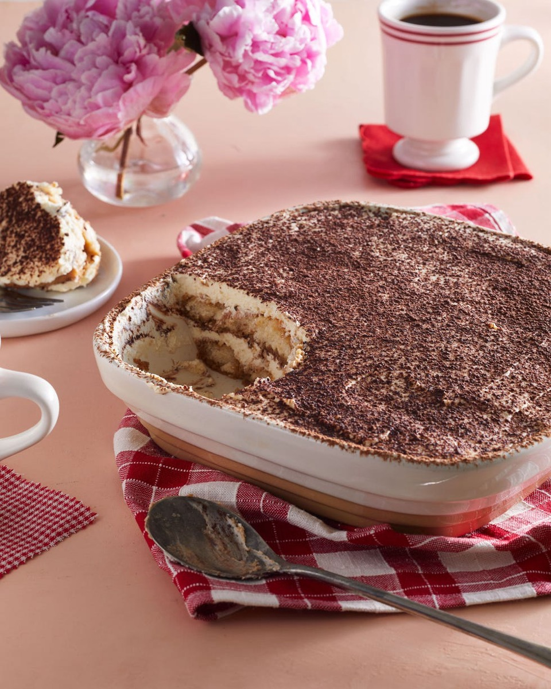
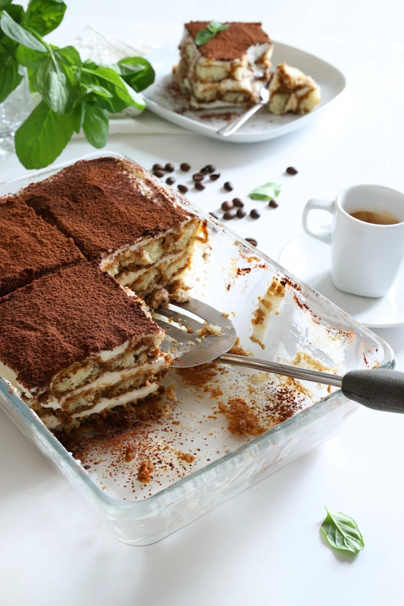
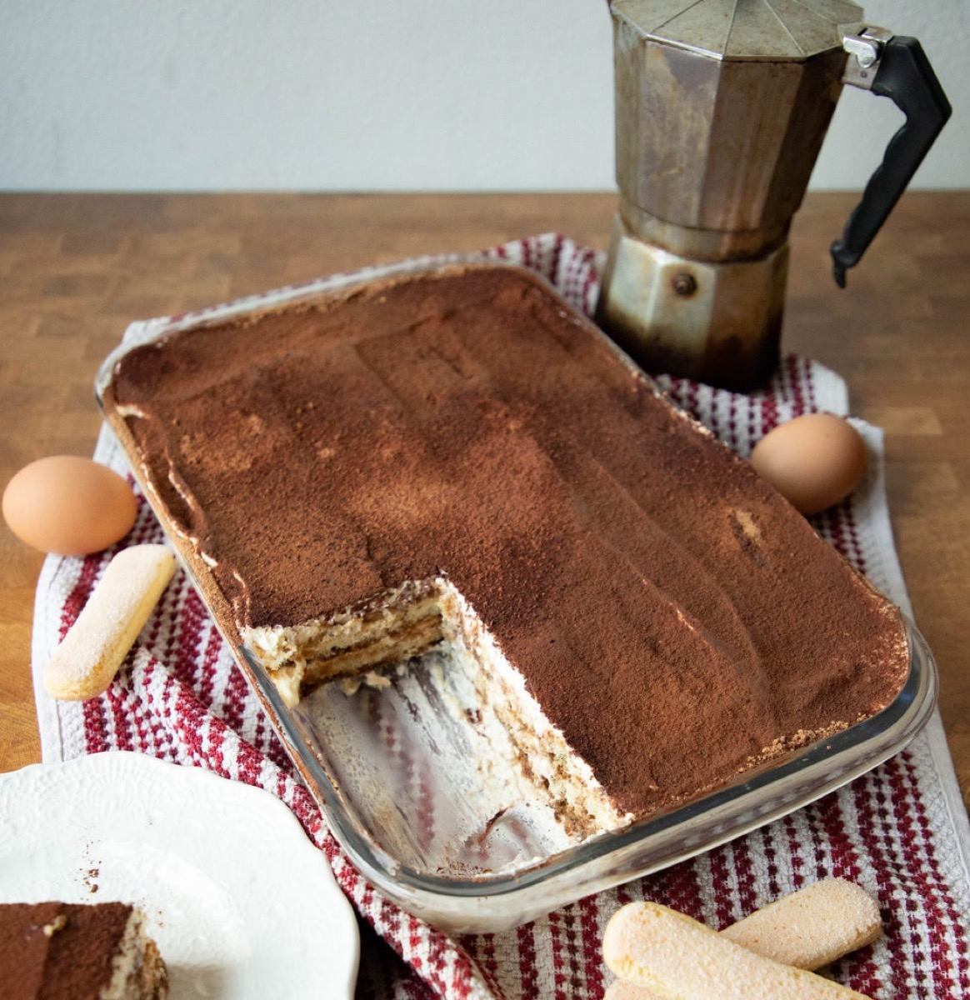
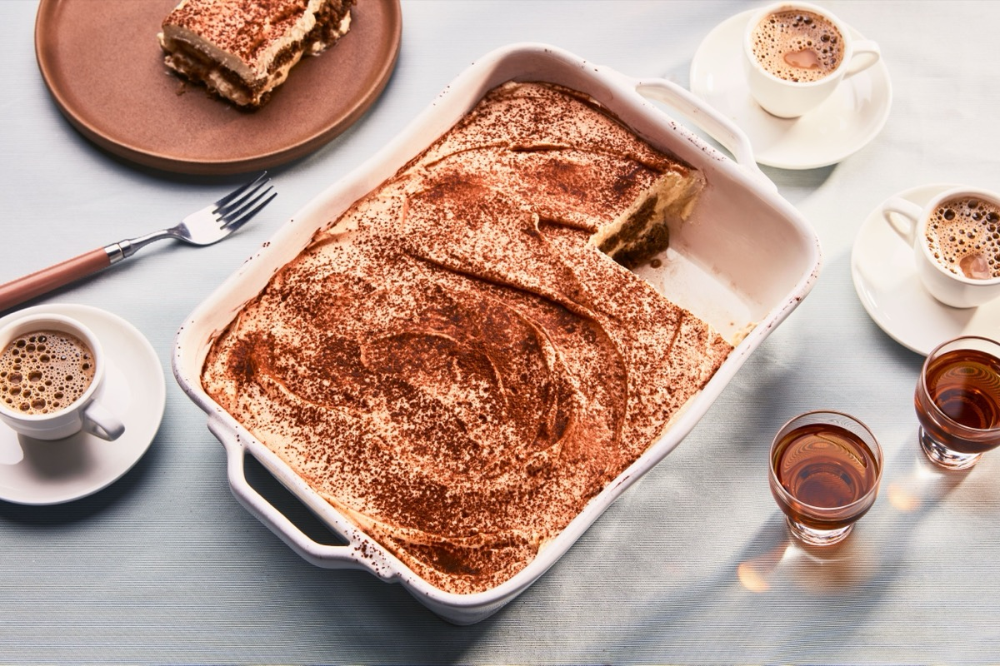

# Easy Tiramisu

<table>
  <tr>
    <td>
      
    </td>
    <td>
      
    </td>
  </tr>
  <tr>
    <td>
      
    </td>
    <td>
      
    </td>
  </tr>
</table>

## Background

Tiramisù is a layered coffee dessert from northeastern Italy that became widely known in the late twentieth
century. Its name roughly means "pick me up," fitting its espresso and cocoa.

## Ingredients

- 250 ml strong espresso, cooled
- 3 tablespoons coffee liqueur, optional
- 250 g mascarpone
- 300 ml heavy cream
- 70 g sugar
- 24 ladyfingers
- Unsweetened cocoa powder

## How to cook

1. Whip mascarpone, cream, and sugar to soft, stable peaks. Mix espresso with optional liqueur.
2. Dip ladyfingers very briefly in coffee and arrange half in a dish. Spread with half the cream; repeat.
3. Cover and chill for at least 6 hours. Dust with cocoa before serving.
