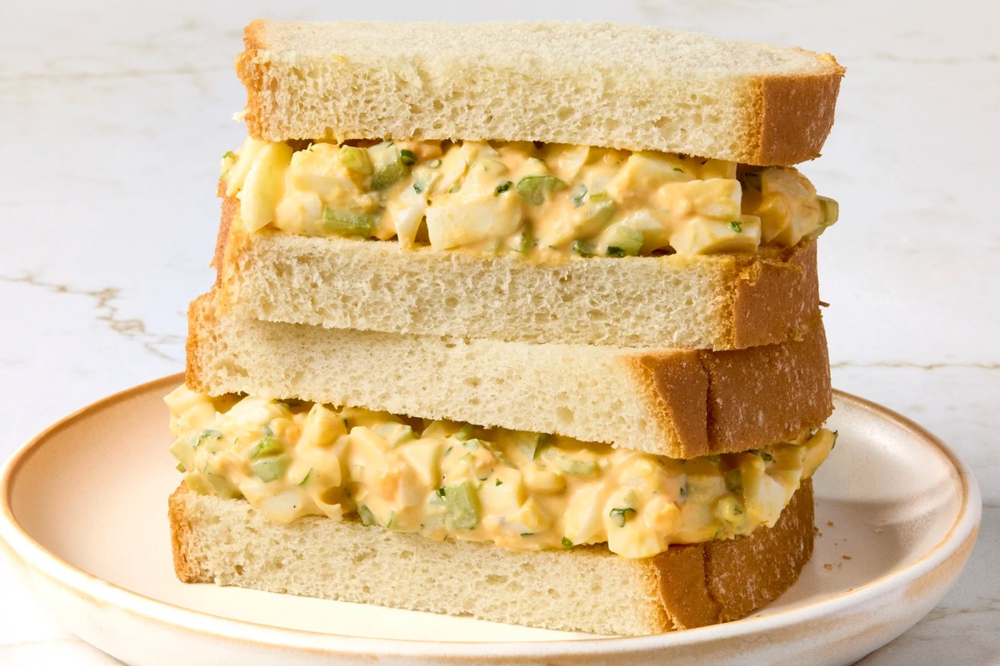
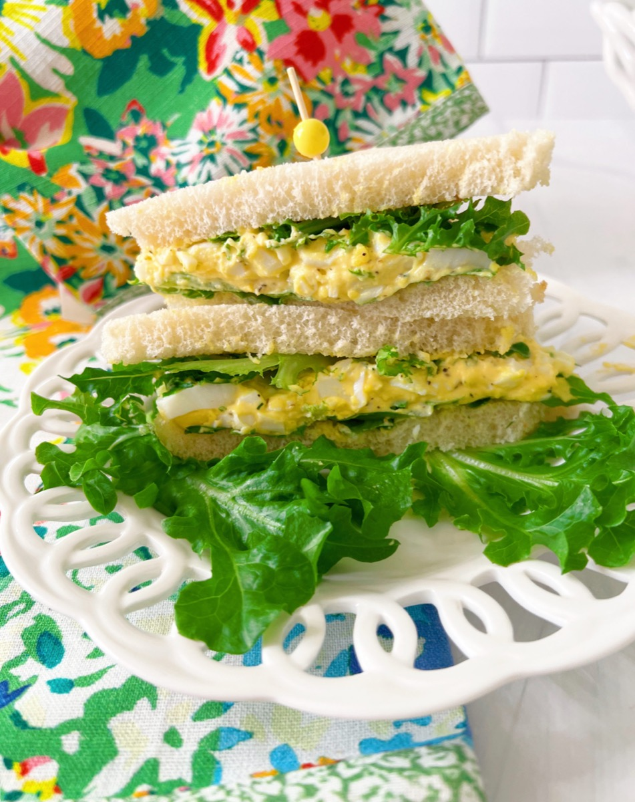
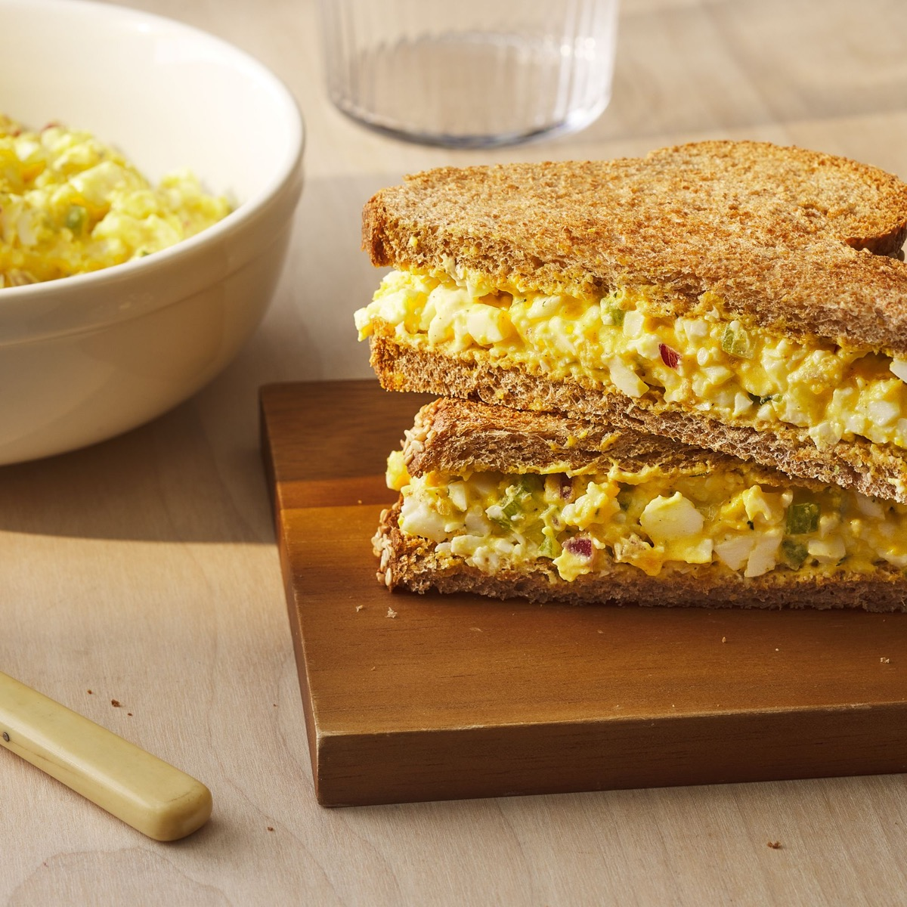
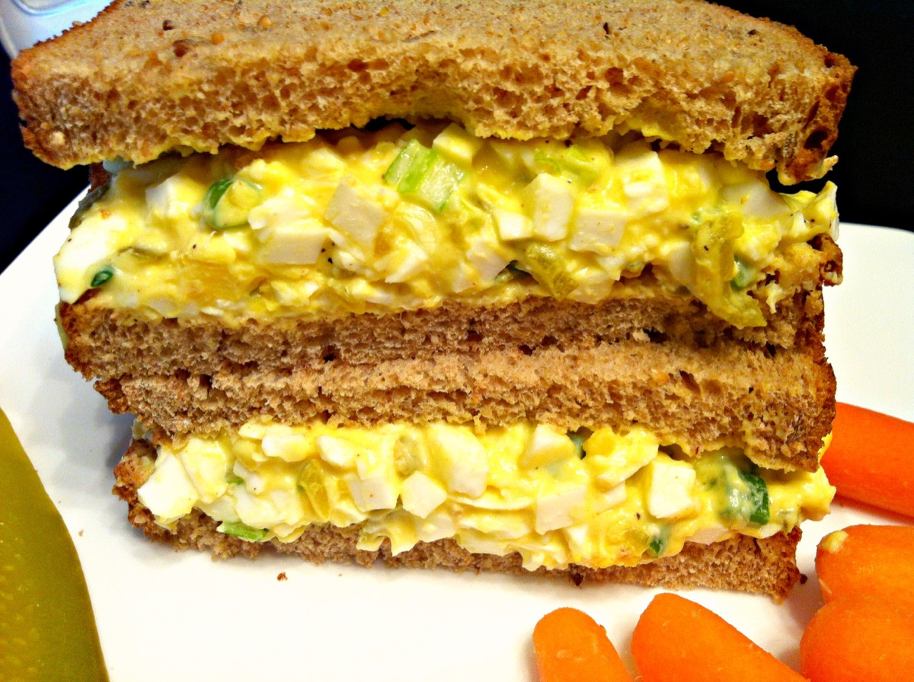

# Egg Salad Sandwich

<table>
  <tr>
    <td>
      
    </td>
    <td>
      
    </td>
  </tr>
  <tr>
    <td>
      
    </td>
    <td>
      
    </td>
  </tr>
</table>

## Background

Egg salad sandwiches became common American lunch fare as mayonnaise gained popularity around the beginning of
the twentieth century. Mustard and celery keep the rich filling lively.

## Ingredients

- 8 hard-boiled eggs, peeled
- 70 g mayonnaise
- 1 celery stalk, finely diced
- 1 teaspoon yellow or Dijon mustard
- 1 tablespoon chopped chives
- Salt and pepper
- 8 slices bread and lettuce

## How to cook

1. Chop eggs and fold with mayonnaise, celery, mustard, chives, salt, and pepper.
2. Chill briefly and adjust seasoning.
3. Make four lettuce-lined sandwiches and keep refrigerated until serving.
