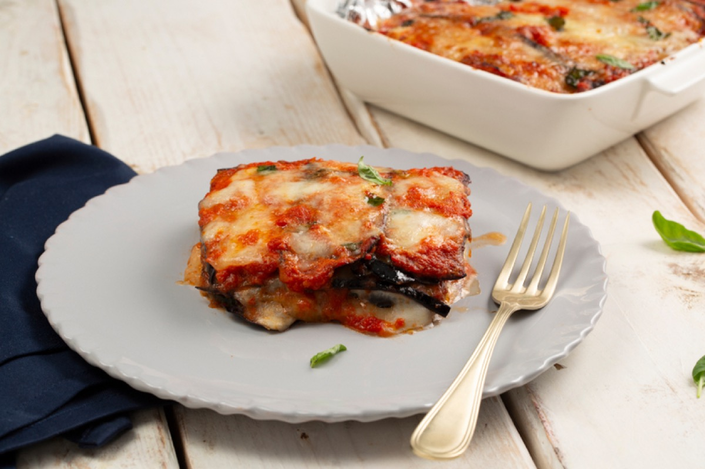
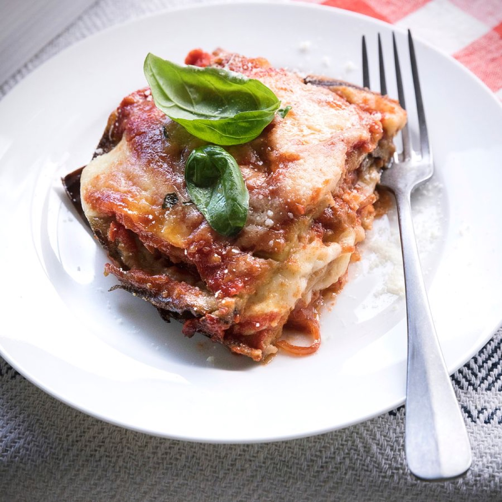
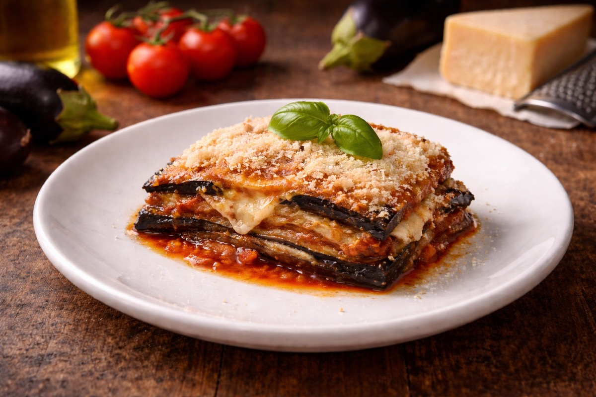
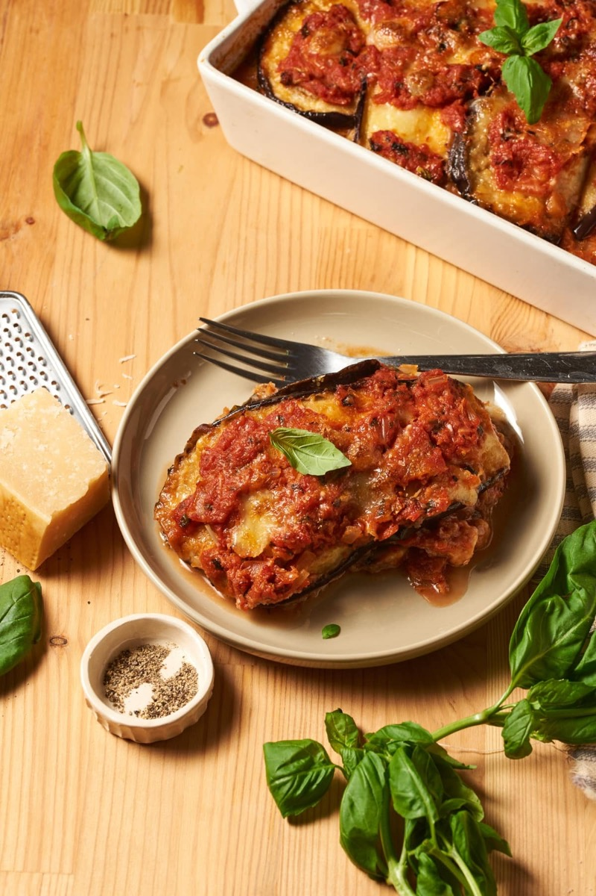

# Eggplant Parmigiana

<table>
  <tr>
    <td>
      
    </td>
    <td>
      
    </td>
  </tr>
  <tr>
    <td>
      
    </td>
    <td>
      
    </td>
  </tr>
</table>

## Background

Parmigiana di melanzane is a southern Italian baked dish of eggplant, tomato, basil, and cheese. Its precise
regional origin is debated among Sicily, Campania, and Emilia-Romagna.

## Ingredients

- 2 large eggplants, sliced 1 cm thick
- Salt and 4 tablespoons olive oil
- 700 ml tomato sauce
- 300 g mozzarella, drained and sliced
- 80 g Parmigiano-Reggiano
- Basil leaves

## How to cook

1. Salt eggplant for 30 minutes, rinse, and dry. Brush with oil and roast at 220°C until browned.
2. Layer sauce, eggplant, mozzarella, Parmigiano, and basil in a baking dish; repeat.
3. Bake at 190°C for 30 to 35 minutes. Rest for 15 minutes before cutting.
