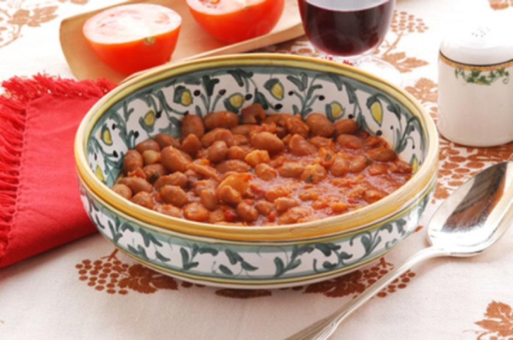
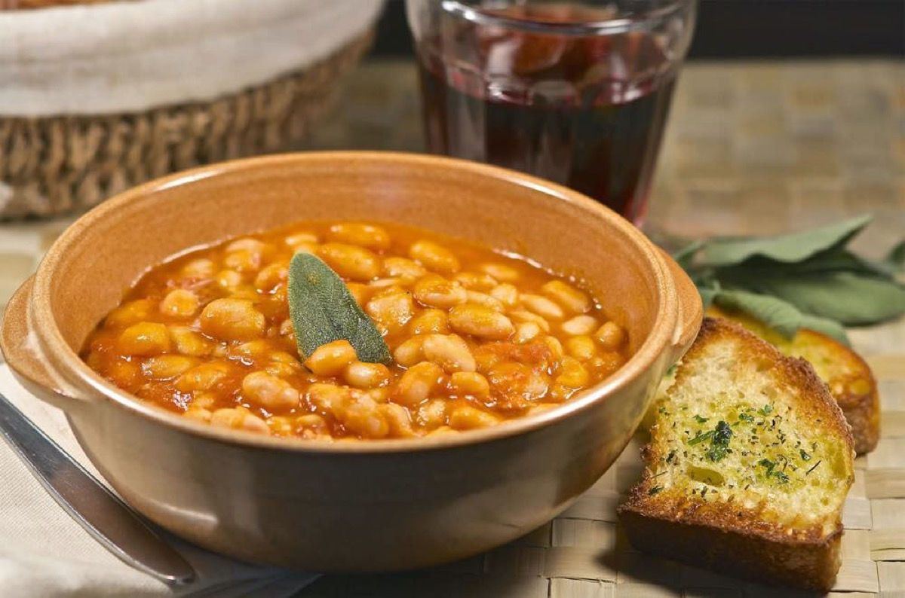

# Fagioli all'Uccelletto

<table>
  <tr>
    <td>
      
    </td>
    <td>
      
    </td>
  </tr>
  <tr>
    <td>
      
    </td>
    <td>
      
    </td>
  </tr>
</table>

## Background

Fagioli all'uccelletto are Tuscan white beans cooked with tomato, garlic, sage, and olive oil. The curious name
may refer to seasonings once used for small game birds, though its origin is uncertain.

## Ingredients

- 3 tablespoons olive oil
- 3 garlic cloves, lightly crushed
- 8 sage leaves
- 2 cans cannellini beans, drained
- 400 g canned tomatoes
- Salt and pepper

## How to cook

1. Gently warm garlic and sage in oil until fragrant.
2. Add beans, tomatoes, salt, and pepper. Simmer uncovered for 20 minutes until thick.
3. Remove garlic if desired and serve with toasted bread.
