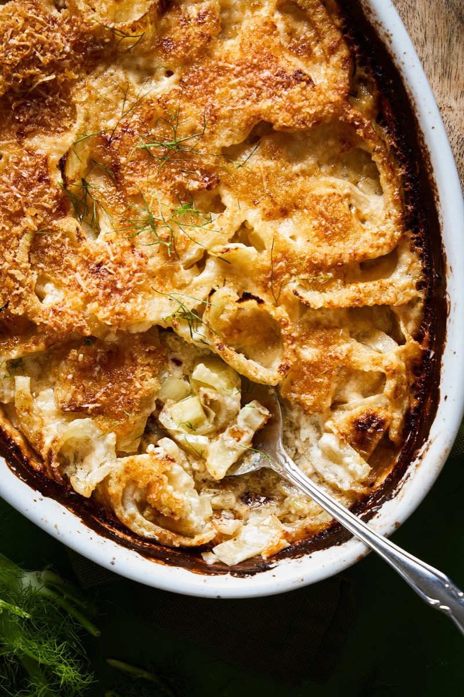
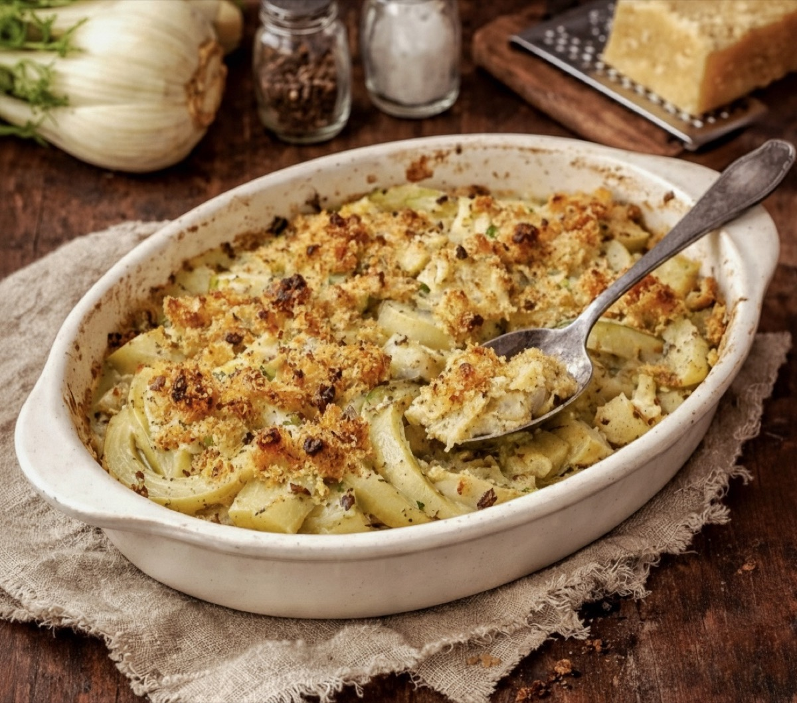
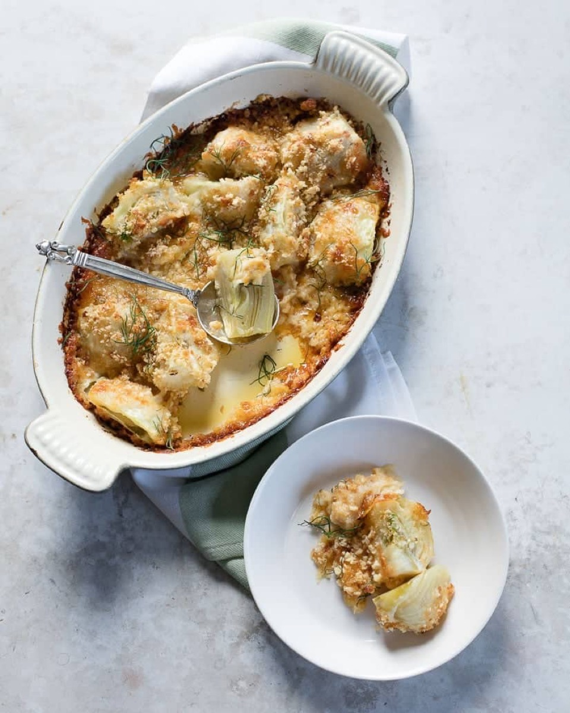
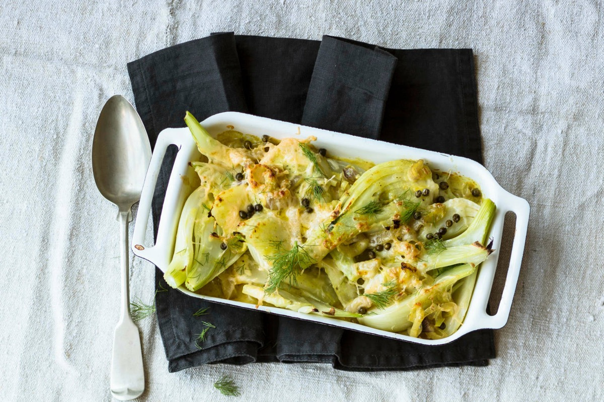

# Fennel Gratin

<table>
  <tr>
    <td>
      
    </td>
    <td>
      
    </td>
  </tr>
  <tr>
    <td>
      
    </td>
    <td>
      
    </td>
  </tr>
</table>

## Background

Finocchi gratinati is an Italian baked fennel side dish. Briefly cooking the bulbs before baking makes them
tender, while cheese and breadcrumbs form a crisp top.

## Ingredients

- 4 fennel bulbs, cut into wedges
- 2 tablespoons olive oil
- 60 g Parmigiano-Reggiano
- 50 g breadcrumbs
- 20 g butter
- Salt and pepper

## How to cook

1. Heat the oven to 200°C. Boil fennel in salted water for 8 minutes; drain very well.
2. Arrange in an oiled baking dish. Season and top with cheese, breadcrumbs, and small pieces of butter.
3. Bake for 20 to 25 minutes until tender and golden.
