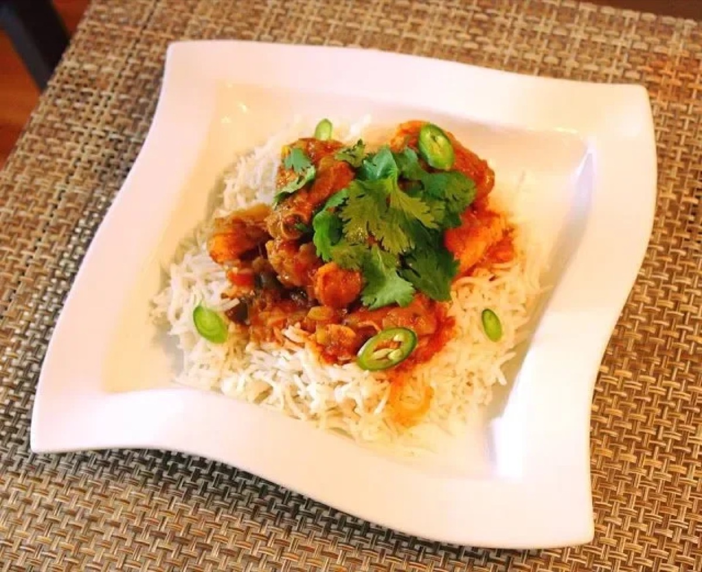
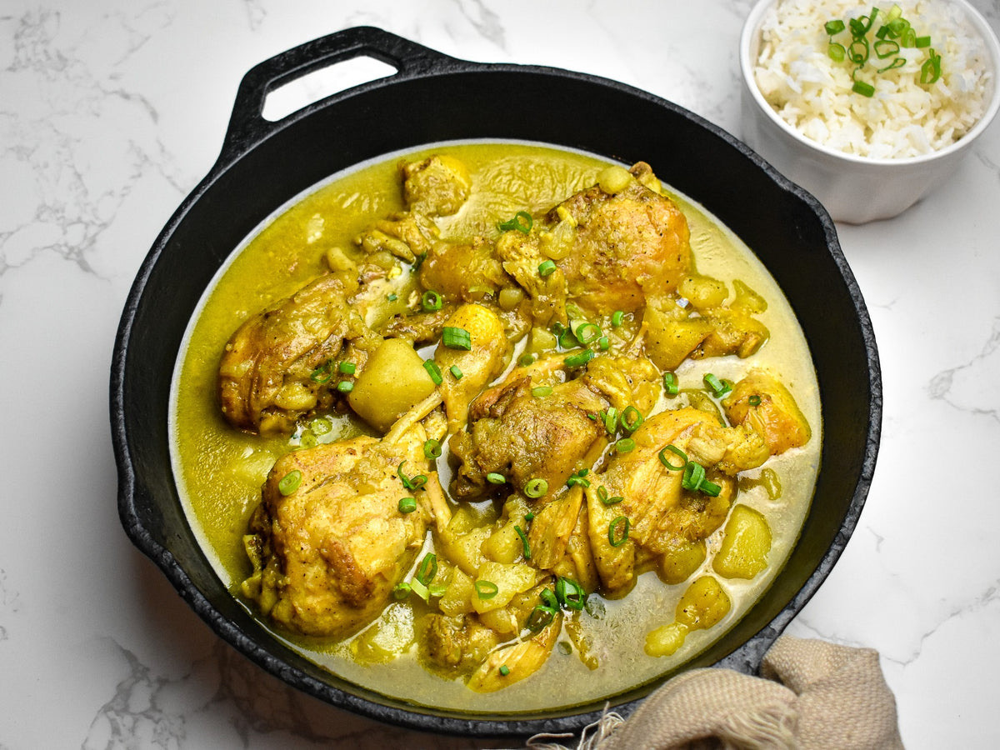

# Fiji's Chicken

<table>
  <tr>
    <td>
      
    </td>
    <td>
      
    </td>
  </tr>
  <tr>
    <td>
      
    </td>
    <td>
      
    </td>
  </tr>
</table>

## Background

This family-style recipe uses a simple seasoned flour batter and a shallow fry. The light frying gives the
chicken a golden crust while using less oil than deep-fried chicken; the name "Fiji's Chicken" is retained here
as requested.

## Ingredients

- 700 g boneless, skinless chicken thighs, cut into strips
- 1 teaspoon salt
- 1/2 teaspoon black pepper
- 1/2 teaspoon paprika
- 120 g all-purpose flour
- 1 teaspoon baking powder
- 180 ml cold water
- 120 ml neutral oil, plus more as needed
- Lemon wedges

## How to cook

1. Pat the chicken dry and season with salt, pepper, and paprika.
2. Whisk flour and baking powder, then add enough cold water to make a batter that lightly coats a spoon.
3. Heat 5 mm of oil in a skillet over medium-high heat. Dip chicken in batter, let excess drip away, and fry in
   batches for 3 to 4 minutes per side.
4. Drain on a rack. Verify that the thickest pieces reach 74°C, season lightly, and serve with lemon.
