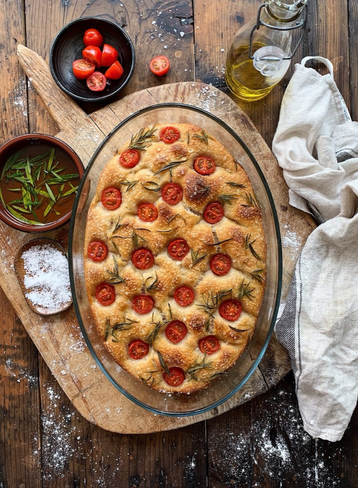
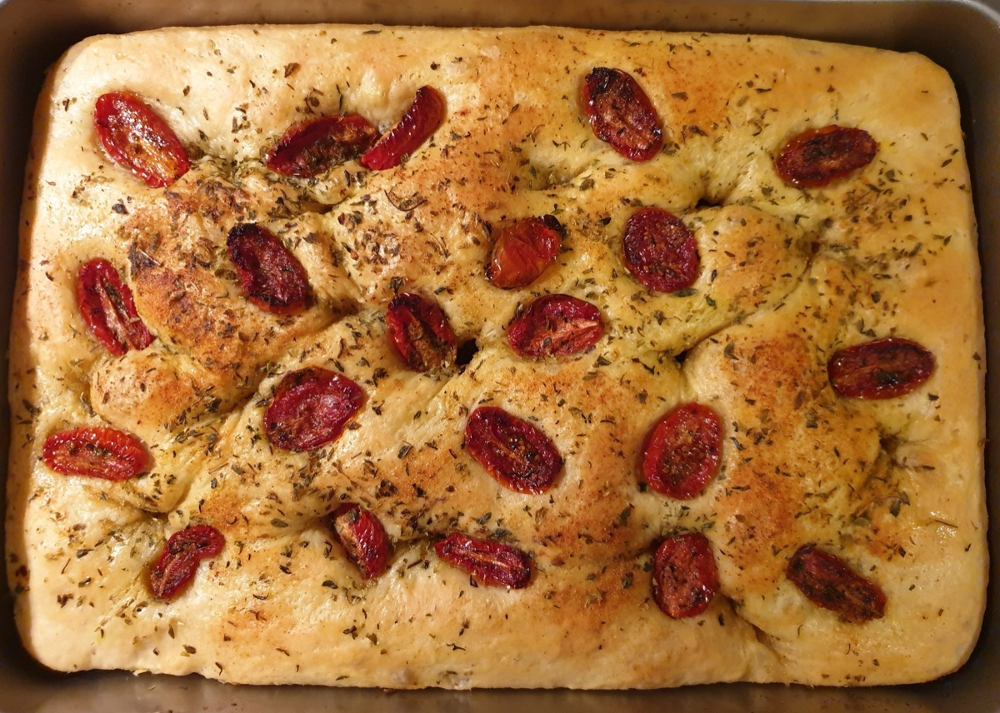
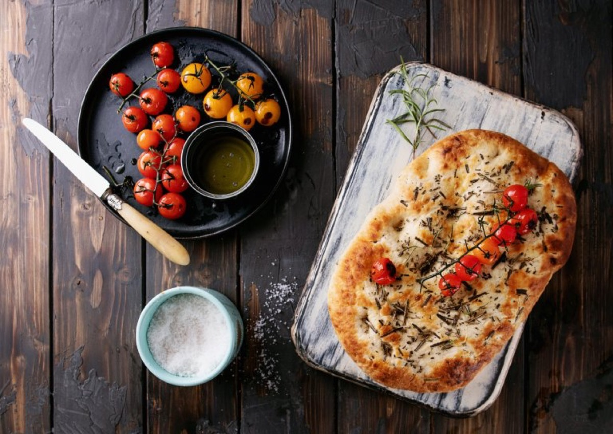
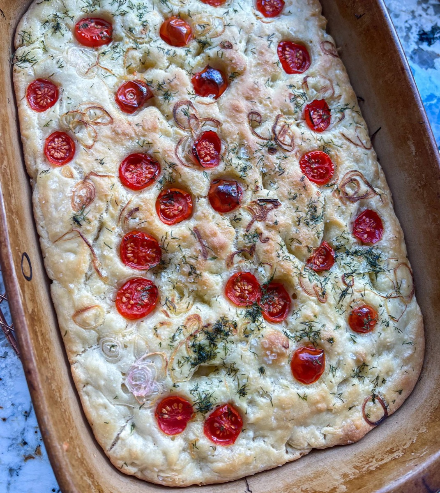

# Focaccia

<table>
  <tr>
    <td>
      
    </td>
    <td>
      
    </td>
  </tr>
  <tr>
    <td>
      
    </td>
    <td>
      
    </td>
  </tr>
</table>

## Background

Focaccia is an ancient Italian flatbread with especially strong ties to Liguria. Olive oil in and over the
dough creates its tender crumb, crisp base, and characteristic dimpled surface.

## Ingredients

- 500 g bread flour
- 400 ml lukewarm water
- 7 g instant yeast
- 10 g fine salt
- 60 ml extra-virgin olive oil, divided
- 1 teaspoon flaky salt
- 1 tablespoon rosemary leaves

## How to cook

1. Mix flour, water, yeast, fine salt, and 2 tablespoons oil into a sticky dough. Cover for 15 minutes, then
   stretch and fold it several times. Let rise until doubled, 1 to 2 hours.
2. Pour 2 tablespoons oil into a 23-by-33 cm pan. Stretch in the dough gently and let it rise for 45 minutes.
3. Heat the oven to 230°C. Oil your fingers, press deep dimples across the dough, and drizzle with remaining
   oil. Add flaky salt and rosemary.
4. Bake for 20 to 25 minutes until golden. Cool on a rack for at least 15 minutes.
