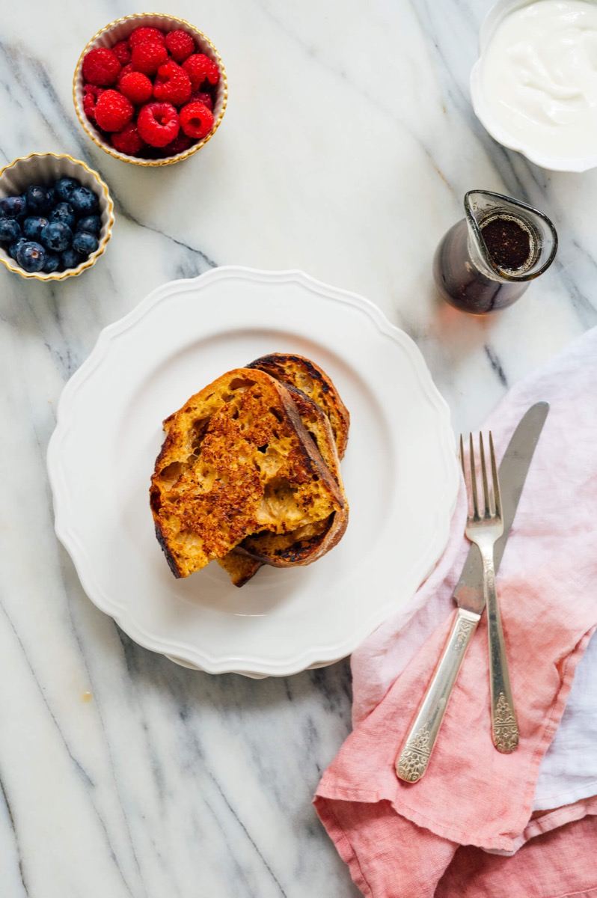
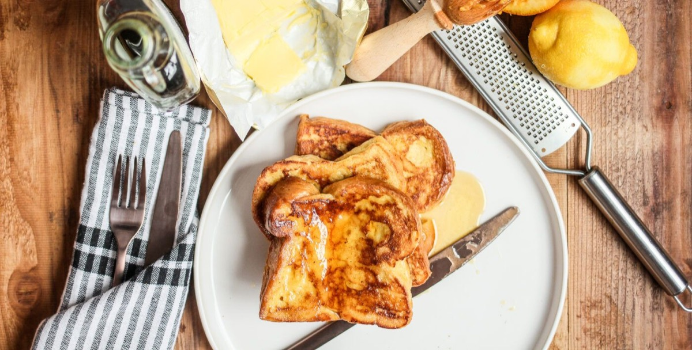
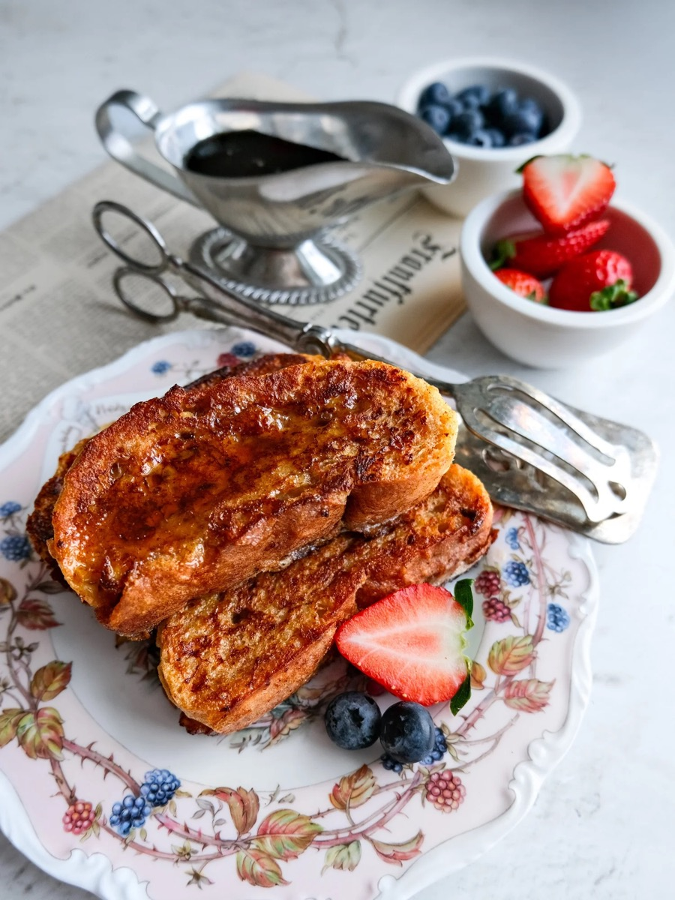
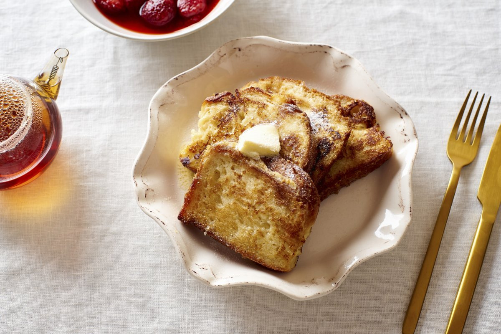

# French Toast

<table>
  <tr>
    <td>
      
    </td>
    <td>
      
    </td>
  </tr>
  <tr>
    <td>
      
    </td>
    <td>
      
    </td>
  </tr>
</table>

## Background

Soaking stale bread in egg and milk is an old technique found in many countries. In the United States, French
toast is a sweet breakfast commonly served with butter, syrup, or fruit.

## Ingredients

- 8 thick slices day-old bread
- 4 eggs
- 240 ml milk
- 1 tablespoon sugar
- 1 teaspoon vanilla
- 1/2 teaspoon cinnamon
- Pinch of salt
- 30 g butter

## How to cook

1. Whisk eggs, milk, sugar, vanilla, cinnamon, and salt in a shallow dish.
2. Soak bread briefly on both sides without letting it collapse.
3. Cook in butter over medium heat for 2 to 3 minutes per side until golden and set inside.
