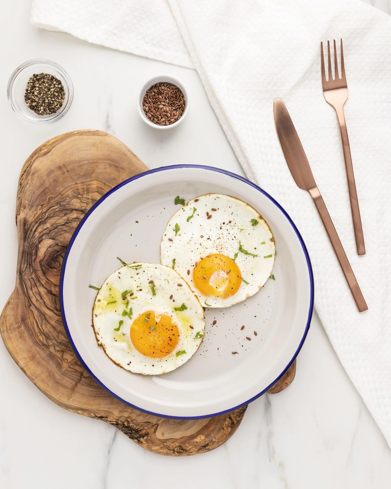
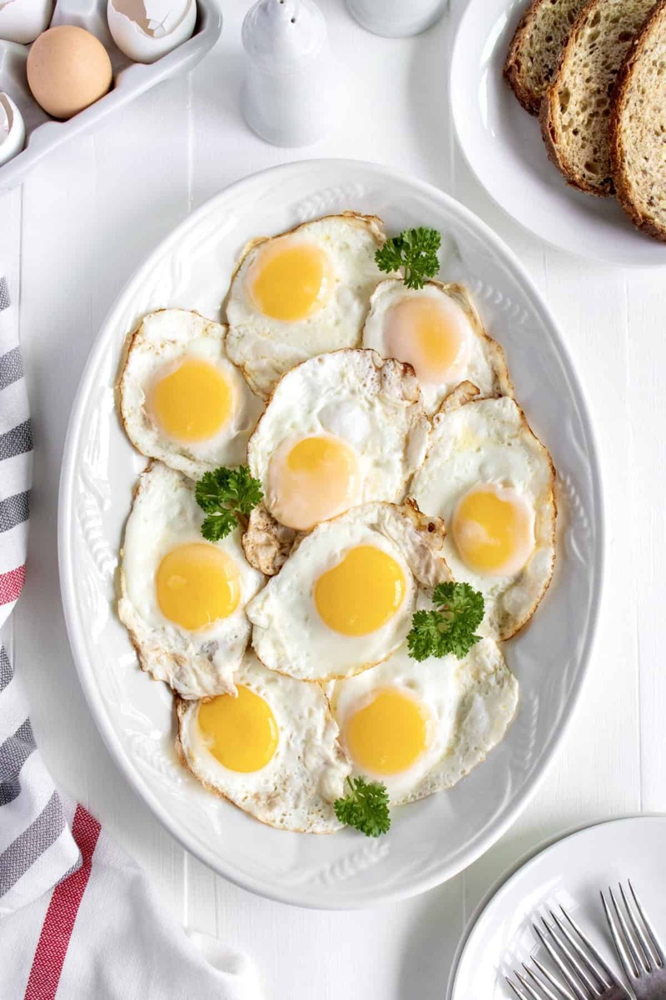
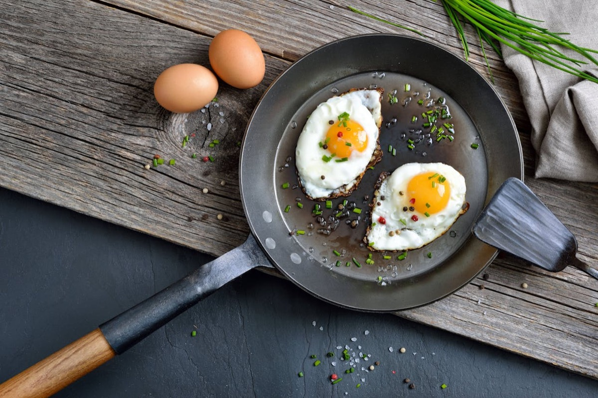
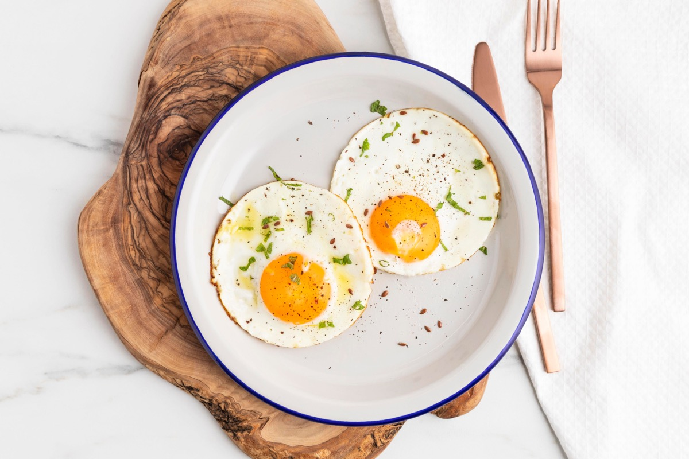

# Fried Eggs

<table>
  <tr>
    <td>
      
    </td>
    <td>
      
    </td>
  </tr>
  <tr>
    <td>
      
    </td>
    <td>
      
    </td>
  </tr>
</table>

## Background

Frying is one of the oldest and most widespread ways to cook eggs. Adjusting heat, fat, and whether the egg is
flipped produces sunny-side-up, over-easy, over-medium, or firm yolks from the same basic method.

## Ingredients

- 8 large eggs
- 2 tablespoons butter or olive oil
- Salt and black pepper

## How to cook

1. Heat butter in a nonstick skillet over medium-low heat until foaming.
2. Crack eggs into small cups, then slide them into the skillet without breaking the yolks.
3. Season and cook for 2 to 4 minutes, until the whites are opaque. Cover briefly to set the tops for
   sunny-side-up eggs, or flip and cook 20 to 60 seconds for over-easy through over-medium.
4. Remove with a thin spatula and serve at once.
