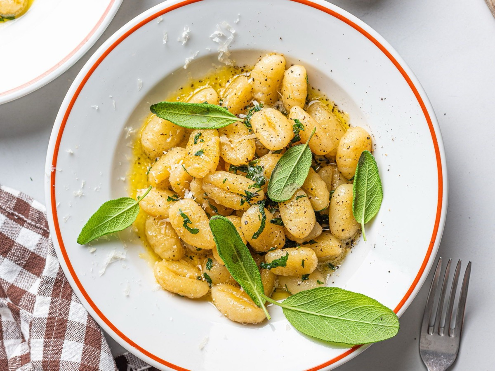
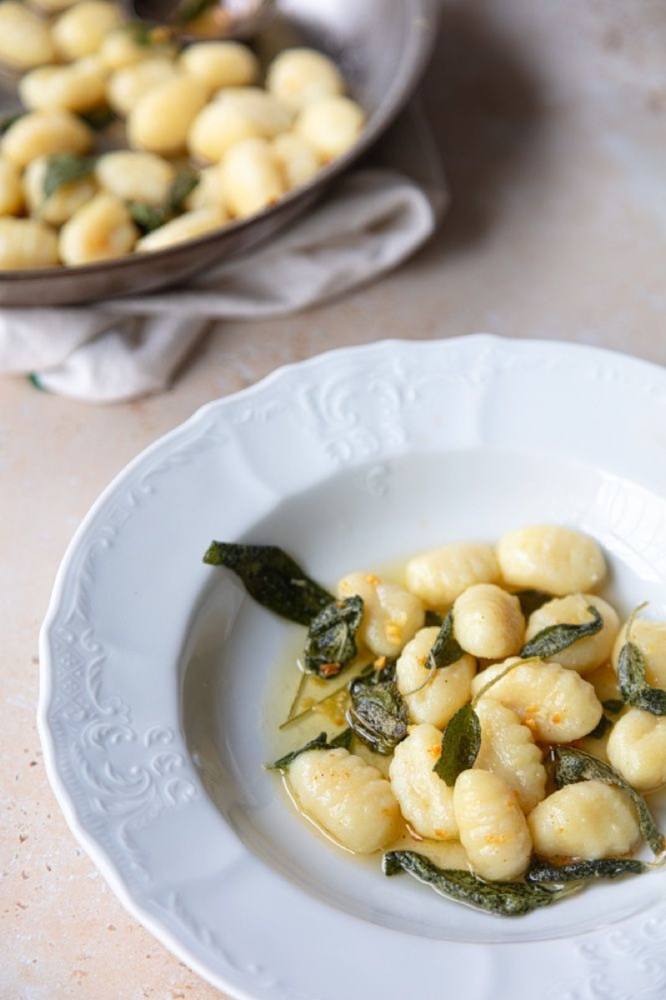
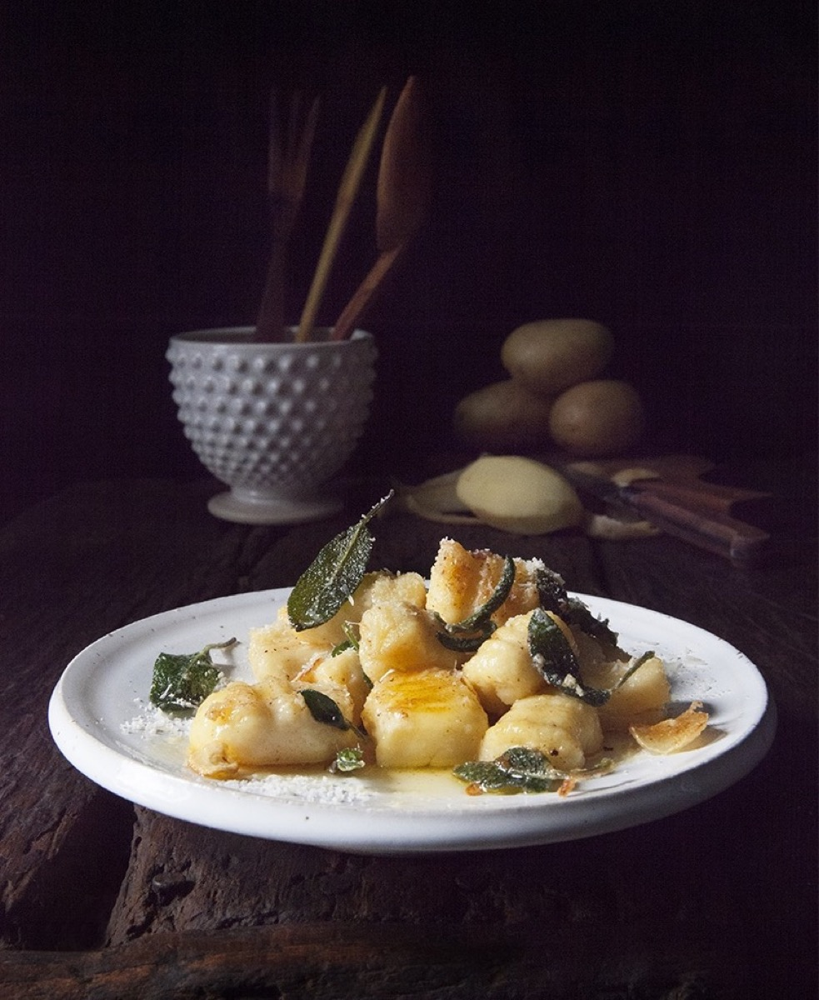
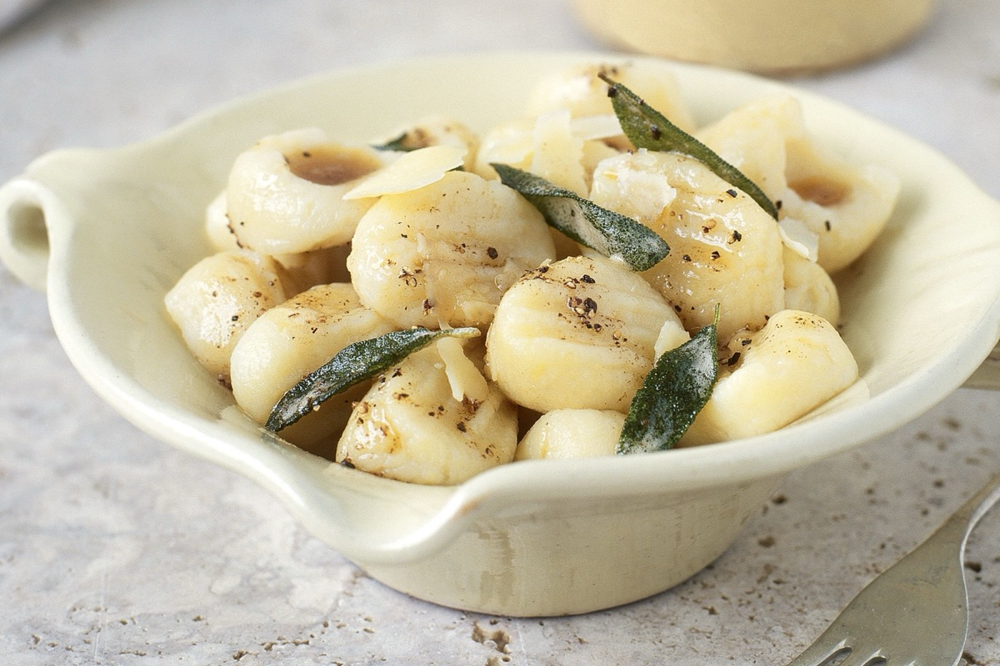

# Gnocchi with Butter and Sage

<table>
  <tr>
    <td>
      
    </td>
    <td>
      
    </td>
  </tr>
  <tr>
    <td>
      
    </td>
    <td>
      
    </td>
  </tr>
</table>

## Background

Potato gnocchi are soft Italian dumplings particularly associated with northern regions. Brown butter and sage
form a fast sauce that complements their delicate texture.

## Ingredients

- 800 g fresh potato gnocchi
- 100 g butter
- 16 sage leaves
- 60 g Parmigiano-Reggiano
- Salt and pepper

## How to cook

1. Melt butter with sage until the leaves crisp and the butter turns amber.
2. Boil gnocchi in salted water. Lift them out as soon as they float.
3. Toss gently in sage butter with a spoonful of cooking water. Add cheese and pepper.
