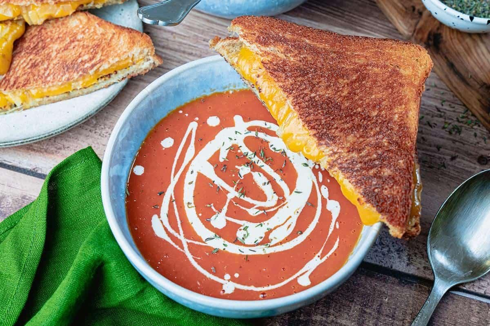
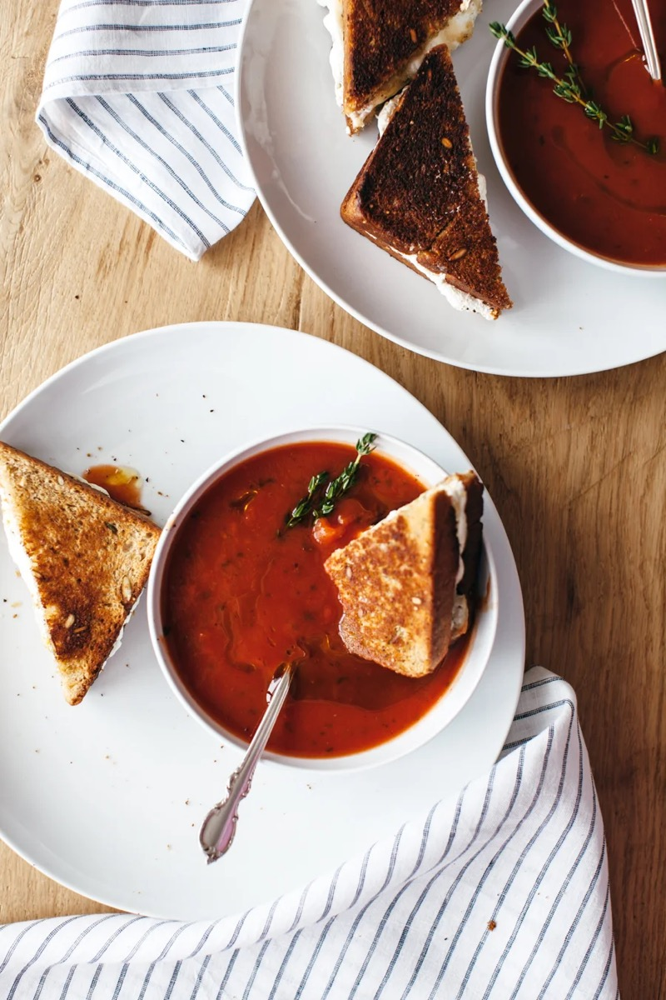
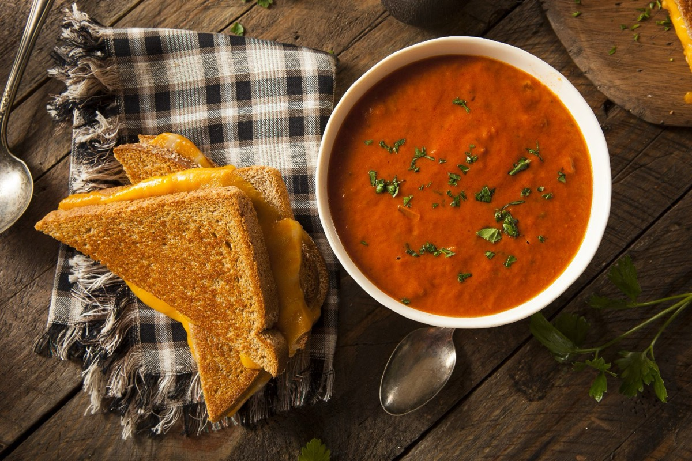
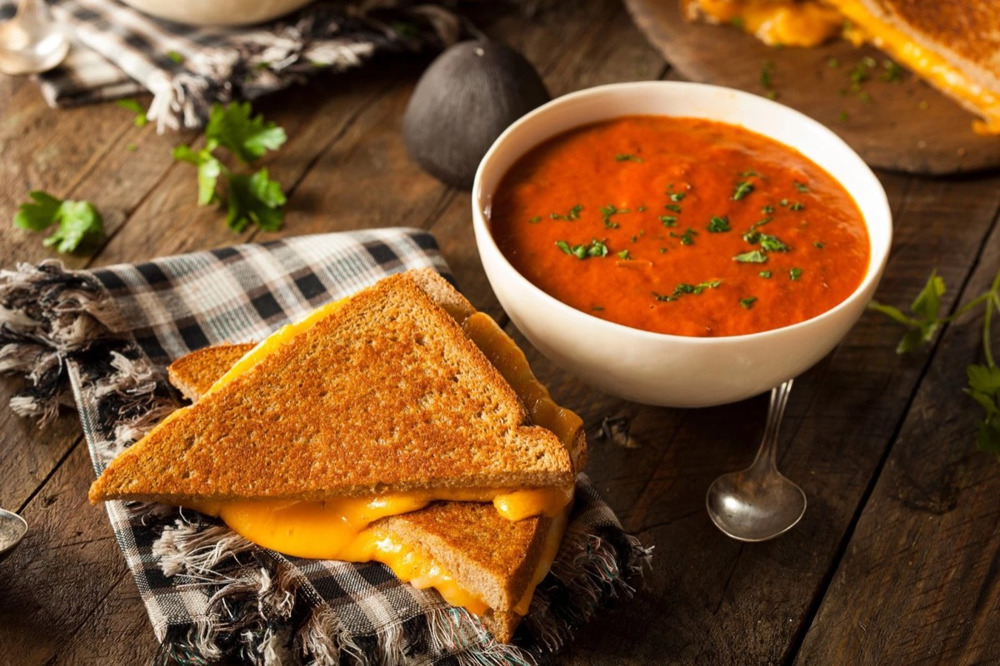

# Grilled Cheese and Tomato Soup

<table>
  <tr>
    <td>
      
    </td>
    <td>
      
    </td>
  </tr>
  <tr>
    <td>
      
    </td>
    <td>
      
    </td>
  </tr>
</table>

## Background

Grilled cheese became an American lunch staple as sliced bread and processed cheese spread during the twentieth
century. Pairing it with canned tomato soup became especially familiar in school cafeterias and home kitchens.

## Ingredients

- 8 slices sandwich bread
- 8 slices cheddar or American cheese
- 4 tablespoons softened butter
- 2 tablespoons olive oil
- 1 small onion, chopped
- 800 g canned tomatoes
- 500 ml vegetable or chicken stock
- Salt, pepper, and 60 ml cream, optional

## How to cook

1. Soften onion in oil. Add tomatoes and stock; simmer for 15 minutes, blend smooth, season, and add optional
   cream.
2. Butter one side of each bread slice. Put cheese between unbuttered sides.
3. Cook sandwiches in a skillet over medium-low heat for 3 to 4 minutes per side. Serve with soup.
