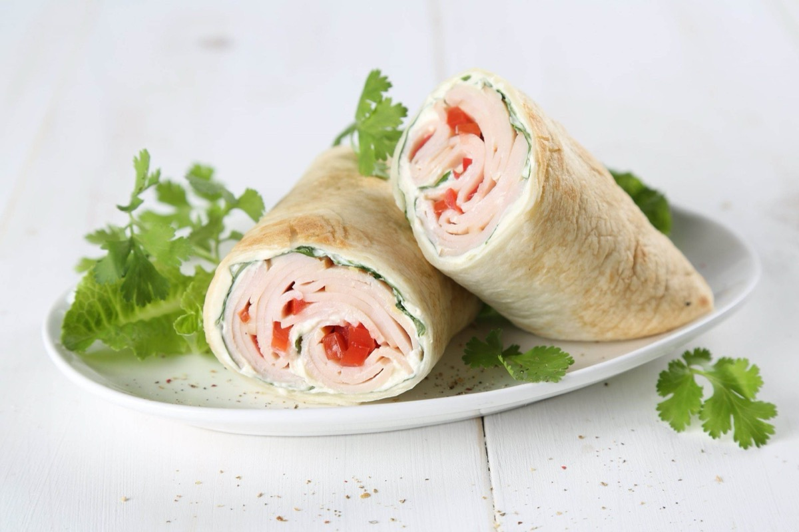
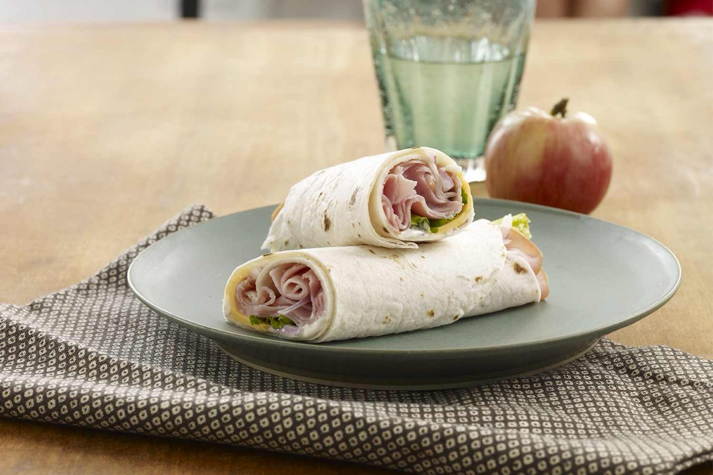
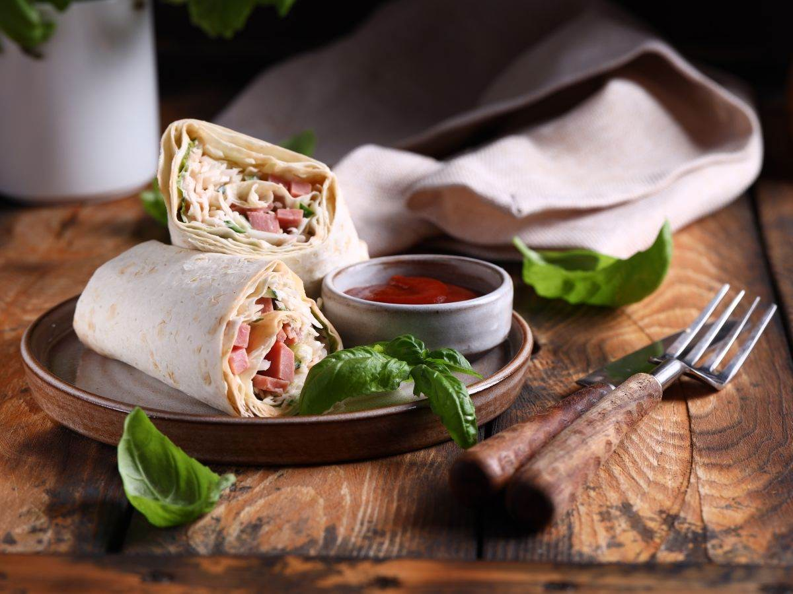

# Ham and Cheese Wrap

<table>
  <tr>
    <td>
      
    </td>
    <td>
      
    </td>
  </tr>
  <tr>
    <td>
      
    </td>
    <td>
      
    </td>
  </tr>
</table>

## Background

Flour-tortilla wraps became a mainstream American lunch format in the late twentieth century. This one
translates a ham-and-cheese sandwich into a quick, portable meal.

## Ingredients

- 4 large flour tortillas
- 300 g sliced ham
- 160 g sliced cheddar or Swiss cheese
- 4 tablespoons mustard or mayonnaise
- 2 cups shredded lettuce
- 1 tomato, thinly sliced

## How to cook

1. Warm tortillas briefly so they bend without cracking. Spread with mustard or mayonnaise.
2. Add ham, cheese, lettuce, and tomato across the center, leaving the edges clear.
3. Fold in the sides, roll tightly, and cut in half. Keep cool until lunch.
