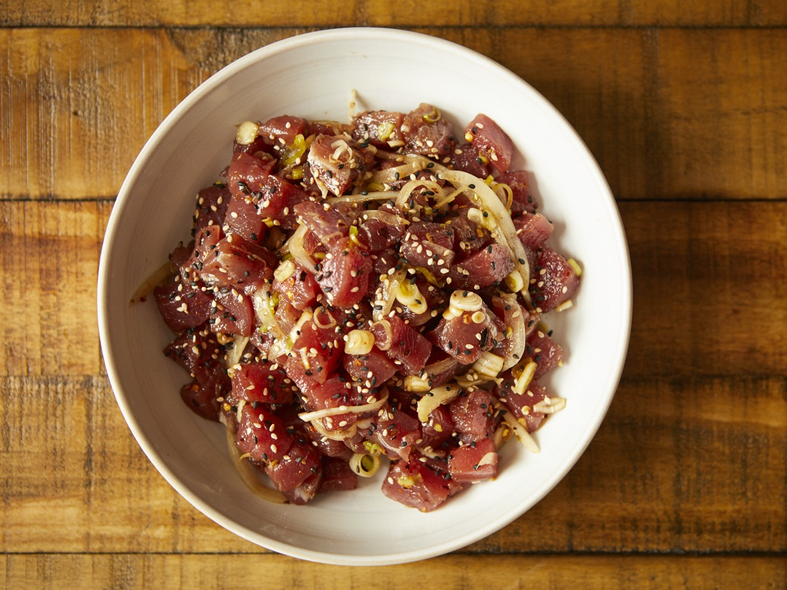
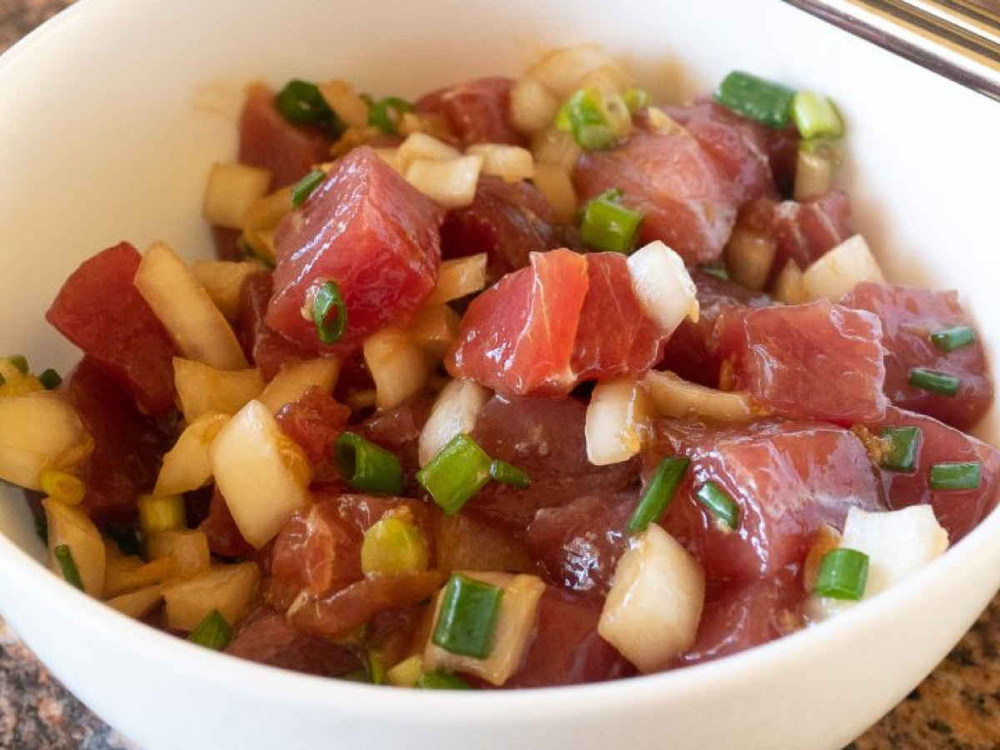
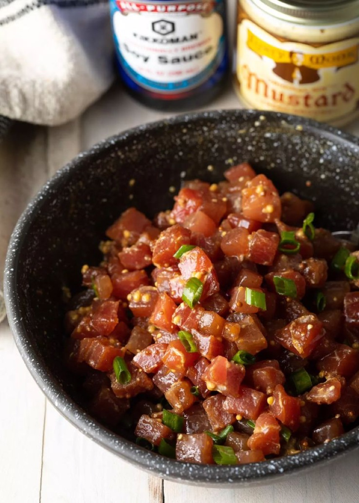
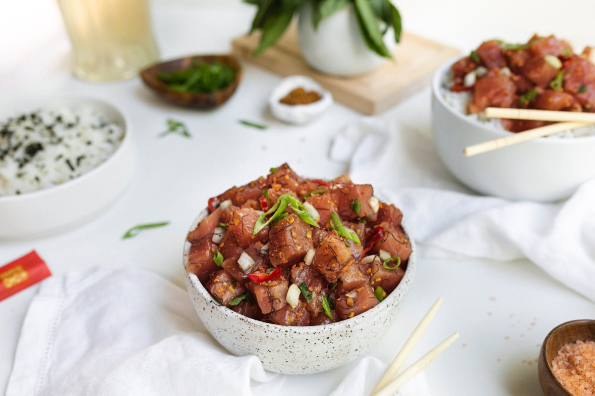

# Hawaiian Ahi Poke

<table>
  <tr>
    <td>
      
    </td>
    <td>
      
    </td>
  </tr>
  <tr>
    <td>
      
    </td>
    <td>
      
    </td>
  </tr>
</table>

## Background

Poke means "to cut crosswise" in Hawaiian. Native Hawaiian fishermen seasoned pieces of reef fish with sea
salt, seaweed, and roasted kukui nut; ahi tuna and Japanese-influenced seasonings later became widely popular.

## Ingredients

- 600 g sushi-grade ahi tuna, kept cold
- 3 tablespoons soy sauce
- 2 teaspoons toasted sesame oil
- 3 scallions, sliced
- 1/2 sweet onion, thinly sliced
- 1 teaspoon grated ginger
- 1 teaspoon sesame seeds
- 1 small fresh chile, sliced, optional
- Cooked rice, seaweed, and cucumber, for serving

## How to cook

1. Confirm that the tuna is intended for raw consumption and keep it refrigerated until preparation.
2. Cut tuna into 2 cm cubes with a clean, sharp knife.
3. Gently combine with soy sauce, sesame oil, scallions, onion, ginger, sesame seeds, and chile.
4. Serve immediately, or chill for no more than 30 minutes, over rice with seaweed and cucumber.
