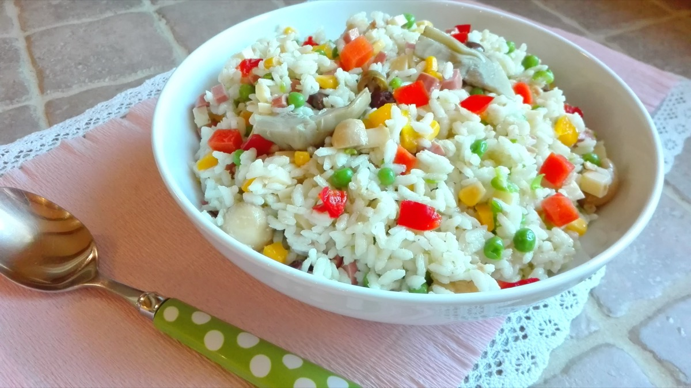
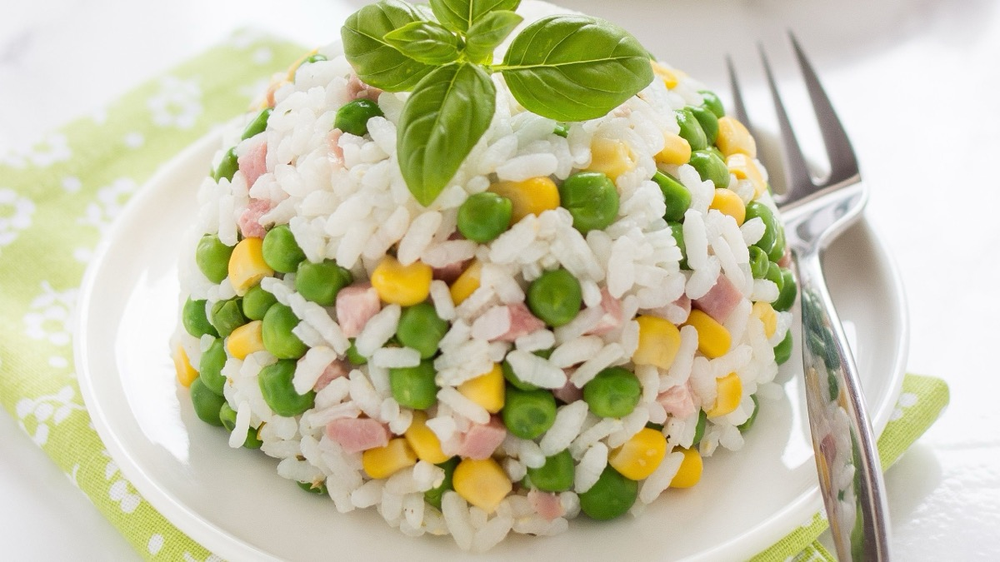
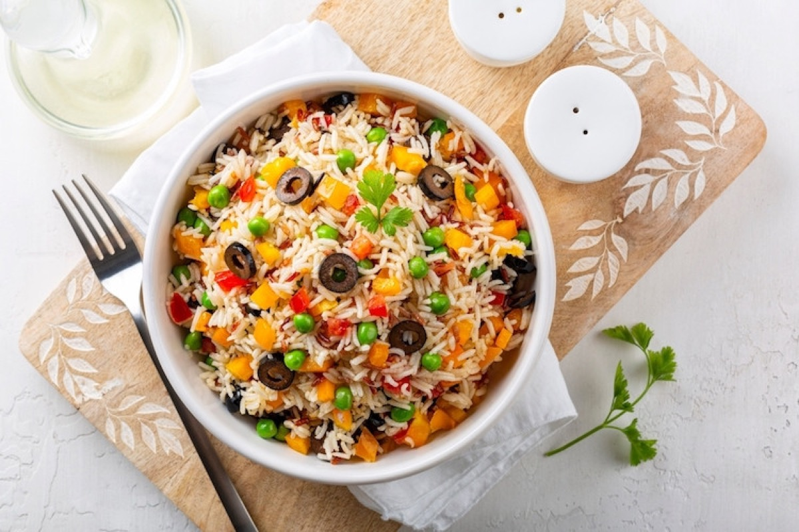
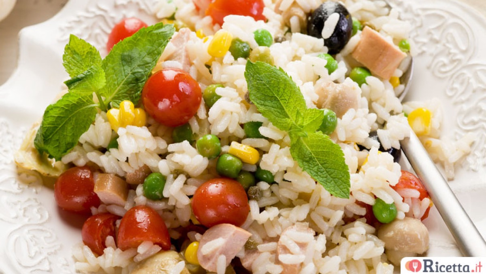

# Insalata di Riso

<table>
  <tr>
    <td>
      
    </td>
    <td>
      
    </td>
  </tr>
  <tr>
    <td>
      
    </td>
    <td>
      
    </td>
  </tr>
</table>

## Background

Insalata di riso is a flexible Italian summer dish served cool or at room temperature. Families vary the
additions, but firm rice, vegetables, cheese, olives, and a bright olive-oil dressing are typical.

## Ingredients

- 320 g parboiled or long-grain rice
- 150 g cherry tomatoes, quartered
- 120 g peas, cooked and cooled
- 100 g provolone, diced
- 100 g pitted olives, sliced
- 150 g tuna in olive oil, drained
- 3 tablespoons extra-virgin olive oil
- 1 tablespoon lemon juice
- Salt, pepper, and chopped parsley

## How to cook

1. Boil rice in salted water until tender but firm. Drain, spread on a tray, and cool promptly.
2. Combine rice with tomatoes, peas, provolone, olives, and tuna.
3. Dress with oil, lemon, salt, pepper, and parsley. Chill for 30 minutes, then let stand briefly before
   serving.
