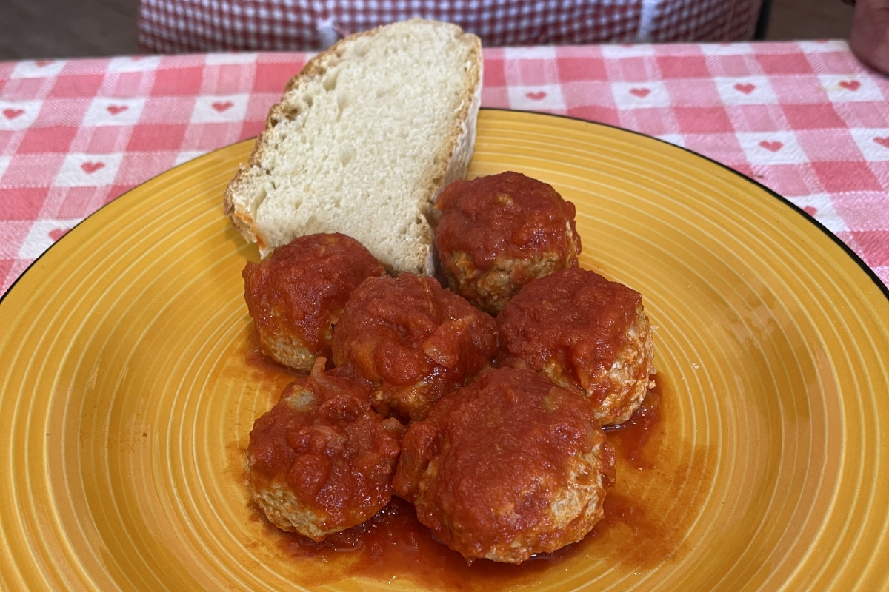
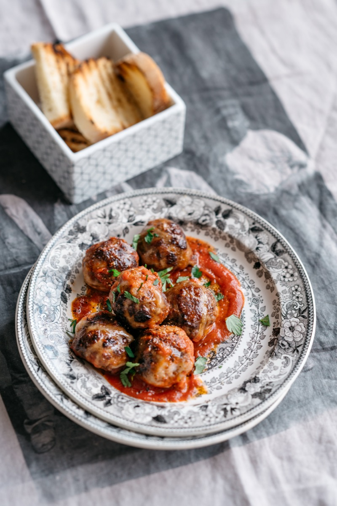
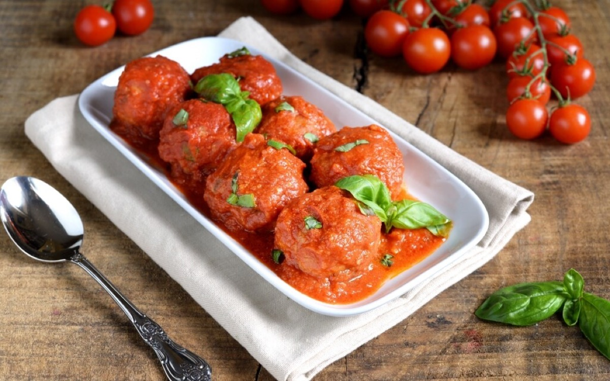
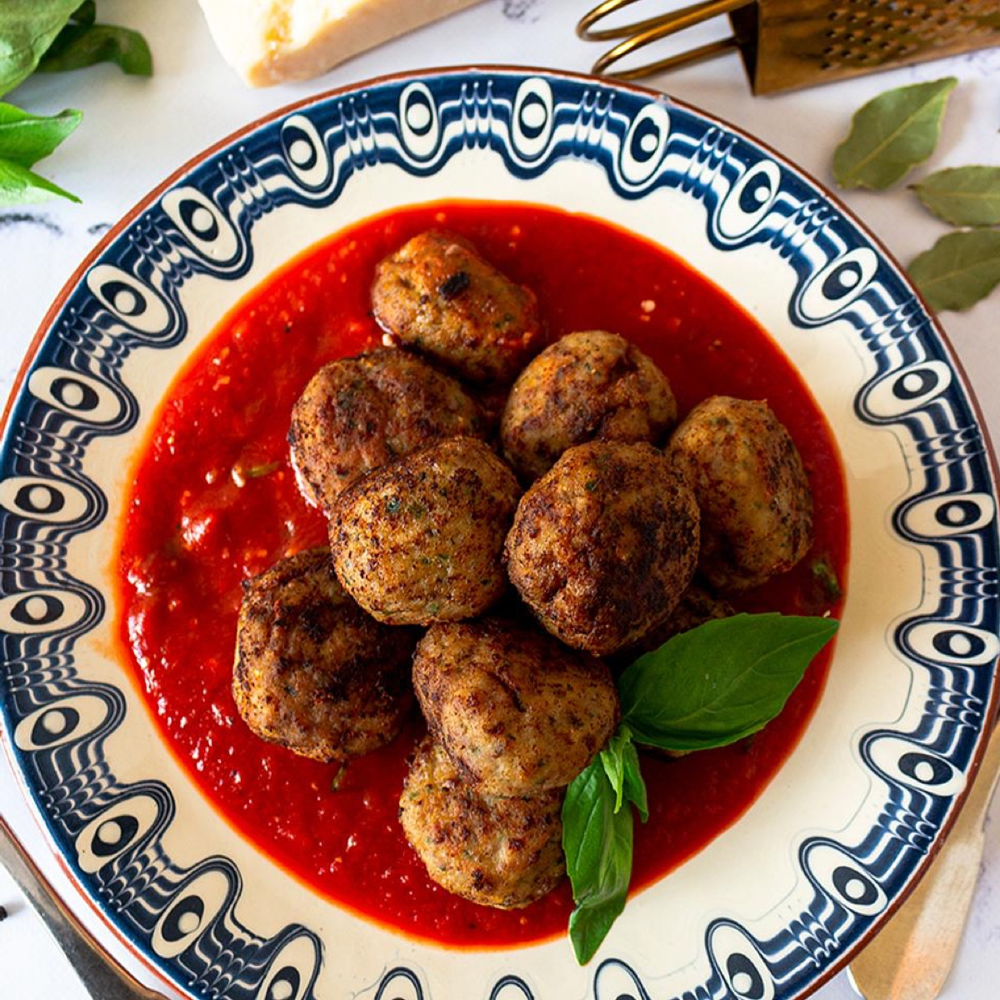

# Polpette

<table>
  <tr>
    <td>
      
    </td>
    <td>
      
    </td>
  </tr>
  <tr>
    <td>
      
    </td>
    <td>
      
    </td>
  </tr>
</table>

## Background

Polpette are Italian meatballs, traditionally served as a main course rather than over spaghetti. Recipes often
use bread soaked in milk for tenderness and may be fried, baked, or simmered in sauce.

## Ingredients

- 500 g ground beef
- 150 g ground pork
- 80 g stale bread, soaked in 120 ml milk and squeezed
- 1 egg
- 60 g Parmigiano-Reggiano
- 2 tablespoons chopped parsley
- 1 garlic clove, minced
- Salt, pepper, and 2 tablespoons olive oil
- 600 ml tomato sauce

## How to cook

1. Gently mix meat, bread, egg, cheese, parsley, garlic, salt, and pepper. Shape into 16 balls.
2. Brown in oil in batches. Add tomato sauce, cover, and simmer gently for 25 minutes until cooked through.
3. Serve with bread, vegetables, or pasta as desired.
