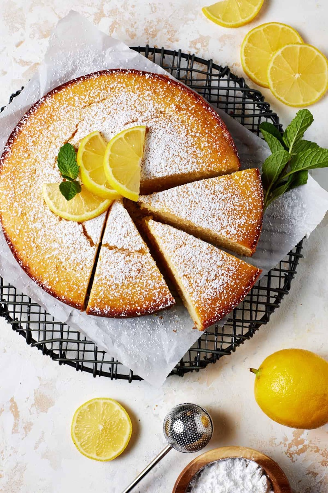
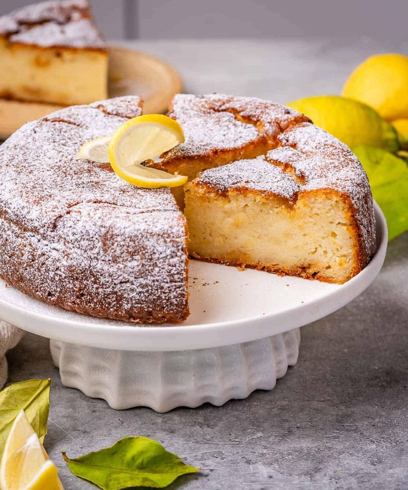
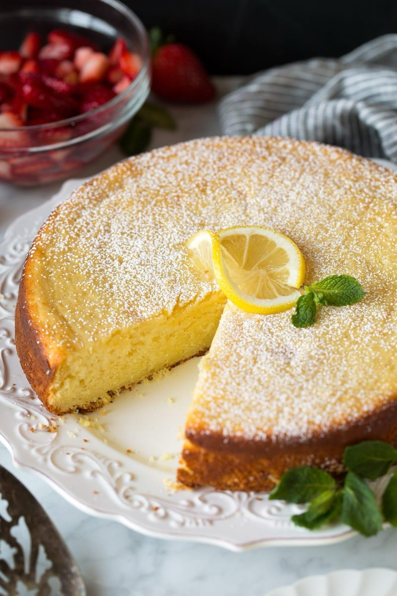
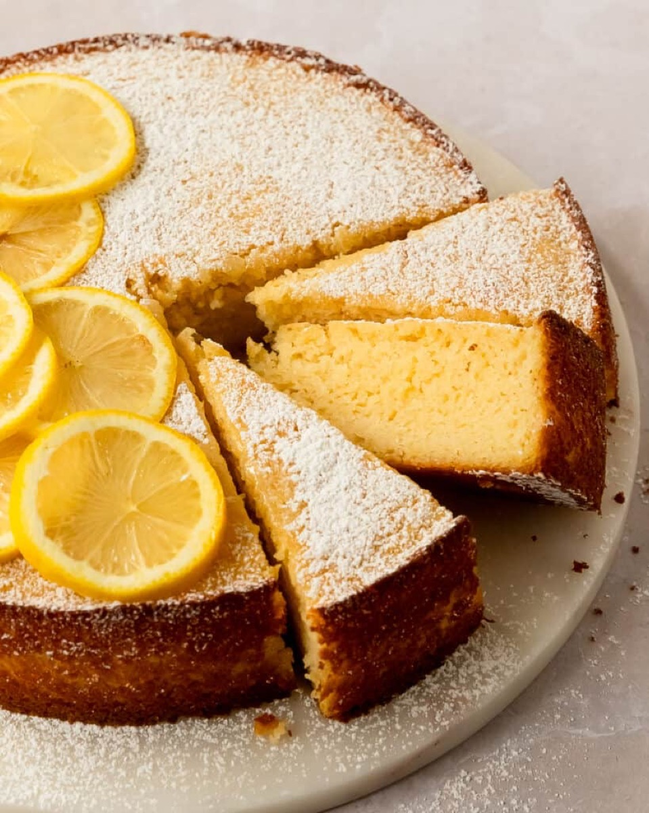

# Lemon Ricotta Cake

<table>
  <tr>
    <td>
      
    </td>
    <td>
      
    </td>
  </tr>
  <tr>
    <td>
      
    </td>
    <td>
      
    </td>
  </tr>
</table>

## Background

Ricotta cakes appear throughout Italy, especially in regions with strong sheep's-milk cheese traditions. This
easy version is moist, lightly sweet, and fragrant with lemon.

## Ingredients

- 250 g ricotta, well drained
- 150 g sugar
- 100 g softened butter
- 3 eggs
- Zest and 2 tablespoons juice of 1 lemon
- 180 g all-purpose flour
- 2 teaspoons baking powder
- 1/4 teaspoon salt

## How to cook

1. Heat the oven to 175°C and grease a 20 cm cake pan.
2. Beat butter and sugar, then beat in ricotta, eggs, lemon zest, and juice.
3. Fold in flour, baking powder, and salt. Bake for 35 to 45 minutes, until a tester comes out clean.
