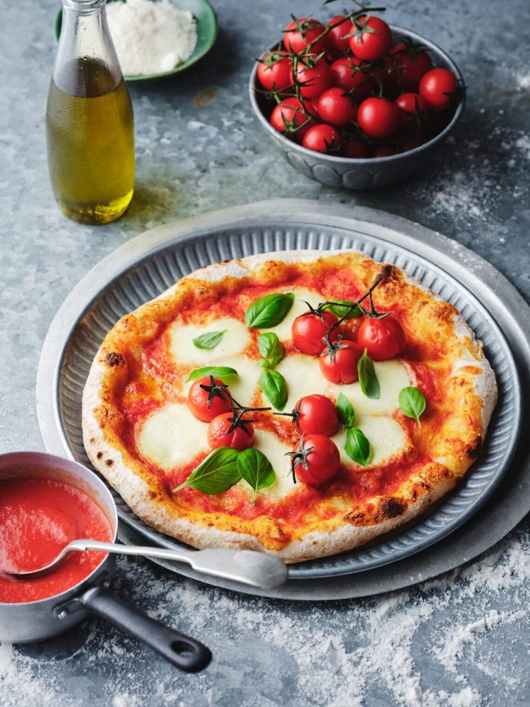
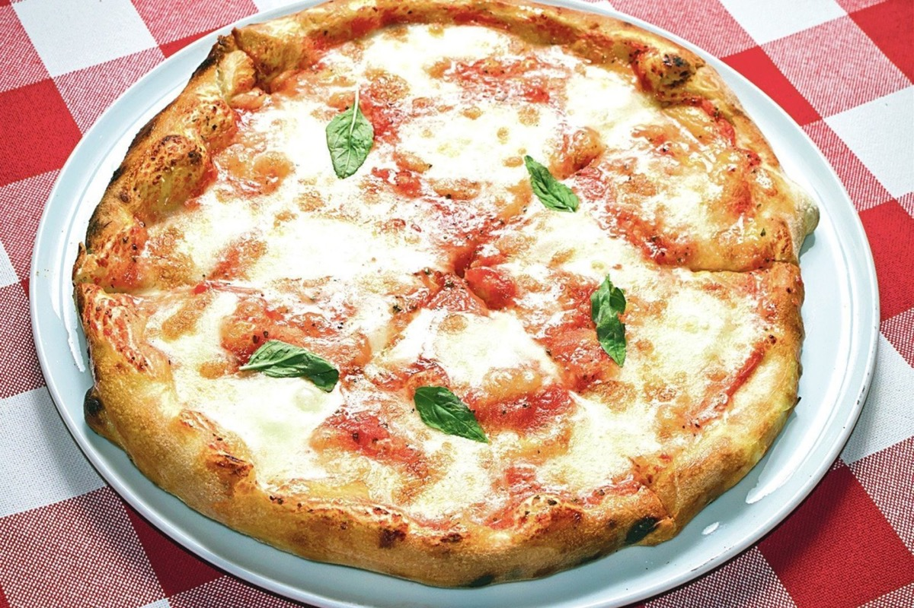
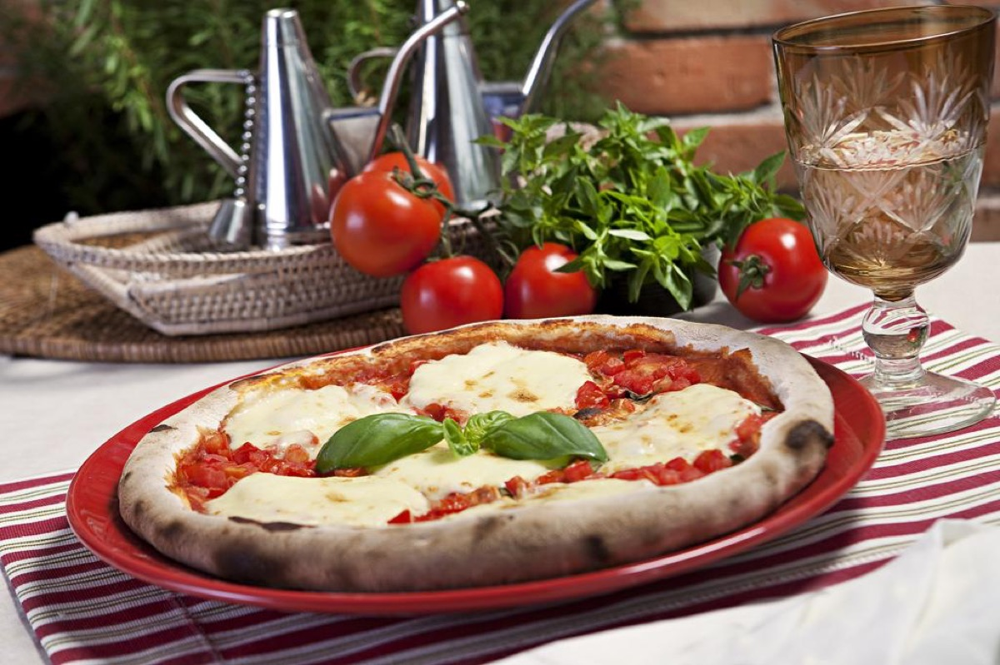
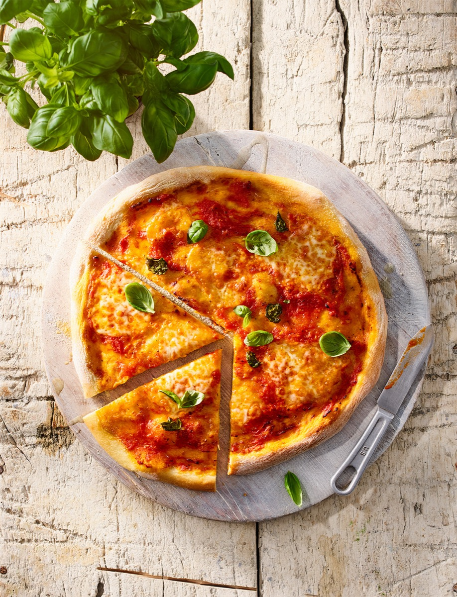

# Margherita Pizza

<table>
  <tr>
    <td>
      
    </td>
    <td>
      
    </td>
  </tr>
  <tr>
    <td>
      
    </td>
    <td>
      
    </td>
  </tr>
</table>

## Background

Pizza has deep roots in Naples. Pizza Margherita's famous combination of tomato, mozzarella, and basil became
linked with Queen Margherita in the late nineteenth century, though similar pizzas existed earlier.

## Ingredients

- 500 g prepared pizza dough
- 250 g canned whole tomatoes, crushed and salted
- 250 g fresh mozzarella, drained and torn
- 12 basil leaves
- 2 tablespoons extra-virgin olive oil
- Semolina or flour, for shaping

## How to cook

1. Heat an oven with a pizza stone or steel to its highest setting for at least 45 minutes.
2. Divide dough in two and stretch into thin rounds. Top sparingly with tomato and mozzarella.
3. Bake one at a time until the crust is blistered and the base crisp, usually 5 to 9 minutes.
4. Add basil and olive oil after baking.
