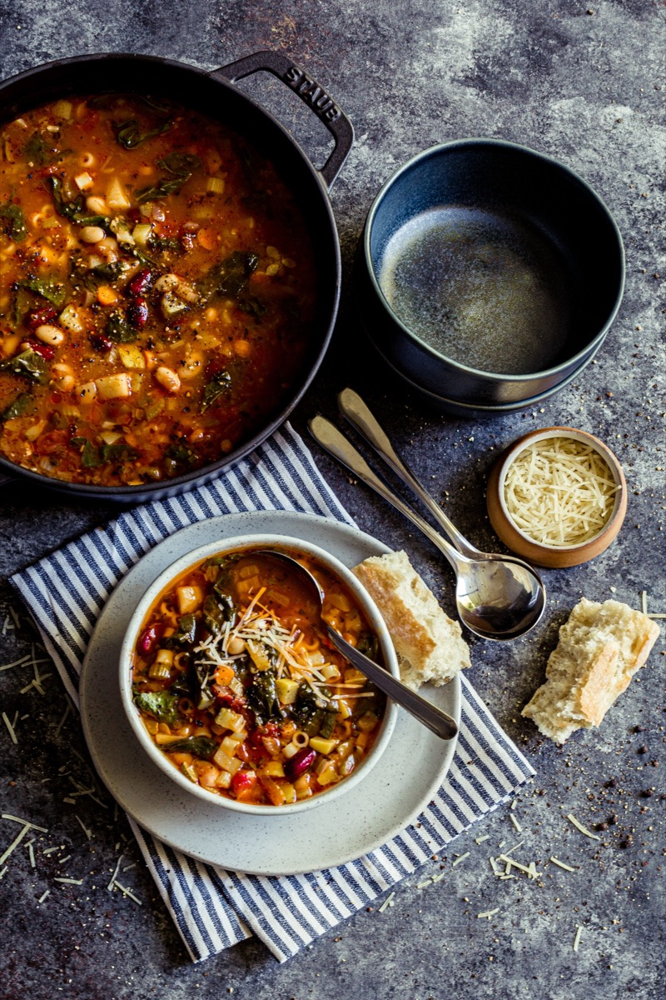
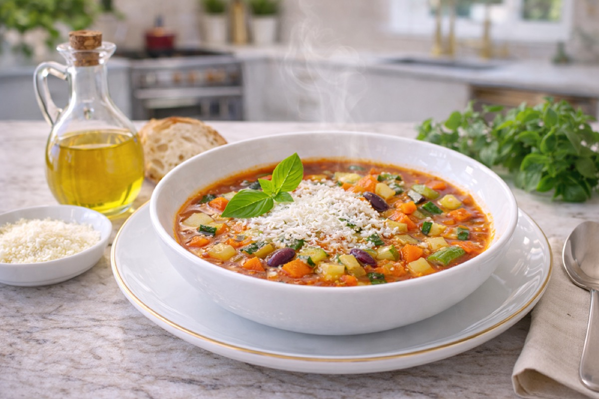
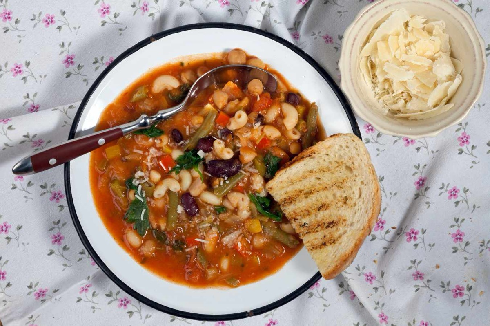
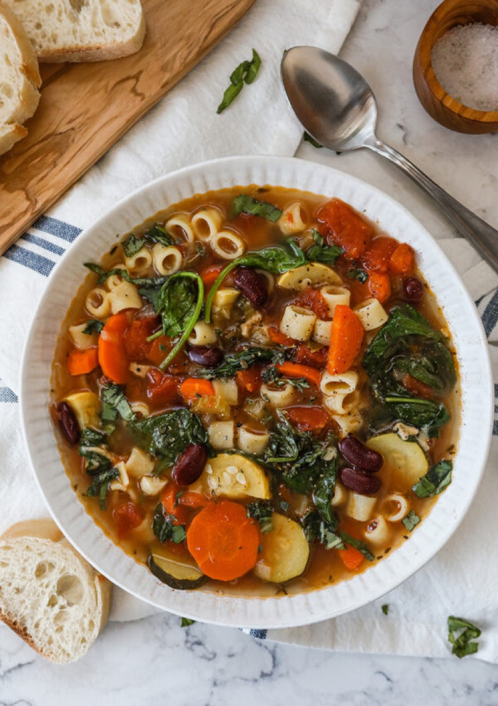

# Minestrone

<table>
  <tr>
    <td>
      
    </td>
    <td>
      
    </td>
  </tr>
  <tr>
    <td>
      
    </td>
    <td>
      
    </td>
  </tr>
</table>

## Background

Minestrone is an Italian vegetable soup without one fixed formula. It follows the season and makes economical
use of beans, vegetables, and small pasta or rice.

## Ingredients

- 3 tablespoons olive oil
- 1 onion, 2 carrots, and 2 celery stalks, diced
- 1 zucchini, diced
- 200 g green beans, cut short
- 400 g canned tomatoes
- 1 can cannellini beans, drained
- 1.2 l vegetable stock
- 120 g small pasta
- Salt, pepper, and basil

## How to cook

1. Soften onion, carrot, and celery in oil. Add zucchini and green beans; cook for 5 minutes.
2. Add tomatoes, beans, and stock. Simmer for 20 minutes.
3. Add pasta and cook until tender. Season and serve with basil and olive oil.
