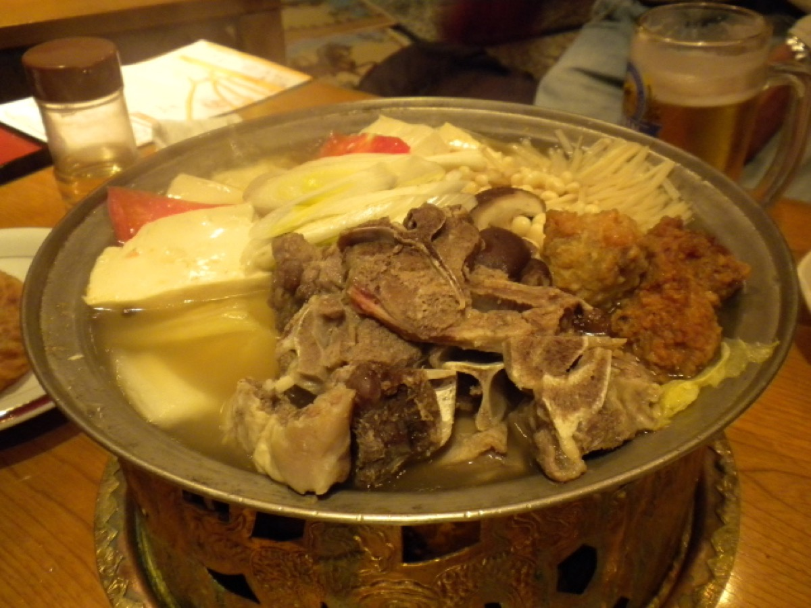
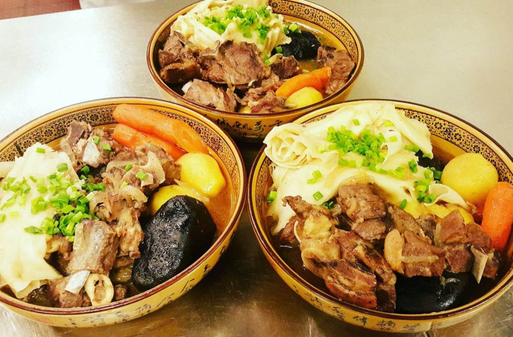
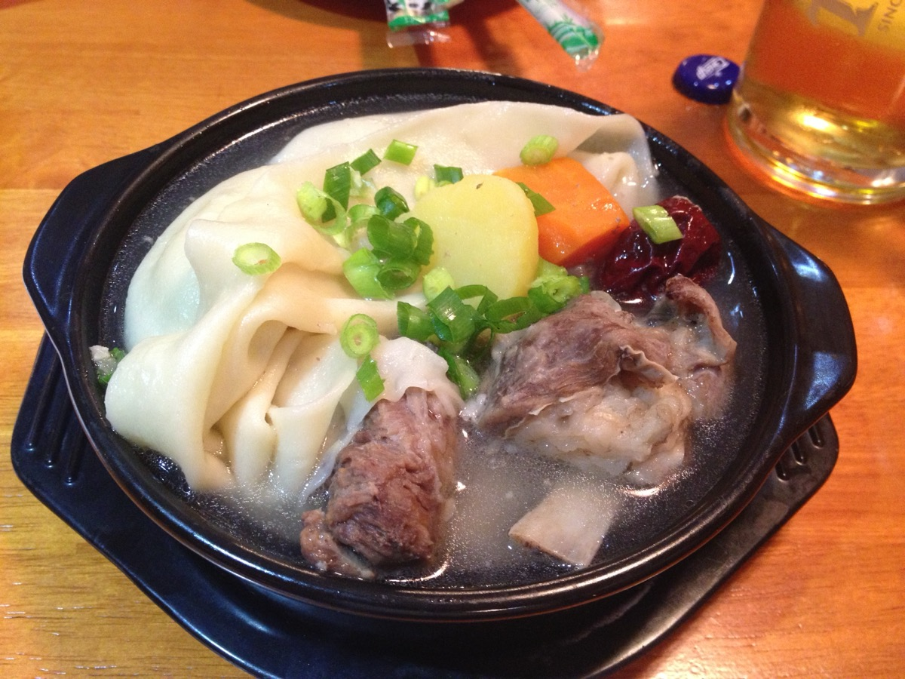
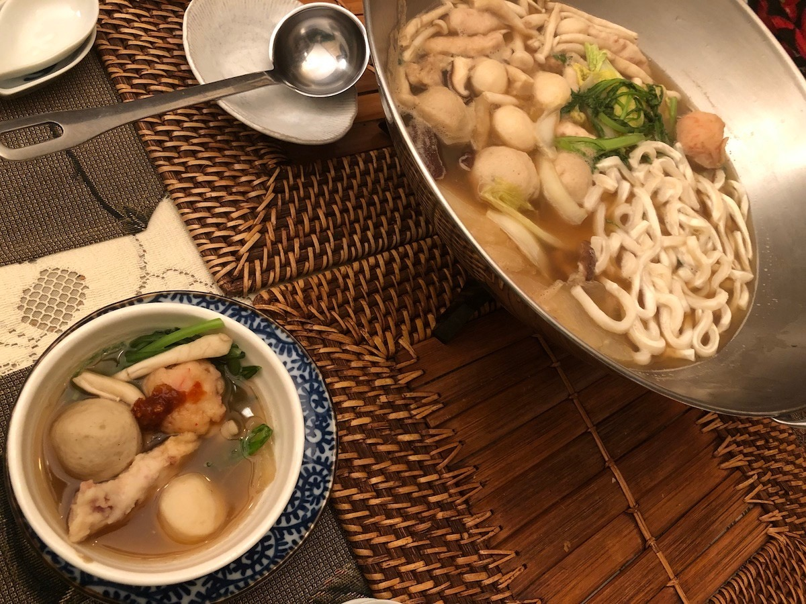

# Mongolian Hot Pot

<table>
  <tr>
    <td>
      
    </td>
    <td>
      
    </td>
  </tr>
  <tr>
    <td>
      
    </td>
    <td>
      
    </td>
  </tr>
</table>

## Background

Mongolian hot pot commonly refers to a northern Chinese communal meal traditionally associated with thinly
sliced mutton cooked in a simmering broth. Diners cook ingredients at the table and season them with individual
dipping sauce.

## Ingredients

- 1.5 l unsalted chicken or lamb stock
- 4 slices ginger
- 3 scallions, cut into lengths
- 2 star anise
- 600 g boneless lamb, partially frozen and paper-thin sliced
- 300 g napa cabbage, chopped
- 250 g mushrooms
- 250 g firm tofu, cubed
- 200 g dried wheat or glass noodles, soaked as directed
- Sesame paste, soy sauce, chile oil, and cilantro, for dipping

## How to cook

1. Simmer stock with ginger, scallions, and star anise for 20 minutes. Transfer to a tabletop hot-pot cooker.
2. Arrange raw lamb separately from vegetables, tofu, and noodles. Give each diner a bowl of dipping sauce.
3. Keep broth at a steady simmer. Cook lamb slices until no pink remains; cook vegetables, tofu, and noodles
   until tender. Use separate utensils for handling raw meat.
4. Ladle broth into bowls near the end of the meal.
